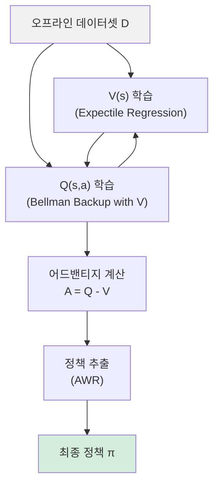

# IQL (Implicit Q-Learning)

IQL(Implicit Q-Learning)은 오프라인 강화학습(offline RL) 알고리즘 중 하나로, 데이터셋에 없는 행동을 평가하지 않고도 최적 Q-함수를 학습할 수 있도록 설계된 기법이다. Kostrikov et al. (2021)이 제안했으며, 오프라인 RL의 가장 고질적인 문제인 **분포 밖(out-of-distribution) 행동 과대평가**를 우회적으로 해결한다.

## 왜 IQL인가

[[offline-reinforcement-learning|오프라인 강화학습]]에서 가장 큰 난제는 에이전트가 데이터셋에 존재하지 않는 행동에 대해 잘못된 높은 Q-값을 부여하는 현상이다. 이를 막기 위해 [[conservative-q-learning-cql|CQL]] 같은 접근법은 분포 밖 행동에 패널티를 직접 부과한다. IQL은 다른 전략을 택한다 - **Q-함수 업데이트 시 아예 행동 샘플링을 하지 않는다.**

핵심 아이디어: $Q(s, a)$의 최적값을 구할 때, 행동 공간에서 최대값을 취하는 대신 상태 가치 함수 $V(s)$를 통해 간접적으로 추정한다.

## 핵심 구성 요소

### 1. Expectile Regression (기대값 회귀)

IQL의 핵심 혁신은 가치 함수 $V(s)$를 학습하는 방식에 있다. 일반적인 회귀는 평균을 예측하지만, IQL은 **expectile regression**을 사용해 분포의 상위 분위(quantile)를 예측한다.

손실 함수:

$$L_V(\psi) = \mathbb{E}_{(s,a) \sim \mathcal{D}} \left[ L_2^\tau (Q_{\hat\theta}(s, a) - V_\psi(s)) \right]$$

여기서 $L_2^\tau(u)$는 asymmetric 제곱 손실:

$$L_2^\tau(u) = |\tau - \mathbf{1}(u < 0)| \cdot u^2$$

$\tau \in (0.5, 1)$로 설정하면 $V(s)$가 해당 상태에서 데이터셋 내 최상위 행동들의 Q-값에 근접하도록 학습된다. $\tau = 1$이면 최대값, $\tau = 0.5$이면 중앙값에 해당한다.

### 2. Q-함수 업데이트

Q-함수는 표준 벨만 백업으로 학습하되, 다음 상태의 가치를 $V$로 대체한다:

$$L_Q(\theta) = \mathbb{E}_{(s,a,s') \sim \mathcal{D}} \left[ (r + \gamma V_\psi(s') - Q_\theta(s, a))^2 \right]$$

이 과정에서 행동 샘플링이 전혀 없으므로 OOD 행동이 개입할 여지가 없다.

### 3. 정책 추출

학습된 Q-함수와 V-함수로부터 정책을 추출할 때는 **가중치 행동 복제(Advantage-Weighted Regression)**를 사용한다:

$$\pi = \arg\max_\pi \mathbb{E}_{(s,a) \sim \mathcal{D}} \left[ \exp\left(\beta (Q(s,a) - V(s))\right) \log \pi(a|s) \right]$$

어드밴티지 $A(s,a) = Q(s,a) - V(s)$가 높은 행동일수록 더 높은 가중치로 학습된다.

## 알고리즘 흐름

위 다이어그램은 IQL의 3단계 파이프라인을 보여준다: V-함수와 Q-함수는 상호 의존적으로 학습되며, 마지막에 어드밴티지 기반 정책 추출이 이루어진다.

## CQL과의 비교

| 특성 | IQL | CQL |
|------|-----|-----|
| OOD 억제 방식 | 암묵적 (행동 샘플링 없음) | 명시적 패널티 |
| 계산 비용 | 낮음 | 높음 (추가 최적화 필요) |
| 하이퍼파라미터 | $\tau$, $\beta$ | $\alpha$ (보수성 강도) |
| 온라인 파인튜닝 | 자연스럽게 지원 | 상대적으로 어려움 |

## 실무 적용 관점

- **$\tau$ 선택**: 일반적으로 $\tau = 0.7 \sim 0.9$가 실용적. 너무 높으면 V가 노이즈에 민감해지고, 너무 낮으면 최적성이 떨어진다.
- **D4RL 벤치마크**: IQL은 D4RL의 locomotion 태스크(HalfCheetah, Hopper, Walker)에서 당시 SOTA 달성.
- **온라인 파인튜닝**: 오프라인 사전학습 후 온라인 파인튜닝(offline-to-online)에 특히 적합. 오프라인 단계에서 OOD를 억제하면서도 온라인 전환 시 보수적 제약이 없어 빠른 적응이 가능.
- **LLM 연계 가능성**: RLHF 파이프라인에서 인간 피드백 데이터셋이 한정적일 때 오프라인 RL 기법으로 활용될 수 있다.

## 한계

- $\tau$가 1에 가까울수록 데이터 내 최상위 행동만 학습하므로, 데이터 품질에 매우 민감하다.
- 정책 추출 단계에서 $\beta$가 너무 크면 훈련 분포에 과적합될 위험이 있다.
- 멀티태스크 설정이나 분포가 매우 다양한 데이터셋에서는 단일 $\tau$ 선택이 어렵다.

## 관련 문서
- [[rl-benchmark-environments]] -- RL 벤치마크 환경

- [[offline-reinforcement-learning]] - IQL이 해결하려는 오프라인 RL의 전반적 문제 정의
- [[conservative-q-learning-cql]] - 명시적 패널티로 OOD를 억제하는 대안 접근법
- [[policy-gradient-ppo]] - 온라인 RL의 대표 알고리즘, 오프라인과 비교 맥락에서 참조
