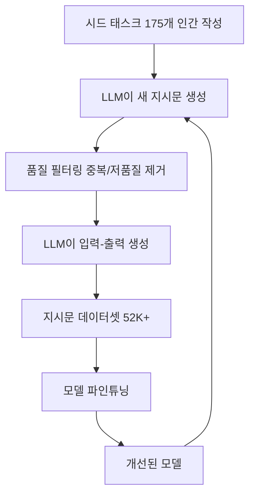

# 지시문 튜닝 (Instruction Tuning)

## 개요

지시문 튜닝(Instruction Tuning)은 다양한 NLP 태스크를 자연어 지시문(instruction) 형태로 변환하여 학습함으로써, 모델이 학습하지 않은 새로운 태스크에서도 zero-shot으로 일반화할 수 있게 하는 파인튜닝 방법이다. FLAN(Finetuned Language Net, Wei et al., 2022)이 이 개념을 체계화했으며, Self-Instruct(Wang et al., 2023)는 인간 어노테이션 없이 모델 자체의 생성으로 지시문 데이터를 부트스트랩하는 방법을 제안했다. [[supervised-fine-tuning]]의 한 형태이지만, 목표가 "특정 태스크 성능"이 아닌 "범용 지시 수행 능력"이라는 점에서 차별화된다.

## 핵심 개념

### FLAN: 다중 태스크 지시문 학습

FLAN(Wei et al., 2022)의 핵심 아이디어는 60개 이상의 NLP 태스크를 자연어 지시문 형태로 재구성(template)하여 학습하면, 모델이 학습하지 않은 태스크도 zero-shot으로 수행할 수 있다는 것이다.

**지시문 변환 예시:**

원본 감성 분석 태스크:
```
입력: "이 영화는 정말 재미있었다"
라벨: positive
```

지시문 형태로 변환:
```
지시: 다음 리뷰의 감성을 positive 또는 negative로 분류하세요.
입력: "이 영화는 정말 재미있었다"
출력: positive
```

**FLAN의 핵심 결과:**
- 137B 파라미터 모델을 60개 이상의 태스크로 학습
- 평가한 25개 태스크 중 20개에서 zero-shot GPT-3(175B)를 능가
- ANLI, RTE, BoolQ, AI2-ARC, OpenbookQA, StoryCloze에서 few-shot GPT-3도 능가

**성공 요인 (ablation으로 확인):**
1. 파인튜닝에 사용된 태스크의 수(다양성)
2. 모델 규모(파라미터 수)
3. 자연어 지시문의 존재와 품질

### Flan-T5/Flan-PaLM: 대규모 스케일링

Scaling Instruction-Finetuned Language Models(Chung et al., 2022)는 FLAN의 접근을 1,800개 태스크로 확장했다.

| 모델 | 태스크 수 | 주요 결과 |
|------|----------|-----------|
| FLAN (2022) | 60+ | zero-shot에서 GPT-3 능가 |
| Flan-T5 (2022) | 1,800 | T5 대비 대폭 향상, 오픈소스 공개 |
| Flan-PaLM 540B (2022) | 1,800 | PaLM 540B 대비 평균 +9.4% |

Flan-PaLM은 [[chain-of-thought|Chain-of-Thought(CoT)]] 데이터를 포함시킨 것이 추론 벤치마크 성능 향상의 핵심 요인임을 확인했다.

### Self-Instruct: 자동 지시문 생성

Self-Instruct(Wang et al., 2023)는 인간 어노테이션 비용을 극적으로 줄이는 부트스트랩 방법이다.



**Self-Instruct의 핵심 결과:**
- GPT-3에 적용하여 Super-NaturalInstructions에서 원본 대비 33% 절대 향상
- InstructGPT-001과 비교 가능한 성능 달성
- 비공개 인간 어노테이션 데이터 없이 "거의 어노테이션 없는 정렬(almost annotation-free alignment)" 실현

이 접근은 이후 Stanford Alpaca, Vicuna, WizardLM 등 오픈소스 모델 생태계의 폭발적 성장을 견인했다.

## Instruction Tuning vs SFT: 관계와 차이

| 항목 | Instruction Tuning | [[supervised-fine-tuning]] |
|------|-------------------|---------------------------|
| 목적 | 범용 지시 수행 + zero-shot 일반화 | 특정 행동 패턴 학습 |
| 데이터 | 다수 태스크의 지시문 집합 | 대화형 instruction-response |
| 태스크 다양성 | 핵심 (수십~수천 태스크) | 부차적 |
| 평가 | 미학습 태스크 zero-shot 성능 | 학습된 형식의 품질 |
| 대표 사례 | FLAN, T0, Self-Instruct | InstructGPT SFT 단계 |

실무에서는 이 구분이 흐려지는 경우가 많다. 현대의 SFT 데이터셋(UltraChat, ShareGPT 등)은 다양한 태스크를 포함하므로 instruction tuning의 요소를 자연스럽게 내포한다.

## 2026년 현재의 위치

Instruction tuning은 현대 LLM 개발 파이프라인에서 여전히 핵심적인 역할을 한다.

1. **사전 학습 데이터 혼합**: Flan 컬렉션 등 지시문 데이터를 사전 학습 단계에 일부 혼합하는 패턴 등장
2. **합성 지시문 생성**: Self-Instruct의 원리가 [[synthetic-data-training]]으로 일반화
3. **RL과의 시너지**: Instruction tuning으로 기반을 잡고 [[rlhf-pipeline]], [[grpo]], [[rlvr]] 등으로 정렬하는 순서가 표준
4. **다국어 확장**: 영어 중심 지시문을 다국어로 확장하는 연구 활발

## 대표 자료

- [Finetuned Language Models Are Zero-Shot Learners (FLAN, Wei et al., 2022)](https://arxiv.org/abs/2109.01652)
- [Scaling Instruction-Finetuned Language Models (Flan-T5/PaLM, Chung et al., 2022)](https://arxiv.org/abs/2210.11416)
- [Self-Instruct: Aligning Language Models with Self-Generated Instructions (Wang et al., 2023)](https://arxiv.org/abs/2212.10560)

## 관련 문서
- [[ifeval-benchmark]] -- IFEval 벤치마크

- [[supervised-fine-tuning]] -- Instruction tuning의 상위 범주
- [[multi-task-learning]] -- Instruction tuning의 이론적 기반
- [[rlhf-pipeline]] -- Instruction tuning 이후 강화학습 정렬
- [[synthetic-data-training]] -- Self-Instruct 원리의 일반화
- [[transfer-learning-for-nlp]] -- Instruction tuning이 전이 학습 패러다임에서 차지하는 위치
- [[grpo]] -- Instruction tuning 이후 적용되는 정책 최적화
- [[causal-language-modeling]] -- Instruction tuning이 전제하는 사전 학습
