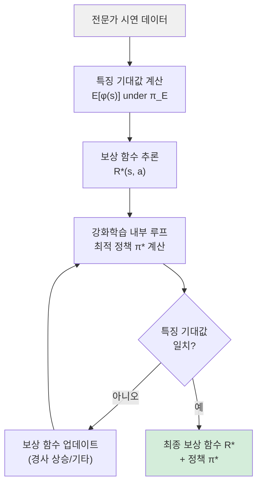

# 역강화학습 (Inverse Reinforcement Learning)

역강화학습(IRL, Inverse Reinforcement Learning)은 전문가의 행동 시연(demonstration)을 관찰해 그 행동을 유발하는 **보상 함수(reward function)를 역으로 추론**하는 기법이다. 일반 강화학습이 "보상 함수가 주어졌을 때 최적 정책을 찾는" 문제라면, IRL은 "전문가 정책이 주어졌을 때 보상 함수를 찾는" 역방향 문제를 푼다.

## 왜 보상 함수를 추론하는가

실세계 태스크에서 보상 함수를 손으로 설계하는 것은 극도로 어렵다. 로봇 보행, 자율주행, 언어 정렬 등의 분야에서 올바른 행동이 무엇인지는 전문가가 시연으로 보여줄 수 있지만, 그 행동을 수식으로 정량화하기는 힘들다. IRL은 이 간극을 메운다.

[[imitation-learning|모방 학습(Imitation Learning)]]과 관련 있지만 목적이 다르다. 단순 모방 학습(행동 복제)은 전문가 행동을 직접 따라 하는 반면, IRL은 **왜 전문가가 그렇게 행동하는지**를 보상 함수로 설명하려 한다. 추론된 보상 함수는 새로운 환경에 이전(transfer)할 수 있다는 강점이 있다.

## 핵심 알고리즘 계보

### 1. 최대 여백 IRL (Maximum Margin IRL)

Abbeel & Ng (2004)의 고전적 접근. 전문가의 특징 기대값(feature expectation)과 학습된 정책의 특징 기대값 사이 여백을 최대화하는 선형 보상 함수를 찾는다.

$$R(s) = w^T \phi(s)$$

제약: $w^T \mu_E \geq w^T \mu_\pi + \epsilon$ (전문가 $\mu_E$가 학습 정책 $\mu_\pi$보다 항상 높은 보상)

한계: 해가 유일하지 않고(reward ambiguity), 반복적인 RL 내부 루프가 필요해 계산 비용이 크다.

### 2. 최대 엔트로피 IRL (MaxEnt IRL)

Ziebart et al. (2008) 제안. 전문가 시연과 일치하는 특징 기대값을 갖는 분포 중 **엔트로피가 최대인 분포**를 정책으로 선택한다.

$$\pi^* = \arg\max_\pi H(\pi) \quad \text{s.t.} \quad \mathbb{E}_\pi[\phi(s)] = \mathbb{E}_{\pi_E}[\phi(s)]$$

이는 불필요한 가정을 최소화하는 원리(최대 엔트로피 원리)에 부합하며, 확률적 정책을 자연스럽게 출력한다.

### 3. 생성적 적대 모방 학습 (GAIL)

Ho & Ermon (2016). GAN 프레임워크를 IRL에 접목했다. 판별자(discriminator)가 전문가 행동과 에이전트 행동을 구분하면, 에이전트는 판별자를 속이도록 학습한다.

$$\min_\pi \max_D \mathbb{E}_\pi[\log D(s,a)] + \mathbb{E}_{\pi_E}[\log(1 - D(s,a))]$$

보상 함수를 명시적으로 추론하지 않아도 되고, 고차원 상태 공간에서도 잘 작동한다.

## 알고리즘 흐름

IRL은 외부 루프(보상 추론)와 내부 루프(RL) 이중 구조를 가진다. 내부 루프에서 매번 [[policy-gradient-ppo|PPO]] 같은 알고리즘으로 최적 정책을 계산해야 하므로 계산 비용이 높다.

## IRL vs 행동 복제 vs RLHF

| 비교 항목 | 행동 복제 (BC) | IRL / GAIL | RLHF |
|-----------|--------------|------------|------|
| 필요 입력 | 상태-행동 쌍 | 상태-행동 궤적 | 선호도 비교 쌍 |
| 보상 함수 | 불필요 | 추론 목표 | 학습됨 |
| 복합 오류 축적 | 심각 (covariate shift) | 경감됨 | 경감됨 |
| 새 환경 이전성 | 낮음 | 높음 | 중간 |
| LLM 정렬 활용 | 제한적 | 이론적 가능 | 주류 방법 |

## RLHF와의 관계

LLM 정렬의 핵심인 RLHF(Reinforcement Learning from Human Feedback)는 IRL의 변형으로 볼 수 있다. 인간의 선호도 비교 데이터로 보상 모델을 학습하는 과정이 IRL의 "전문가 시연에서 보상 추론"과 본질적으로 같은 구조다. 다만 RLHF는 전문가 궤적 대신 쌍비교(pairwise preference) 데이터를 사용한다.

## 실무 적용 관점

- **로봇 제어**: 인간이 로봇 팔을 물리적으로 시연하면(kinesthetic teaching), IRL로 보상 함수를 추출해 다양한 물체에 일반화.
- **자율주행**: 전문 드라이버의 주행 데이터에서 안전성, 편안함, 효율성을 균형 잡는 암묵적 보상 구조 학습.
- **대화 시스템**: 인간 대화 전문가의 응답 궤적에서 대화 품질에 대한 보상 함수 추론.
- **GAIL 실용성**: 환경에서 샘플링이 가능한 시뮬레이션 설정에서 가장 잘 작동. 실세계 오프라인 전용 설정에서는 오프라인 IL 기법(IBC, BCRNN 등)이 더 현실적.

## 한계 및 주의사항

- **보상 모호성(Reward Ambiguity)**: 동일한 전문가 행동을 설명하는 보상 함수가 무한히 많을 수 있다. 정규화나 추가 제약 없이는 유일한 해가 존재하지 않는다.
- **계산 비용**: 이중 루프 구조로 인해 단순 행동 복제보다 훨씬 비싸다.
- **시연 품질 의존성**: 전문가 시연이 최적이 아닐 경우(sub-optimal demonstrations), 추론된 보상 함수도 왜곡된다.

## 관련 문서

- [[imitation-learning]] - 전문가 행동을 직접 복제하는 단순한 대안 접근법
- [[policy-gradient-ppo]] - IRL 내부 루프에서 정책 최적화에 사용되는 대표 알고리즘
- [[offline-reinforcement-learning]] - 환경 상호작용 없이 데이터만으로 학습하는 관련 패러다임
