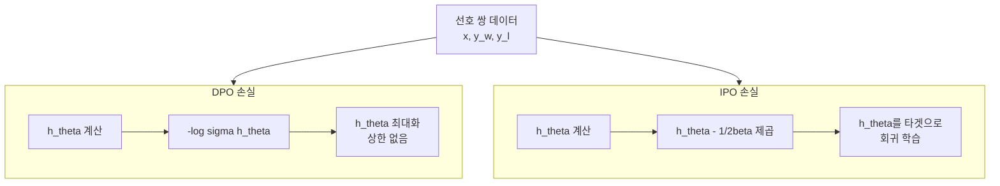
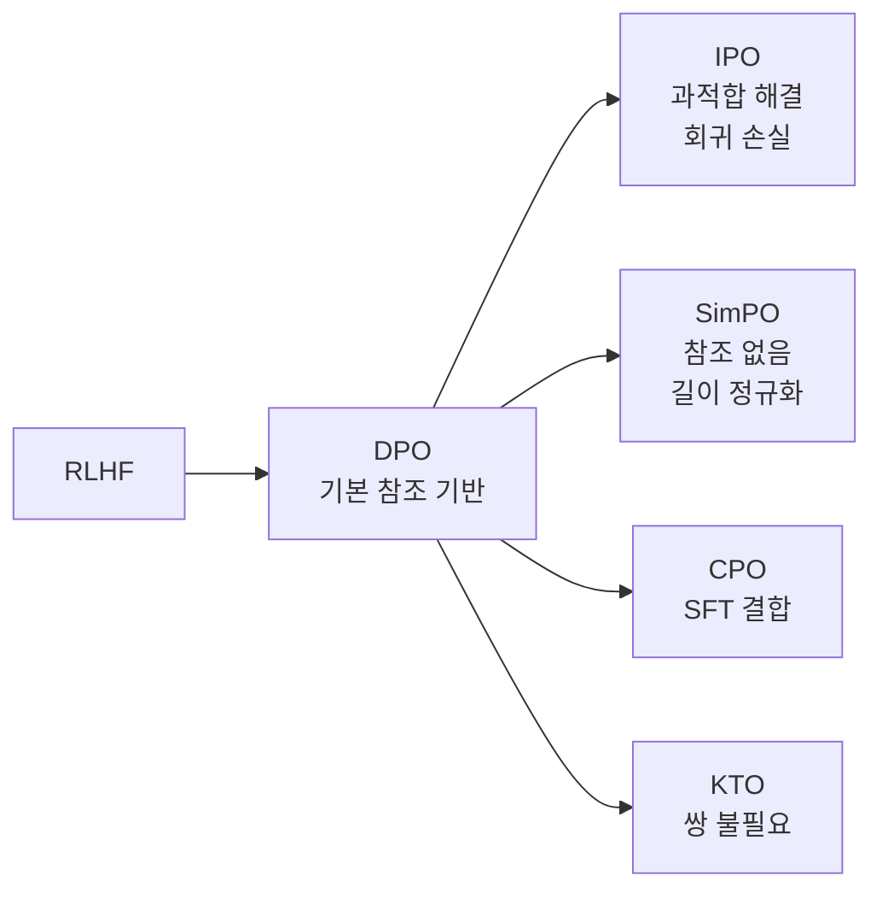

# IPO - Identity Preference Optimization

## 배경과 문제 의식

[[direct-preference-optimization|DPO]]는 명시적 보상 모델 없이 선호 데이터로 LLM을 정렬하는 효과적인 방법이지만, 이론적으로 중요한 결함이 있다. DPO는 Bradley-Terry 쌍 비교 모델에서 **유계(bounded)되지 않은 보상**을 암묵적으로 가정한다. 실제 학습에서 이 가정이 위반되면 다음 현상이 나타난다:

1. **보상 과적합(reward overfitting)**: 선호 응답의 로그 확률이 무한히 커지고 기각 응답은 무한히 작아지는 방향으로 최적화되어, 사실상 의미 있는 정규화 없이 훈련됨.
2. **분포 붕괴**: 모델이 선호 데이터 분포에서 크게 벗어난 영역으로 이탈.
3. **명시적 마진 없음**: DPO 손실에는 선호/기각 응답 사이 확률 차이의 크기를 제어하는 명시적 정규화 항이 없음.

IPO(Identity Preference Optimization)는 이 문제를 이론적으로 해결하기 위해 Bradley-Terry 가정 없이 직접 **확률 차이 거리(probability ratio gap)를 정규화**하는 손실 함수를 유도한다.

## 핵심 이론: 이원 최적화 관점

DPO의 손실은 다음 KL 정규화 보상 최대화 문제의 정확한 해법에서 유도된다:

$$\max_{\pi} \mathbb{E}_{y \sim \pi}[r(y)] - \beta \cdot \text{KL}(\pi \| \pi_{\text{ref}})$$

IPO는 이 최적화 문제 자체에 내재된 가정을 다시 검토한다. Bradley-Terry 모델을 사용하지 않고 선호 함수 $h(y_w, y_l)$를 직접 최적화한다. 최종 유도된 목적 함수는:

$$h_\theta(y_w, y_l \mid x) = \log \frac{\pi_\theta(y_w \mid x)}{\pi_{\text{ref}}(y_w \mid x)} - \log \frac{\pi_\theta(y_l \mid x)}{\pi_{\text{ref}}(y_l \mid x)}$$

IPO는 이 $h_\theta$ 값이 특정 타겟 값 $\tau$에 가까워지도록 학습한다:

## 손실 함수

$$\mathcal{L}_{\text{IPO}} = \mathbb{E}_{(x, y_w, y_l) \sim \mathcal{D}} \left[ \left( h_\theta(y_w, y_l \mid x) - \frac{1}{2\beta} \right)^2 \right]$$

- $h_\theta$: 선호-기각 응답 간 로그 비율 차이 (DPO에서도 사용하는 값)
- $\frac{1}{2\beta}$: 최적 정책에서의 이론적 타겟 값
- MSE(평균 제곱 오차) 형태의 손실로 값이 유계됨

이 손실은 **$h_\theta$를 $\frac{1}{2\beta}$로 수렴시키는 회귀 문제**로 해석된다. DPO는 $h_\theta$를 최대화하려 하지만 IPO는 특정 값으로 고정한다.

### DPO vs IPO 손실 비교

DPO는 $h_\theta$를 단순히 최대화하는 반면, IPO는 이론적 최적값으로 수렴시켜 과적합을 방지한다.

## 과적합 방지 메커니즘 분석

IPO 손실이 DPO보다 과적합에 강한 이유는 다음과 같다:

### 유계된 업데이트 방향

MSE 손실은 $h_\theta$가 타겟 $\frac{1}{2\beta}$에 가까워질수록 그래디언트가 줄어든다. DPO의 크로스 엔트로피 손실은 $h_\theta$가 커질수록 그래디언트가 감소하지만 이론적 상한이 없다.

### 대칭적 학습

IPO는 선호 응답 확률을 무한히 올리거나 기각 응답을 무한히 낮추는 것 모두 손실을 증가시킨다. 타겟으로부터 양 방향 이탈이 모두 페널티를 받는다.

### 명시적 마진

$\frac{1}{2\beta}$ 타겟은 $\beta$ (KL 패널티 강도)와 직접 연결된다. $\beta$가 클수록 타겟이 작아져 참조 모델에 가까운 정책을 유도하고, $\beta$가 작을수록 더 적극적인 정렬이 허용된다.

## 하이퍼파라미터 분석

| 파라미터 | DPO에서의 역할 | IPO에서의 역할 |
|---------|--------------|--------------|
| $\beta$ | KL 패널티 스케일 | KL 패널티 + 타겟 값 결정 |
| 학습률 | 최적화 속도 | 회귀 수렴 속도 |
| 배치 크기 | 그래디언트 안정성 | 그래디언트 안정성 |

IPO에서 $\beta$ 선택이 더 중요하다. $\beta$가 너무 작으면 타겟이 너무 커져 학습이 불안정해지고, 너무 크면 참조 모델에서 거의 벗어나지 않는다. 실용적 범위는 $\beta \in [0.05, 0.5]$.

## 실험 결과와 한계

IPO는 다음 상황에서 DPO보다 우수함이 확인되었다:

- **소규모 데이터셋**: 선호 쌍이 수천 개 미만일 때 DPO보다 안정적.
- **긴 학습**: 에폭을 늘려도 보상 해킹이 적게 발생.
- **정렬 퇴화 저항**: 학습 후 일반 언어 모델링 능력 손실이 DPO보다 적음.

**한계**:
- 참조 모델이 여전히 필요하므로 메모리 비용은 DPO와 동일.
- $\beta$ 튜닝이 민감해 실무에서 추가 탐색 필요.
- 대규모 데이터에서 DPO 대비 우위가 항상 명확하지 않음.

## DPO 변형 방법론과의 위치

IPO는 DPO의 이론적 결함을 수정하는 방향이고, [[simpo-simple-preference|SimPO]]는 참조 모델 제거라는 다른 방향으로 DPO를 개선한다.

## 실무 적용 관점

IPO는 다음 상황에서 DPO보다 적합하다:

- 선호 데이터 규모가 작아 과적합 위험이 높은 경우.
- 정렬 후 일반 성능 저하가 크게 우려되는 경우.
- 긴 학습을 계획하거나 여러 에폭 반복이 필요한 경우.

데이터가 충분하고 빠른 실험이 목표라면 DPO가 실용적 선택일 수 있다.

## 관련 문서

- [[direct-preference-optimization]] - DPO 원본 메커니즘
- [[simpo-simple-preference]] - 참조 없는 DPO 변형
- [[cpo-contrastive-preference]] - SFT와 결합된 선호 최적화
- [[kto]] - 쌍 없는 선호 최적화
- [[orpo]] - 참조 없는 단일 모델 정렬
- [[online-dpo-iterative]] - 온라인/반복 DPO
- [[dpo-paper]] - DPO 원논문 요약
- [[rlhf-and-alignment]] - RLHF와 정렬 전반
