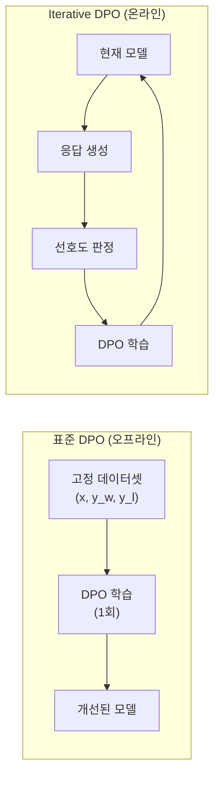
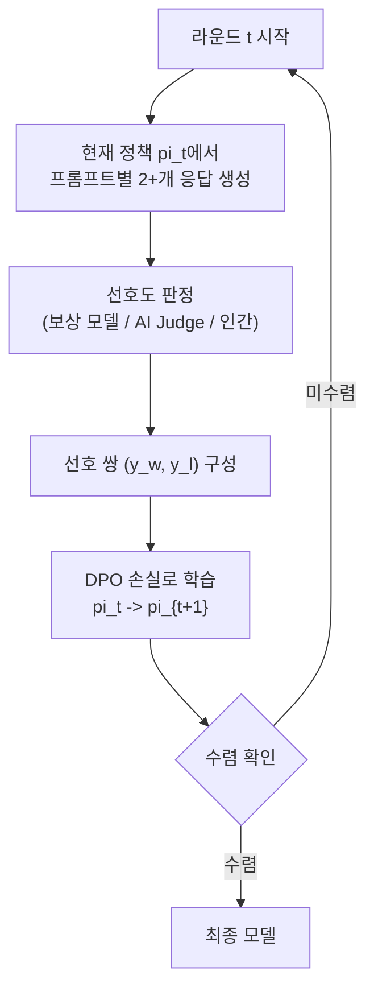

# 반복적 DPO (Iterative/Online DPO)

## 정의

**반복적 DPO(Iterative DPO)**는 표준 [[direct-preference-optimization|DPO]]의 오프라인 학습 한계를 극복하기 위해, 모델이 자신의 현재 정책에서 새로운 응답을 반복적으로 생성하고, 선호도 판정을 받아 DPO 학습을 수행하는 온라인/반복 학습 기법이다. 표준 DPO가 고정된 선호도 데이터셋에서 한 번 학습하는 반면, Iterative DPO는 "생성 -> 판정 -> 학습 -> 반복" 사이클을 통해 분포 이동(distribution shift) 문제를 완화하고 지속적인 성능 향상을 달성한다.

## 표준 DPO의 한계

표준 DPO의 핵심 문제는 **오프라인 학습(offline learning)**에 있다.

1. **분포 이동**: 학습이 진행되면서 모델의 출력 분포가 변하지만, 학습 데이터는 이전 정책(또는 다른 모델)이 생성한 것이다. 현재 모델이 실제로 생성하는 응답과 학습 데이터 사이의 괴리가 점점 커진다.

2. **탐색 부재**: 모델이 새로운 전략을 시도하고 피드백을 받는 과정이 없으므로, 고정 데이터셋의 범위를 넘어서는 개선이 어렵다.

3. **데이터 노후화**: 모델이 개선됨에 따라 기존 학습 데이터의 비선호 응답이 너무 쉬운 네거티브가 되어 학습 신호가 약해진다.

이 다이어그램은 표준 DPO와 반복적 DPO의 구조적 차이를 보여준다. 표준 DPO는 단방향 파이프라인이고, 반복적 DPO는 순환 루프다.

## 핵심 메커니즘

### Iterative DPO 파이프라인

### 단계별 상세

**1단계 - 응답 생성 (On-Policy Sampling)**

현재 모델 $\pi_t$에서 각 프롬프트에 대해 복수의 응답을 샘플링한다. 이것이 "온라인"의 핵심 -- 학습 데이터가 현재 모델의 실제 출력 분포에서 나온다.

**2단계 - 선호도 판정 (Preference Annotation)**

생성된 응답 쌍에 대해 선호도를 결정한다. 판정 주체에 따라 여러 변형이 존재한다.

| 판정 방식 | 장점 | 단점 |
|-----------|------|------|
| 보상 모델 | 빠르고 비용 낮음 | 보상 해킹 위험 |
| AI Judge (GPT-4 등) | 유연한 기준 적용 | 비용 높음, 편향 가능 |
| 인간 평가자 | 가장 정확 | 느리고 비용 최고 |
| 검증기 (수학/코드) | 정확한 이진 신호 | 적용 영역 제한적 |

**3단계 - DPO 학습**

구성된 선호 쌍으로 표준 DPO 손실을 계산하여 모델을 업데이트한다. 참조 모델 $\pi_{ref}$는 보통 라운드 시작 시점의 모델을 사용한다.

**4단계 - 반복**

업데이트된 모델로 1단계부터 다시 시작한다. 일반적으로 3-10 라운드를 수행하며, 각 라운드마다 더 어려운 비교를 학습하게 된다.

## 주요 변형

### Self-Play Fine-Tuning (SPIN)

SPIN(Zephyr 팀, 2024)은 현재 모델 vs 이전 버전 모델의 대결 구도를 활용한다. 현재 모델이 생성한 응답을 비선호 응답으로, 인간이 작성한 참조 응답을 선호 응답으로 사용한다. 모델이 인간 데이터를 완벽히 복제하면 학습이 자연스럽게 수렴하는 이론적 보장이 있다.

### Online DPO (OAIF)

AI Feedback을 활용한 Online DPO(OAIF, 2024)는 강력한 LLM(GPT-4 등)을 심판으로 사용하여 온라인으로 선호도 레이블을 생성한다. 인간 피드백 없이도 반복적 DPO를 구현할 수 있어 비용이 크게 절감된다. [[online-dpo-iterative]] 페이지에서 이 변형을 더 상세히 다룬다.

### Self-Play Preference Optimization (SPPO)

SPPO는 게임 이론의 내쉬 균형 관점에서 접근한다. 두 플레이어(현재 정책 vs 이전 정책)의 2인 제로섬 게임으로 모델링하며, 내쉬 균형에서 인간 선호도의 실제 분포를 복원한다는 이론적 기반을 갖는다.

### Iterative RPO / RLHF-V

비전-언어 모델(VLM) 영역에서도 반복적 DPO가 적용되고 있다. RLHF-V는 멀티모달 환각을 줄이기 위해 이미지-텍스트 쌍에 대해 반복적 선호도 학습을 수행한다.

## [[grpo|GRPO]], [[dapo|DAPO]]와의 비교

Iterative DPO와 GRPO/DAPO는 모두 온라인/반복 학습이라는 공통점을 갖지만, 접근 방식이 다르다.

| 항목 | Iterative DPO | GRPO | DAPO |
|------|---------------|------|------|
| 기반 프레임워크 | DPO (쌍별 비교) | 정책 그래디언트 (RL) | 정책 그래디언트 (RL) |
| 보상 신호 | 쌍별 선호도 | 스칼라 보상 | 스칼라 보상 |
| 어드밴티지 계산 | 암묵적 (선호 쌍) | 그룹 내 정규화 | 동적 샘플링 |
| 크리틱 모델 | 불필요 | 불필요 | 불필요 |
| 수렴 안정성 | 높음 | 중간 | 높음 |

Iterative DPO는 쌍별 비교 구조를 유지하므로 구현이 직관적이고, 기존 DPO 코드베이스에서 확장이 쉽다. 반면 GRPO/DAPO는 그룹 단위 보상 정규화로 더 풍부한 학습 신호를 활용할 수 있다.

## 실무 관점

### 적용 가이드

1. **시작점**: 표준 DPO로 먼저 기본 정렬을 수행한 모델에서 시작하는 것이 효과적
2. **라운드 수**: 3-5 라운드가 일반적. 과도한 반복은 보상 해킹 또는 다양성 감소를 유발
3. **참조 모델 전략**: 매 라운드마다 참조 모델을 갱신할지, 초기 SFT 모델을 고정할지 결정 필요. 고정하면 안정적이지만 보수적, 갱신하면 공격적이지만 불안정할 수 있음
4. **판정 비용 관리**: AI Judge 사용 시 API 비용을 라운드 수와 샘플 수에 따라 미리 추정

### 언제 사용하는가

- 표준 DPO의 성능이 정체되었을 때
- 모델이 학습 데이터와 다른 분포의 응답을 생성할 때
- 보상 모델이나 AI Judge를 이미 보유하고 있을 때
- RL 인프라(PPO 등)를 구축하기 어려울 때

## 관련 문서

- [[direct-preference-optimization]] -- Iterative DPO의 기반이 되는 표준 DPO
- [[online-dpo-iterative]] -- AI 피드백 기반 온라인 DPO 변형
- [[grpo]] -- 그룹 보상 정규화 기반 정책 최적화
- [[dapo]] -- GRPO의 발전형, 동적 샘플링 도입
- [[reward-model-training]] -- 판정 단계에서 사용하는 보상 모델
- [[kl-divergence-penalty]] -- DPO 손실에서 참조 모델과의 거리 제어
- [[rlhf-pipeline]] -- Iterative DPO가 대안을 제시하는 전체 RLHF 파이프라인
