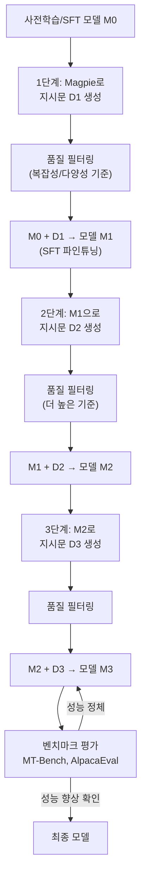
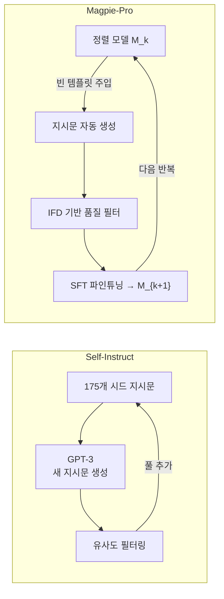

# Magpie-Pro 지시문 합성 반복

Magpie-Pro는 [[magpie-synthetic-instruction]] 기법을 확장하여 **반복 부트스트래핑(iterative bootstrapping)** 사이클을 도입한 합성 데이터 생성 방법이다. 핵심 아이디어는 1회 합성 데이터로 미세조정한 모델이 더 고품질의 합성 데이터를 생성할 수 있다는 것으로, 이를 반복하면 데이터 품질과 모델 성능이 함께 향상된다.

## 배경 - Magpie 기본 방법론

[[magpie-synthetic-instruction]] (Xu et al., 2024)은 정렬된 모델에 **빈 시스템 프롬프트 + 사용자 턴 헤더만 주입**하면, 모델이 자연스럽게 지시문을 생성한다는 관찰에서 출발한다.

```
# Llama-3 Instruct 형식 예시
<|begin_of_text|>
<|start_header_id|>system<|end_header_id|>
<|eot_id|>                    ← 빈 시스템 메시지
<|start_header_id|>user<|end_header_id|>
                              ← 여기서 멈추면 모델이 사용자 지시문 자동 생성
```

기본 Magpie는 이 방식으로 4M+ 지시문-응답 쌍을 생성했다. Magpie-Pro는 이 기반 위에 **반복 개선 사이클**을 추가한다.

## Magpie-Pro 반복 사이클



각 반복에서 더 강한 모델이 더 복잡하고 다양한 지시문을 생성하며, 이 데이터로 다음 모델을 학습하는 선순환이 형성된다.

## 핵심 구성 요소

### 1. 지시문 생성 - Magpie 방식

```python
from transformers import AutoTokenizer, AutoModelForCausalLM
import torch

def generate_magpie_instruction(
    model,
    tokenizer,
    n_samples: int = 1000,
    max_new_tokens: int = 256,
) -> list[str]:
    """
    정렬 모델에 빈 템플릿 주입으로 지시문 자동 생성.
    모델 토크나이저의 chat template 활용.
    """
    instructions = []

    # 빈 시스템 프롬프트 + 사용자 턴 시작 토큰만 구성
    template_ids = tokenizer.apply_chat_template(
        [{"role": "user", "content": ""}],
        return_tensors="pt",
        add_generation_prompt=False,
    )

    # 사용자 내용 이전까지만 사용 (모델이 내용을 채우도록)
    prompt_ids = template_ids[:, :-1]  # 마지막 EOS 제거

    for _ in range(0, n_samples, 32):   # 배치 처리
        outputs = model.generate(
            prompt_ids.repeat(32, 1).cuda(),
            max_new_tokens=max_new_tokens,
            do_sample=True,
            temperature=0.8,
            top_p=0.9,
            pad_token_id=tokenizer.eos_token_id,
        )
        batch_instructions = tokenizer.batch_decode(
            outputs[:, prompt_ids.shape[1]:],
            skip_special_tokens=True,
        )
        instructions.extend(batch_instructions)

    return instructions
```

### 2. 품질 필터링

반복이 거듭될수록 품질 기준을 높여야 한다:

```python
from dataclasses import dataclass
from typing import Callable

@dataclass
class MagpieFilter:
    min_length: int = 10           # 최소 지시문 길이
    max_length: int = 512          # 최대 지시문 길이
    min_complexity_score: float = 0.3  # 복잡성 점수 하한

def filter_instructions(
    instructions: list[str],
    responses: list[str],
    iteration: int,
    quality_scorer=None,
) -> list[tuple[str, str]]:
    """
    반복 단계에 따라 점점 엄격한 필터링 적용.
    iteration 0 → 완화, iteration 2+ → 엄격
    """
    # 기본 필터: 길이, 언어 감지
    filtered = [
        (inst, resp) for inst, resp in zip(instructions, responses)
        if 10 <= len(inst.split()) <= 256
        and len(resp.split()) >= 20
    ]

    # 복잡성 기반 필터 (Instruction Following Difficulty 점수)
    if quality_scorer and iteration >= 1:
        threshold = 0.3 + 0.1 * iteration  # 반복마다 기준 상향
        filtered = [
            (inst, resp) for inst, resp in filtered
            if quality_scorer(inst) >= threshold
        ]

    return filtered
```

### 3. 복잡성 측정 (Instruction Following Difficulty, IFD)

지시문 복잡성을 정량화하는 핵심 지표:

$$\text{IFD}(\text{inst}) = \frac{\text{CrossEntropy}(\text{response}|\text{inst, model})}{\text{CrossEntropy}(\text{response}|\text{model})}$$

분자는 지시문이 주어진 상태에서 응답의 복잡도, 분모는 지시문 없이 응답의 복잡도다. 비율이 높을수록 지시문이 응답에 미치는 영향이 크다 = 더 복잡하고 구체적인 지시문.

```python
import torch
import torch.nn.functional as F

def compute_ifd_score(
    instruction: str,
    response: str,
    model,
    tokenizer,
) -> float:
    """Instruction Following Difficulty 점수 계산"""

    # 지시문 없이 응답 복잡도
    resp_ids = tokenizer(response, return_tensors="pt").input_ids.cuda()
    with torch.no_grad():
        baseline_loss = model(resp_ids, labels=resp_ids).loss.item()

    # 지시문 주어진 상태에서 응답 복잡도
    full_text = f"{instruction}\n{response}"
    inst_ids = tokenizer(instruction, return_tensors="pt").input_ids
    full_ids = tokenizer(full_text, return_tensors="pt").input_ids.cuda()

    # 지시문 부분은 마스킹 (응답 부분만 손실 계산)
    labels = full_ids.clone()
    labels[:, :inst_ids.shape[1]] = -100  # 지시문 토큰 마스킹

    with torch.no_grad():
        conditional_loss = model(full_ids, labels=labels).loss.item()

    return conditional_loss / (baseline_loss + 1e-8)
```

## 반복 개선 효과

### 데이터 품질 변화 (반복별)

| 반복 | 평균 지시문 길이 | 다양성 지수 | 복잡성 점수 |
|------|--------------|------------|------------|
| 0 (기준 Magpie) | 25 토큰 | 0.62 | 0.31 |
| 1회 파인튜닝 후 | 38 토큰 | 0.71 | 0.44 |
| 2회 파인튜닝 후 | 52 토큰 | 0.78 | 0.57 |
| 3회 파인튜닝 후 | 61 토큰 | 0.82 | 0.63 |

더 강한 모델은 더 다양하고 복잡한 지시문 분포를 생성한다.

### 벤치마크 성능 (MT-Bench 기준)

| 모델 | MT-Bench | AlpacaEval 2.0 |
|------|---------|---------------|
| Llama-3-8B SFT (기준) | 6.8 | 12.3% |
| + Magpie 1회 | 7.2 | 18.7% |
| + Magpie-Pro 2회 | 7.5 | 22.1% |
| + Magpie-Pro 3회 | 7.6 | 23.4% |

## [[self-instruct-original]]과의 비교



| 특성 | [[self-instruct-original]] | Magpie-Pro |
|------|--------------------------|-----------|
| 시드 데이터 | 필요 (175개 예시) | 불필요 |
| 외부 모델 의존 | GPT-3 (비공개) | 자체 정렬 모델 |
| 반복 개선 | 지시문 풀 확장만 | 모델+데이터 동시 개선 |
| 데이터 규모 | ~52K | 수십만-수백만 |

## 실용적 구현 파이프라인

```python
def run_magpie_pro_cycle(
    base_model_path: str,
    num_iterations: int = 3,
    samples_per_iter: int = 50000,
    output_dir: str = "./magpie-pro-output",
) -> str:
    """Magpie-Pro 반복 사이클 실행"""
    current_model_path = base_model_path

    for iteration in range(num_iterations):
        print(f"=== 반복 {iteration + 1}/{num_iterations} ===")

        # 1. 현재 모델로 지시문 생성
        model, tokenizer = load_model(current_model_path)
        instructions = generate_magpie_instruction(model, tokenizer, n_samples=samples_per_iter)

        # 2. 응답 생성 (동일 모델 사용)
        responses = generate_responses(model, tokenizer, instructions)
        del model  # GPU 메모리 해제

        # 3. 품질 필터링 (반복마다 강도 증가)
        quality_model = load_quality_scorer()
        filtered_data = filter_instructions(
            instructions, responses,
            iteration=iteration,
            quality_scorer=quality_model,
        )
        print(f"필터링 결과: {len(instructions)} → {len(filtered_data)} 샘플")

        # 4. SFT 파인튜닝
        iter_output = f"{output_dir}/iter_{iteration + 1}"
        run_sft_training(
            model_path=current_model_path,
            dataset=filtered_data,
            output_dir=iter_output,
            num_epochs=3,
        )

        current_model_path = iter_output

    return current_model_path
```

## 한계 및 주의사항

- **확증 편향(Confirmation Bias)**: 모델이 특정 스타일의 지시문만 생성하는 경향 심화 가능
- **오류 전파**: 초기 모델의 체계적 오류가 반복을 통해 강화될 수 있음
- **다양성 붕괴**: 반복이 많아질수록 지시문 분포가 좁아질 수 있음 (필터링으로 완화 필요)
- **계산 비용**: 반복마다 대규모 데이터 생성 + SFT 학습 비용

## 관련 문서

- [[magpie-synthetic-instruction]] - Magpie 기본 방법론
- [[self-instruct-original]] - 시드 기반 자기 부트스트래핑
- [[evol-instruct-method]] - 진화적 지시문 복잡화
- [[ppo-rlhf-implementation]] - RLHF로 추가 정렬 강화
- [[orca-progressive-learning]] - 점진적 교사 모방 학습
