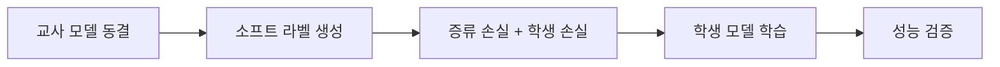

# 지식 증류 (Knowledge Distillation)

## 개요

지식 증류(Knowledge Distillation)는 대형 "교사(teacher)" 모델의 지식을 소형 "학생(student)" 모델로 전이하는 모델 압축 기법이다. 교사 모델의 소프트 확률 분포(soft probability distribution)가 하드 라벨보다 훨씬 풍부한 정보를 담고 있다는 핵심 통찰에 기반한다. 2026년 현재 P-KD-Q 파이프라인과 GKD(Generalized Knowledge Distillation)가 LLM 압축의 표준 접근법으로 자리잡았다.

## 핵심 개념

### 교사-학생 전이 메커니즘

교사 모델은 하드 라벨 대신 소프트 타겟을 제공한다. 예를 들어 "파리"라는 정답에 대해 하드 라벨은 단순히 정답/오답만 전달하지만, 소프트 타겟은 "파리 92%, 리옹 5%, 프랑스 3%"처럼 대안 간 관계 정보까지 전달한다.

**손실 함수 구성**:

```
Total Loss = alpha * Distillation Loss + (1 - alpha) * Student Loss
```

- **Distillation Loss**: 교사와 학생의 소프트 확률 분포 간 KL 발산([[kl-divergence-penalty|KL divergence]])
- **Student Loss**: 정답 라벨에 대한 교차 엔트로피(cross-entropy)
- **alpha**: 교사 가이던스와 정답 간 균형 조절 (일반적 범위: 0.5-0.9)

### 온도(Temperature) 파라미터

온도 T는 softmax 분포를 부드럽게(smooth) 만들어 교사의 대안 간 신뢰도 수준을 노출한다:

| 온도 범위 | 효과 | 활용 |
|-----------|------|------|
| T = 3-5 | 비교적 선명한 분포 | 하드 라벨에 가까운 학습 |
| T = 10-15 | 부드러운 분포 | 풍부한 관계 정보 전달 |
| T = 15-20 | 매우 부드러운 분포 | 최대 정보 추출 (Hinton 원논문) |

베이지안 프레임워크에서 온도는 사전 확률(prior)의 분산 파라미터로 해석될 수 있다.

### P-KD-Q 파이프라인

최적 압축 순서는 Pruning(가지치기) -> Knowledge Distillation(지식 증류) -> Quantization([[ai-inference-quantization-2026|양자화]])이다:

| 단계 | 목적 | 영향 |
|------|------|------|
| **Pruning (P)** | 중복 파라미터 제거 | 구조적 기반 확립 |
| **Distillation (KD)** | 지식 전이로 재학습 | 남은 파라미터 최적화, 능력 회복 |
| **Quantization (Q)** | 수치 정밀도 축소 | 구조에 간섭하지 않는 최종 압축 |

**순서가 중요한 이유**: 양자화를 증류 전에 수행하면 perplexity가 한 자릿수 이상 급등하는 것으로 보고되었다. 양자화된 모델은 소프트 라벨 생성 능력이 제한되기 때문이다.

### GKD (Generalized Knowledge Distillation)

기존 증류가 교사 생성 시퀀스만 사용하는 반면, GKD는 학생이 직접 생성한 시퀀스에 교사의 피드백을 통합한다. 학생 모델의 실제 출력 분포에 맞춘 학습이 가능해져, 학습-추론 간 분포 불일치(distribution mismatch) 문제를 완화한다.

### LLM 증류의 고유 과제

전통적 증류와 달리 LLM 증류는 다음과 같은 고유한 과제를 수반한다:

- **스케일 차이**: 약 50,000 토큰 어휘에 대한 자기회귀 토큰 분포를 순차적으로 증류해야 함
- **아키텍처 이질성**: 구조적으로 다른 모델 간 증류 시 레이어 리매핑(layer remapping) 전략 필요
- **지식 분산**: LLM은 깊은 레이어 스택과 멀티 헤드 어텐션에 걸쳐 지식이 분산 저장
- **동적 적응**: 교사 모델이 RLHF 등으로 지속 진화하는 환경 대응
- **로짓 이외의 지식**: 은닉 상태 활성화, 중간 레이어, 어텐션 행렬, 관계적 지식까지 전이 대상 확장

## 작동 원리



1. 사전 학습된 교사 모델을 동결 상태로 유지
2. 학습 데이터를 교사에 통과시켜 소프트 라벨 생성
3. 증류 손실과 학생 자체 손실의 가중합으로 학생 모델 학습
4. 교사, 기준 학생, 증류 학생 간 정확도 비교 검증

## 성능/효과

### 대표 벤치마크 결과

| 모델 | 파라미터 감소 | 추론 속도 | 정확도 유지 | 비고 |
|------|-------------|-----------|-------------|------|
| DistilBERT | 40% | 60% 빠름 | GLUE 97% | BERT-base 대비 |
| TinyBERT-4 | 86.7% | BERT의 10.6% | 동등 수준 | DistilBERT 대비 파라미터 28%, 추론 31% |
| TinyBERT-6 | 상당 감소 | 상당 감소 | GLUE 동등 | BERT-base와 성능 동일 |

### 배포 대상별 권장 접근법

| 배포 환경 | 권장 방법 | 근거 |
|-----------|----------|------|
| 클라우드 | 양자화 단독 | 리소스 소비 감소에 집중 |
| 에지/모바일 | 증류 | 온디바이스 추론 가능 수준으로 압축 |
| IoT/임베디드 | 증류 + 가지치기 + 양자화 (P-KD-Q) | 극한 제약 환경 |

### 추가 수치

- 일부 기법은 원본 학습 데이터의 3% 미만으로도 효과적 지식 전이 달성
- P-KD-Q 순서 준수 시 양자화 단독 대비 현저한 품질 보존
- 실시간 채팅: 저지연 응답 필수 환경에서 3배 속도 향상
- 문서 처리: 동일 워크로드를 1/3 컴퓨트 비용으로 처리 가능

## 증류 기법의 분류

| 증류 패러다임 | 설명 | 활용 사례 |
|-------------|------|-----------|
| 근거 기반(Rationale-based) | 교사의 추론 과정(CoT)을 학생에 전이 | 수학/논리 추론 |
| 불확실성 인식(Uncertainty-aware) | 교사의 신뢰도 정보를 함께 전달 | 안전 관련 응용 |
| 다중 교사(Multi-teacher) | 여러 교사 모델의 앙상블 지식 전이 | 범용 능력 보존 |
| 동적 적응(Dynamic) | 학생 진행도에 따라 교사 가이던스 조절 | 효율적 학습 |
| 태스크 특화(Task-specific) | 특정 태스크에 최적화된 증류 | 도메인 전문 모델 |

### 증류 vs 다른 압축 기법

증류는 [[lora-qlora-finetuning]]이나 가지치기(pruning)와 다른 축의 압축이다. LoRA/QLoRA가 기존 모델을 효율적으로 적응시키는 것이라면, 증류는 아예 새로운(더 작은) 모델을 처음부터 학습시키되 교사의 지식을 활용하는 것이다. 실전에서는 이들을 조합하여 사용하는 것이 일반적이다: 증류로 소형 모델을 만들고, LoRA로 도메인 특화하며, 양자화로 추론을 최적화한다.

## 관련 문서
- [[knowledge-distillation-llm]] -- LLM 지식 증류
- [[continual-learning]] -- 지속적 학습 (Continual Learning)
- [[synthetic-data-training]]

- [[lora-qlora-finetuning]] -- 파인튜닝 기반 모델 적응 기법
- [[small-language-models]] -- 증류의 주요 활용처인 소형 모델
- [[turboquant]] -- 양자화 기반 추론 최적화
