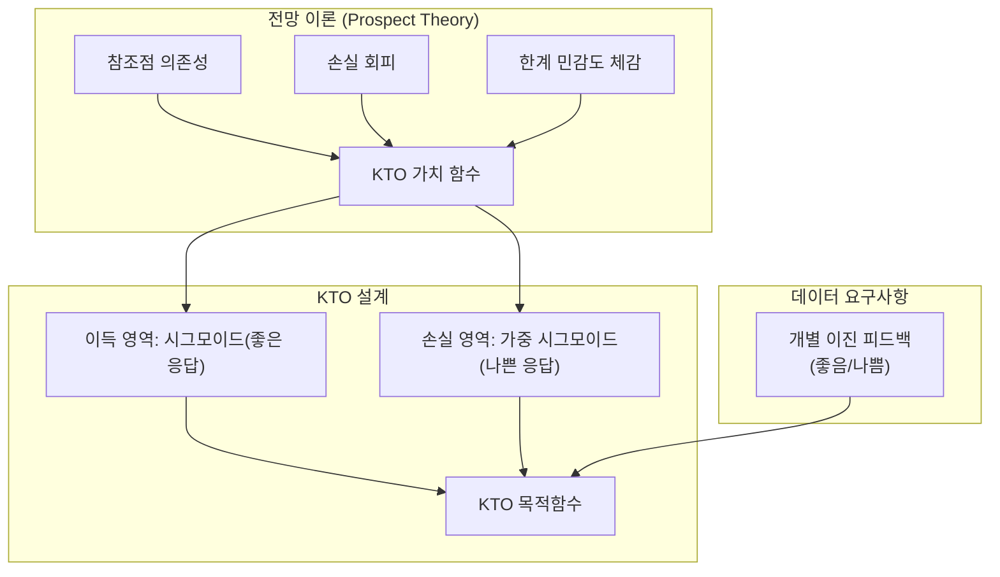
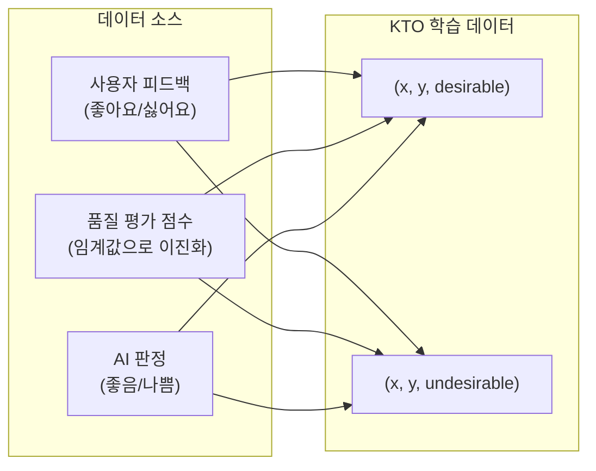

# KTO (Kahneman-Tversky Optimization)

## 개요

KTO(Kahneman-Tversky Optimization)는 Ethayarajh et al. (2024)이 제안한 LLM 정렬 알고리즘으로, 행동경제학의 전망 이론(Prospect Theory)에 기반하여 선호도 최적화를 수행한다. 기존 [[direct-preference-optimization|DPO]]가 "응답 A가 응답 B보다 낫다"는 쌍별(pairwise) 선호도 데이터를 요구하는 반면, KTO는 "이 응답이 좋다/나쁘다"는 개별(pointwise) 이진 신호만으로 학습할 수 있다. 1B에서 30B 규모까지 쌍별 방법과 동등하거나 우수한 성능을 보이며, 데이터 수집 비용을 크게 절감한다. ICML 2024에서 발표되었다.

논문: "KTO: Model Alignment as Prospect Theoretic Optimization" (arXiv: 2402.01306)

## 이론적 기반: 전망 이론(Prospect Theory)

### Kahneman-Tversky 전망 이론

Daniel Kahneman과 Amos Tversky가 1979년에 제안한 전망 이론은 인간이 확률적 결과를 인지하는 방식에 체계적 편향이 있음을 설명한다. 핵심 특성:

1. **참조점 의존성(Reference Dependence)**: 결과의 절대값이 아닌 참조점 대비 이득/손실로 평가
2. **손실 회피(Loss Aversion)**: 동일 크기의 손실이 이득보다 심리적으로 더 크게 느껴짐 (약 2-2.5배)
3. **한계 민감도 체감(Diminishing Sensitivity)**: 이득/손실의 크기가 커질수록 추가 단위의 주관적 가치가 감소

### LLM 정렬에의 적용

Ethayarajh et al.은 DPO 등 기존 정렬 방법의 목적함수가 이미 전망 이론의 편향을 암묵적으로 반영하고 있으며, 이들 방법의 성공이 부분적으로 이 특성 덕분이라고 분석했다. 이러한 인간 인지 편향을 반영하는 손실 함수 군을 "인간 인식 손실(Human-Aware Losses, HALOs)"이라 명명했다.

## 핵심 메커니즘

### 가치 함수(Value Function)

전망 이론의 가치 함수를 LLM 정렬에 적용한 KTO의 가치 함수는 다음 특성을 갖는다:

- **참조점**: 입력-출력 쌍 (x, y) 분포의 기대값으로 정의. KL 발산의 기대값이 참조점 역할
- **이득 영역(Gains)**: 좋은 응답(y_desirable)에 대해 오목(concave)한 가치 함수 적용
- **손실 영역(Losses)**: 나쁜 응답(y_undesirable)에 대해 볼록(convex)하고 더 가파른(steeper) 가치 함수 적용

핵심 수학적 구조에서, 시그모이드 함수가 전망 이론의 지수 함수 대신 사용된다. 참조점은 (x, y) 분포에 대한 [[kl-divergence-penalty|KL 발산]]의 기대값으로 직접 정의된다.

### 쌍별 데이터가 불필요한 이유

| 측면 | DPO | KTO |
|------|-----|-----|
| 데이터 형태 | (x, y_w, y_l) 쌍 | (x, y, label) 개별 |
| 라벨 | "A가 B보다 나음" | "좋음" 또는 "나쁨" |
| 동일 프롬프트 요구 | 두 응답이 같은 프롬프트 필요 | 프롬프트별 단일 응답 가능 |
| 데이터 수집 비용 | 높음 (비교 판단 필요) | 낮음 (절대 평가) |

DPO는 동일 프롬프트에 대한 두 응답의 상대적 비교가 필요하므로 데이터 수집에 제약이 크다. KTO는 각 응답에 대한 독립적인 "좋음/나쁨" 판단만 있으면 되므로, 기존에 수집된 평가 데이터나 사용자 피드백(좋아요/싫어요)을 직접 활용할 수 있다.

### 손실 회피와 비대칭 학습

KTO에서 손실 회피는 나쁜 응답에 대한 패널티가 좋은 응답에 대한 보상보다 더 강하게 작용하도록 구현된다. 이는 전망 이론의 핵심 통찰 -- 인간은 이득보다 손실에 더 민감하다 -- 을 직접 반영한다.

실제 구현에서는 손실 회피 계수(lambda_D, lambda_U)로 좋은/나쁜 응답의 가중치를 조절한다. 일반적으로 나쁜 응답의 가중치가 더 크게 설정되어, 모델이 유해하거나 저품질인 출력을 더 적극적으로 회피하도록 학습된다.

## HALOs (Human-Aware Losses) 프레임워크

### 통합적 관점

Ethayarajh et al.은 DPO, IPO, SLiC 등 기존 선호도 최적화 방법들이 모두 HALOs 프레임워크의 특수한 경우임을 보였다. HALOs의 핵심 특성:

1. 참조점 대비 상대적 평가 수행
2. 이득과 손실을 비대칭적으로 처리
3. 인간의 인지적 편향을 구조적으로 반영

KTO는 이 프레임워크에서 전망 이론의 Kahneman-Tversky 모델을 직접 적용한 HALO로, 생성물의 효용(utility)을 선호도 로그 우도가 아닌 직접적으로 최대화한다.

## 실증 결과

### 스케일별 성능

- **1B-30B** 규모에서 DPO 등 쌍별 방법과 동등하거나 우수한 성능
- 특히 데이터가 제한적인 상황에서 KTO의 우위가 두드러짐
- 쌍별 데이터의 절반 수준의 데이터량으로도 경쟁력 있는 성능 달성

### 데이터 효율성

KTO의 가장 큰 실용적 장점은 데이터 수집의 유연성이다:

- 사용자의 좋아요/싫어요 피드백을 직접 학습 데이터로 변환 가능
- 기존 품질 평가 데이터(점수 기반)를 이진 레이블로 변환하여 활용
- [[preference-data-collection|선호도 데이터 수집]]의 쌍 매칭 제약이 제거

## 실전 적용 가이드

### 데이터 구성

- **좋은/나쁜 응답 비율**: 극단적 불균형은 피하되, 반드시 1:1일 필요는 없음. 논문에서는 lambda 파라미터로 불균형 보정
- **품질 임계값**: 점수 기반 데이터를 이진화할 때 임계값 선택이 중요. 중간 품질 응답의 처리 전략 필요

### DPO 대비 선택 기준

KTO가 유리한 경우:
- 쌍별 비교 데이터가 없고, 개별 평가 데이터만 존재할 때
- 사용자 피드백(thumbs up/down)을 직접 활용하고 싶을 때
- 데이터 수집 비용을 최소화해야 할 때

DPO가 유리한 경우:
- 이미 고품질 쌍별 선호도 데이터가 확보되어 있을 때
- 미묘한 품질 차이를 구분해야 하는 과제일 때

## DPO 변형 계보에서의 위치

KTO는 [[direct-preference-optimization|DPO]]에서 파생된 선호도 최적화의 주요 흐름 중 "데이터 요구사항 완화" 방향을 대표한다. DPO가 보상 모델을 제거했고, [[orpo|ORPO]]가 SFT 단계를 통합했다면, KTO는 쌍별 데이터 요구를 제거하여 정렬 학습의 접근성을 한 단계 더 넓혔다. 세 접근법 모두 [[rlhf-pipeline|RLHF 파이프라인]]의 복잡성을 서로 다른 축에서 줄이는 것을 목표로 한다.

## 관련 페이지

- [[direct-preference-optimization|DPO]] - KTO의 기반이 되는 쌍별 선호도 최적화
- [[orpo|ORPO]] - SFT와 선호도 최적화를 통합한 또 다른 변형
- [[rlhf-pipeline|RLHF 파이프라인]] - KTO가 단순화하는 전체 후학습 프로세스
- [[reward-model-training|보상 모델 학습]] - 전통적 보상 모델 기반 접근과의 비교
- [[kl-divergence-penalty|KL 발산 패널티]] - KTO의 참조점으로 사용되는 KL 발산
- [[preference-data-collection|선호도 데이터 수집]] - KTO의 데이터 요구사항 완화
- [[supervised-fine-tuning|SFT]] - KTO의 전단계 또는 통합 대상
