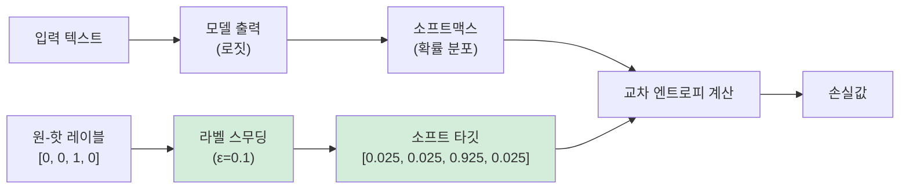

# 라벨 스무딩 (Label Smoothing)

## 개요

**라벨 스무딩(label smoothing)** 은 원-핫(one-hot) 하드 레이블을 부드러운 소프트 타깃(soft target)으로 대체하는 정규화 기법이다. Szegedy et al. (2016) "Rethinking the Inception Architecture for Computer Vision"에서 제안됐으며, Transformer 원논문 "Attention Is All You Need" (Vaswani et al. 2017)에도 적용됐다.

핵심 직관: 모델이 정답 클래스에 대해 과도한 자신감(overconfidence)을 갖는 것을 방지한다. "이것은 100% 확실히 A다"가 아니라 "이것은 아마 A일 것이다"라고 학습하게 한다.

## 수학적 정의

원-핫 인코딩에서 소프트 타깃으로의 변환:

$$q_i = \begin{cases} 1 - \varepsilon & \text{if } i = y \text{ (정답 클래스)} \\ \varepsilon / (K-1) & \text{otherwise} \end{cases}$$

더 일반적인 형태 (균일 분포 혼합):

$$q_i = (1 - \varepsilon) \cdot \delta_{iy} + \varepsilon / K$$

- $\varepsilon$: 스무딩 파라미터 (일반적으로 0.1)
- $K$: 클래스(어휘) 수
- $\delta_{iy}$: 정답 클래스에서만 1인 델타 함수

예시 (K=5, y=2, ε=0.1):

| 클래스 | 원-핫 | 스무딩 후 |
|--------|-------|-----------|
| 0 | 0.0 | 0.02 |
| 1 | 0.0 | 0.02 |
| 2 (정답) | 1.0 | 0.92 |
| 3 | 0.0 | 0.02 |
| 4 | 0.0 | 0.02 |

## 손실 함수와의 관계

라벨 스무딩이 적용된 교차 엔트로피(cross-entropy) 손실:

$$\mathcal{L}_{LS} = (1-\varepsilon) \cdot \mathcal{L}_{CE} + \varepsilon \cdot H(u, p)$$

여기서:
- $\mathcal{L}_{CE}$: 원래 교차 엔트로피 손실
- $H(u, p)$: 균일 분포 $u$와 모델 예측 $p$ 사이의 교차 엔트로피
- 두 번째 항이 KL 발산 정규화 역할

## 효과

### 과신뢰 방지

원-핫 타깃은 정답 로짓을 무한대로 밀어붙이는 방향으로 학습된다. 이는:
- 학습 데이터에 과적합
- 소프트맥스 출력이 0이나 1에 집중 (확률 포화)
- 분포 외(out-of-distribution) 샘플에 부정확한 자신감

라벨 스무딩은 모델이 어떤 단일 클래스에 완전히 집중하지 않도록 제약한다.

### 캘리브레이션 개선

**캘리브레이션(calibration)** 은 모델이 예측한 확률이 실제 정확도와 얼마나 일치하는지를 나타낸다. "90% 자신감"으로 예측한 샘플들이 실제로 90% 맞아야 잘 캘리브레이션된 것이다.

라벨 스무딩은 일반적으로 캘리브레이션을 향상시킨다. 모델이 덜 극단적인 확률을 출력하도록 유도하기 때문이다.

단, 이 관계는 단순하지 않다. Müller et al. (2019) "When Does Label Smoothing Help?"는 라벨 스무딩이 모델 자신의 특징 표현(representation)을 그룹화하는 방식에도 영향을 준다고 보고했다.

### 일반화 향상

정규화 효과로 테스트 성능이 개선되는 경향이 있다. Transformer 원논문에서는 ε=0.1로 BLEU 점수가 향상됐다.

## Transformer 원논문에서의 사용

Vaswani et al. (2017)은 라벨 스무딩 ε=0.1을 영어-독일어, 영어-프랑스어 번역 실험에 모두 적용했다. 논문에서는 "이로 인해 모델이 더 불확실하게 학습되어 perplexity가 높아지지만 BLEU 점수와 정확도가 향상된다"고 언급한다.

## 지식 증류와의 연결

**지식 증류(knowledge distillation)** (Hinton et al. 2015)도 소프트 타깃을 사용한다는 점에서 라벨 스무딩과 맥락이 닿아 있다.

- **라벨 스무딩**: 균일 분포와 혼합한 소프트 타깃
- **지식 증류**: 교사 모델(teacher model)의 출력 분포를 소프트 타깃으로 사용

지식 증류는 라벨 스무딩보다 더 많은 정보를 담은 소프트 타깃을 제공한다. 교사 모델이 "이것은 3이지만 8과 헷갈릴 수 있다"는 구조적 정보를 전달하기 때문이다.

## 온도 스케일링과의 관계

**캘리브레이션** 측면에서 라벨 스무딩의 대안은 **온도 스케일링(temperature scaling)** (Guo et al. 2017)이다.

온도 스케일링은 학습 후 단일 온도 파라미터 T를 소프트맥스에 적용해 캘리브레이션을 사후 보정한다:

$$P_T(y=k \mid x) = \frac{\exp(z_k / T)}{\sum_j \exp(z_j / T)}$$

T > 1이면 분포가 평탄해져 모델이 덜 확신하게 된다.

| 기법 | 적용 시점 | 파라미터 수 | 목적 |
|------|-----------|-------------|------|
| 라벨 스무딩 | 학습 중 | ε 하나 | 정규화 + 캘리브레이션 |
| 온도 스케일링 | 학습 후 | T 하나 | 캘리브레이션만 |
| Platt 스케일링 | 학습 후 | 2개 | 캘리브레이션만 |

## 실무 가이드라인

- **분류 태스크**: ε=0.1이 일반적인 시작점
- **NMT/언어 생성**: ε=0.1이 Transformer 기본값
- **소규모 데이터셋**: 더 높은 ε (0.2-0.3) 고려
- **이미 캘리브레이션이 좋은 경우**: 효과가 적을 수 있음
- **지식 증류와 함께 사용**: 중복 효과가 있을 수 있으므로 ablation 필요

## 단점 및 주의사항

- 레이블 오류(label noise)가 많은 데이터셋에서는 오히려 오류를 강화할 수 있음
- Müller et al. (2019)에 따르면 라벨 스무딩이 적용된 모델을 교사로 쓰는 지식 증류는 성능이 떨어질 수 있음 (교사의 소프트 타깃 정보가 손상됨)
- 캘리브레이션 개선이 항상 보장되지는 않음

## 관련 문서

- [[교차 엔트로피 손실]] - 라벨 스무딩이 적용되는 기본 손실 함수
- [[지식 증류]] - 소프트 타깃을 활용하는 관련 기법
- [[과적합과 정규화]] - 라벨 스무딩이 속하는 정규화 범주
- [[캘리브레이션]] - 예측 확률의 신뢰도 측정 및 개선
- [[Transformer]] - 라벨 스무딩이 원논문부터 적용된 아키텍처
