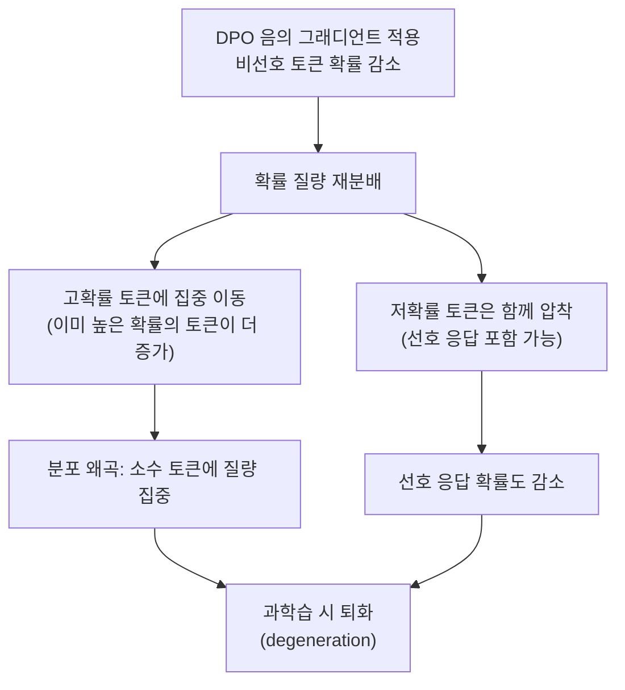
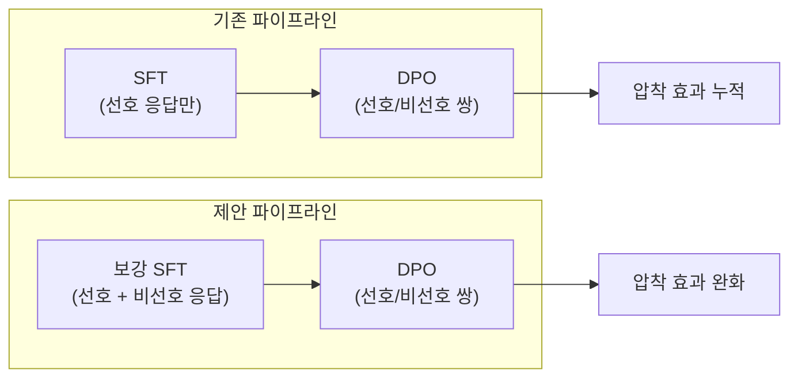

# LLM 파인튜닝 학습 동역학

## 개요

LLM 파인튜닝 학습 동역학(Learning Dynamics of LLM Finetuning)은 [[supervised-fine-tuning|지도 파인튜닝(SFT)]]과 [[direct-preference-optimization|DPO]] 등 후학습(post-training) 과정에서 모델 내부의 토큰 확률 분포가 학습 스텝별로 어떻게 변화하는지를 분석하는 프레임워크이다. Ren 등(arXiv 2407.10490)이 제안하였으며, ICLR 2025에서 Oral 발표와 Outstanding Paper Award를 수상했다. 이 연구는 SFT 후 발생하는 특정 유형의 환각(hallucination) 강화 현상과 DPO의 과도한 학습 시 선호 응답마저 확률이 감소하는 현상을 "압착 효과(squeezing effect)"라는 통합 프레임워크로 설명한다.

## 핵심 프레임워크: 스텝별 영향 분해

### 토큰 확률 분포의 동역학

파인튜닝 과정에서 모델이 특정 입력 x에 대해 토큰 y를 생성할 확률 P(y|x)는 매 학습 스텝마다 변화한다. 이 연구의 핵심 기여는 이 확률 변화를 각 학습 스텝의 영향(influence)으로 분해하여 추적하는 방법을 제안한 것이다. 즉 "학습 데이터의 어떤 예시가 어떤 응답의 확률을 얼마나 올리거나 내렸는가"를 정량적으로 분석할 수 있다.

### 양의 그래디언트와 음의 그래디언트

파인튜닝 알고리즘은 크게 두 가지 방향의 그래디언트를 사용한다:

| 그래디언트 방향 | 적용 알고리즘 | 작용 |
|----------------|-------------|------|
| **양의 그래디언트** | SFT, DPO의 선호 항 | 타깃 시퀀스의 확률을 증가 |
| **음의 그래디언트** | DPO의 비선호 항 | 비선호 시퀀스의 확률을 감소 |

SFT는 양의 그래디언트만 사용하는 반면, DPO는 선호 응답을 끌어올리는 양의 항과 비선호 응답을 내리누르는 음의 항이 동시에 작용한다. 이 음의 그래디언트가 존재하기 때문에 DPO에서 고유한 학습 동역학이 발생한다.

## 압착 효과 (Squeezing Effect)

### 메커니즘

압착 효과는 DPO 학습에서 음의 그래디언트가 적용될 때 나타나는 핵심 현상이다. 비선호 응답(rejected response)의 확률을 감소시키는 음의 그래디언트가 적용되면, 해당 토큰의 확률 질량(probability mass)이 다른 토큰으로 재분배된다. 문제는 이 재분배가 균등하지 않다는 점이다.

비선호 토큰이 이미 낮은 확률의 "골짜기(valley)"에 있을 때, 음의 그래디언트는 해당 토큰뿐 아니라 인접한 저확률 토큰들까지 함께 누른다. 선호 응답이 이 저확률 영역에 위치해 있다면, 비선호 응답을 억제하려는 시도가 역설적으로 선호 응답까지 억제하는 결과를 낳는다.

### DPO 과학습 설명

기존에 관찰되었던 "DPO를 너무 오래 학습하면 선호 응답의 확률마저 감소한다"는 현상이 압착 효과로 설명된다. 초기 학습 스텝에서는 선호/비선호 분리가 잘 이루어지지만, 학습이 진행될수록 압착 효과가 누적되어 전체 분포가 왜곡된다. 이것은 off-policy DPO에서 특히 심각한데, 학습 데이터의 분포가 현재 모델의 분포와 점점 괴리되기 때문이다.

## SFT 학습 동역학과 환각 메커니즘

### SFT 중 교차 오염

SFT에서도 흥미로운 학습 동역학이 관찰된다. 질문 A에 대한 응답을 학습할 때, 모델은 질문 B에 대한 응답에도 영향을 받는다. 이 연구는 SFT 후 특정 유형의 환각이 강화되는 원인을 다음과 같이 설명한다:

- **응답 간 교차 오염**: 질문 B의 응답에 포함된 사실이나 문구가 질문 A의 응답에 "누수"되어 잘못된 정보를 생성
- **반복 패턴 강화**: 단순하고 빈번한 문구(예: "다음과 같습니다", "따라서")의 확률이 과도하게 증가하여 반복적이고 내용 없는 응답 생성

이러한 현상은 SFT 데이터의 구성과 배치 단위 학습의 상호작용에서 비롯되며, 데이터 큐레이션의 중요성을 강조한다.

## 개선 방안: Rejected Response를 활용한 SFT 보강

### 핵심 아이디어

연구진은 압착 효과를 완화하기 위한 실용적 해법을 제안한다. SFT 단계에서 선호 응답뿐 아니라 비선호 응답(rejected response)도 함께 학습시키는 것이다. 비선호 응답에 대해서도 표준 최대 우도(maximum likelihood) 학습을 적용함으로써, 이 응답들의 확률을 저확률 골짜기에서 끌어올린다.

비선호 응답이 높은 확률 영역으로 이동하면, DPO의 음의 그래디언트가 더 정확하게 해당 응답만을 타겟팅할 수 있게 되어 인접 토큰에 대한 부정적 파급 효과가 줄어든다.

### On-policy DPO와의 연결

이 프레임워크는 on-policy DPO(현재 모델이 생성한 데이터로 학습)가 off-policy DPO보다 우수한 이유도 설명한다. On-policy 데이터에서는 비선호 응답이 현재 모델의 고확률 영역에 위치하므로, 음의 그래디언트가 더 효과적으로 작용하고 압착 효과가 줄어든다. 이는 [[direct-preference-optimization|online DPO/iterative DPO]] 연구의 경험적 결과와 일치한다.

## 실무적 시사점

### 파인튜닝 파이프라인 설계

| 관찰 | 원인 (학습 동역학) | 대응 전략 |
|------|-------------------|----------|
| DPO 과학습 시 선호 응답 확률 감소 | 압착 효과 누적 | 학습 스텝 조기 종료, 보강 SFT |
| SFT 후 특정 환각 증가 | 응답 간 교차 오염 | 데이터 큐레이션, 배치 구성 개선 |
| Off-policy DPO 성능 한계 | 분포 괴리로 인한 압착 심화 | On-policy 또는 iterative DPO 전환 |
| 반복적 문구 생성 | 고빈도 토큰 확률 과증가 | SFT 데이터 다양성 확보 |

### 모니터링 권장사항

학습 동역학 분석을 실무에 적용하려면, 학습 중 선호/비선호 응답의 로그 확률을 별도로 추적하는 것이 중요하다. 선호 응답의 로그 확률이 감소하기 시작하면 압착 효과가 누적되고 있다는 신호이므로, [[learning-rate-scheduling|학습률 조정]]이나 조기 종료를 고려해야 한다.

## 관련 연구와의 연결

이 연구는 기존의 grokking 현상(학습 초기에는 과적합하다가 추가 학습 후 갑자기 일반화되는 현상)과도 관련된다. 두 현상 모두 학습 과정에서의 위상 전이(phase transition)를 다루며, 모델의 내부 표현이 학습 중 어떻게 재구성되는지에 대한 이해를 제공한다.

또한 [[lora-qlora-finetuning|LoRA/QLoRA]] 같은 파라미터 효율적 파인튜닝에서도 학습 동역학이 달라질 수 있다. 전체 파라미터 학습 대비 저랭크 갱신에서는 표현 공간의 제약으로 인해 압착 효과의 양상이 달라질 수 있으며, 이는 향후 연구 과제로 남아있다.

## 참고 문헌

- Ren et al., "Learning Dynamics of LLM Finetuning" (arXiv:2407.10490, ICLR 2025 Outstanding Paper)
- Rafailov et al., "Direct Preference Optimization" (NeurIPS 2023)
- GitHub 구현: Joshua-Ren/Learning_dynamics_LLM
