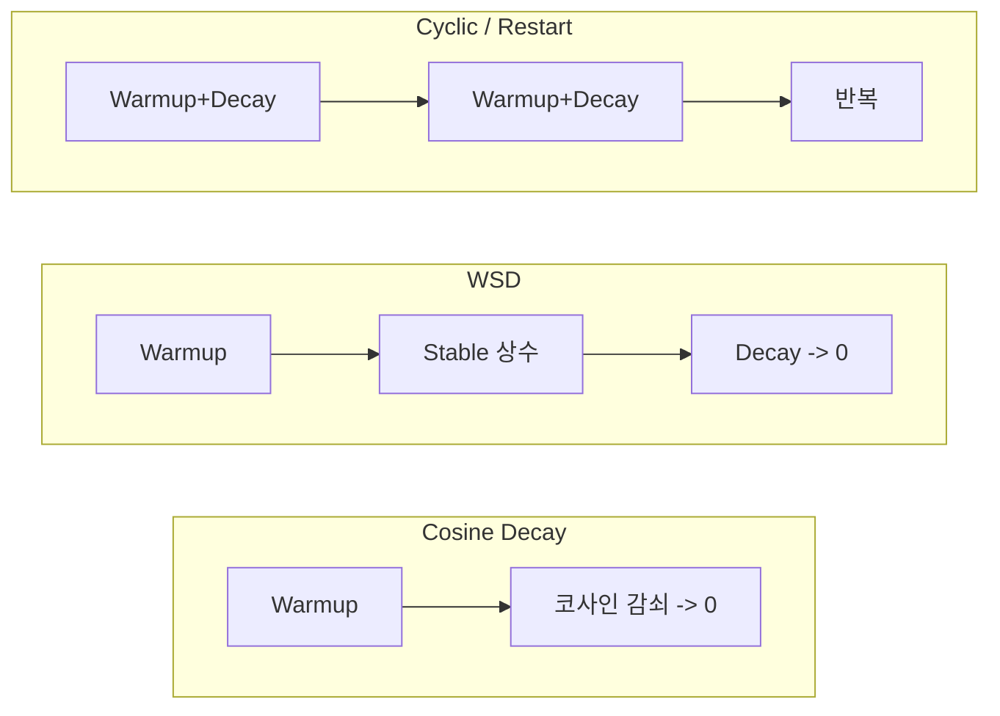

# 학습률 스케줄링

## 개요

학습률 스케줄링(Learning Rate Scheduling)은 학습 과정에서 학습률(learning rate)을 동적으로 조절하는 전략이다. 초기에 너무 큰 학습률은 발산을, 너무 작은 학습률은 느린 수렴을 유발하므로, 학습 단계에 따라 적절한 학습률을 적용하는 것이 수렴 품질과 속도에 결정적이다. 2026년 현재 Warmup-Stable-Decay(WSD) 스케줄이 cosine decay를 대체하는 새로운 표준으로 부상하고 있으며, 사전학습과 계속학습(continual pre-training) 모두에서 우수한 성능을 보인다.

## 핵심 개념

### Warmup (학습률 예열)

학습 초기에 매우 작은 학습률에서 시작하여 점진적으로 목표 학습률까지 증가시키는 구간이다. 초기 파라미터가 무작위에 가까운 상태에서 큰 학습률로 업데이트하면 그래디언트가 불안정해지고 [[optimizer-selection]]의 적응형 모멘트 추정(Adam의 1차/2차 모멘트)이 부정확하다.

**일반적 설정**:
- 기간: 전체 학습 스텝의 1-2% (또는 500-2,000 스텝)
- 증가 방식: 선형(linear) 증가가 기본
- 예: 100K 스텝 학습이면 1,000-2,000 스텝 warmup

### Cosine Decay (코사인 감쇠)

가장 널리 사용되어 온 학습률 스케줄이다. Warmup 후 코사인 함수를 따라 학습률을 부드럽게 감소시켜 최종적으로 0 또는 최소 학습률에 도달한다.

**특성**:
- 초반에 천천히 감소, 중반에 빠르게 감소, 후반에 다시 천천히 감소
- 전체 학습 스텝 수를 사전에 결정해야 함 (고정 계산 예산)
- GPT-3, LLaMA 등 대부분의 초기 LLM 사전학습에서 사용

**한계**: 학습 종료 시점이 사전에 고정되어야 하므로, 학습을 연장하거나 계속학습으로 전환하기 어렵다. 스케줄 후반부에 학습률이 이미 낮아져 있으면 추가 학습의 효과가 제한된다.

### WSD (Warmup-Stable-Decay)

3단계 학습률 스케줄로, cosine decay의 고정 계산 예산 한계를 극복한다:

| 단계 | 학습률 | 기간 | 역할 |
|------|--------|------|------|
| Warmup | 0 -> peak | 전체의 1-2% | 옵티마이저 안정화 |
| Stable | peak 유지 (상수) | 전체의 대부분 | 주요 학습 진행 |
| Decay | peak -> 0 | 마지막 10-20% | 수렴 정밀도 향상 |

**핵심 장점**: Stable 단계에서 일정한 학습률을 유지하므로, 사전에 학습 종료 시점을 결정할 필요가 없다. 학습을 원하는 시점까지 진행하다가 Decay 단계에 진입하면 된다. 이는 다음과 같은 시나리오에서 유리하다:

- 계산 예산이 유동적인 환경
- 계속학습(continual pre-training)으로 전환
- 체크포인트 분기(branching): Stable 단계의 체크포인트에서 여러 Decay 실험 가능

### 이론적 배경: River Valley 관점

최신 연구에 따르면 LLM의 사전학습 손실 지형(loss landscape)은 "강이 흐르는 계곡(river valley)" 형태를 띤다. 깊은 계곡의 바닥에 강이 흐르는 형상으로, WSD 스케줄은 이 지형에서 이론적으로 최적이다:

- **Stable 단계**: 높은 학습률로 계곡 바닥의 강을 따라 빠르게 이동
- **Decay 단계**: 학습률을 낮추어 노이즈를 줄이고 최적점에 정밀하게 수렴

## 주요 스케줄 비교

### 정량 비교

| 스케줄 | 사전 예산 필요 | 계속학습 적합 | 성능 (동일 계산) | 주요 사용처 |
|--------|-------------|-------------|----------------|-----------|
| Step Decay | 아니오 | 보통 | 낮음 | 전통 ML |
| Cosine Decay | 예 | 제한적 | 기준 | GPT-3, LLaMA |
| WSD | 아니오 | 우수 | cosine 이상 | DeepSeek, 최신 LLM |
| Cosine w/ Restart | 부분적 | 보통 | 유사 | 파인튜닝 |

### Decay 변형

WSD의 Decay 단계에서 사용할 수 있는 감쇠 함수:

- **Linear Decay-to-Zero (D2Z)**: 가장 단순, 선형 감소
- **Cosine Decay**: 코사인 함수 형태로 부드럽게 감소
- **Inverse Square Root**: 1/sqrt(t) 형태, 느린 감쇠
- **Power Decay**: t^(-alpha) 형태, alpha로 감쇠 속도 조절

## 실전 적용

### [[gradient-accumulation-checkpointing]]과의 관계

그래디언트 누적으로 유효 배치 크기를 변경하면 학습률도 조정해야 한다. Linear Scaling Rule에 따르면 배치 크기가 k배 증가하면 학습률도 k배 증가시키되, warmup 기간을 충분히 설정해야 한다. 단, 이 법칙은 매우 큰 배치 크기에서는 성립하지 않을 수 있으며, Square Root Scaling이 더 안정적인 경우도 있다.

### [[optimizer-selection]]과의 관계

옵티마이저마다 최적의 학습률 범위가 다르다:

| 옵티마이저 | 일반적 학습률 범위 | 권장 스케줄 | 비고 |
|-----------|-----------------|-----------|------|
| AdamW | 1e-4 ~ 3e-4 | Cosine 또는 WSD | 표준 설정 |
| Lion | 1e-5 ~ 3e-5 | WSD 선호 | AdamW의 3-10배 작음 |
| Sophia | 별도 튜닝 | WSD | 곡률 기반 적응 |
| SGD + Momentum | 1e-1 ~ 1e-2 | Step Decay | LLM에서 드물게 사용 |

### [[lora-qlora-finetuning]] 학습률

파인튜닝에서는 사전학습 대비 작은 학습률을 사용한다:

| 방법 | 학습률 범위 | 스케줄 |
|------|-----------|--------|
| LoRA (< 33B) | 2e-4 | Cosine 또는 상수 |
| LoRA (>= 33B) | 1e-4 | Cosine 또는 상수 |
| QLoRA | 2e-4 | Cosine |
| Full Fine-tuning | 1e-5 ~ 5e-5 | Cosine w/ warmup |

## 실전 도입 가이드

### 스케줄 선택 기준

| 상황 | 권장 스케줄 | 이유 |
|------|-----------|------|
| 사전학습 (고정 예산) | Cosine Decay | 검증된 기본값 |
| 사전학습 (유동 예산) | WSD | 유연한 종료/연장 |
| 계속학습 | WSD (Stable에서 재시작) | 고정 예산 불필요 |
| 파인튜닝 | Cosine w/ warmup | 짧은 학습에 적합 |
| [[lora-qlora-finetuning]] | 상수 또는 Cosine | 소규모 파라미터 |

### 흔한 실수

- **Warmup 생략**: 특히 대규모 배치에서 학습 초기 발산의 주원인
- **Cosine 학습 연장**: 이미 0에 근접한 학습률로는 추가 학습 효과가 미미
- **파인튜닝에서 과도한 학습률**: 사전학습 수준의 학습률은 파인튜닝에서 치명적 망각(catastrophic forgetting) 유발

## 관련 문서

- [[optimizer-selection]] -- 옵티마이저별 학습률 범위
- [[gradient-accumulation-checkpointing]] -- 배치 크기와 학습률 관계
- [[mixed-precision-training]] -- BF16/FP16에서의 학습률 안정성
- [[lora-qlora-finetuning]] -- 파인튜닝 학습률 설정
- [[mit-training-efficiency]] -- 학습 효율화 연구
- [[model-checkpointing-sharding]] -- WSD Stable 체크포인트 분기
