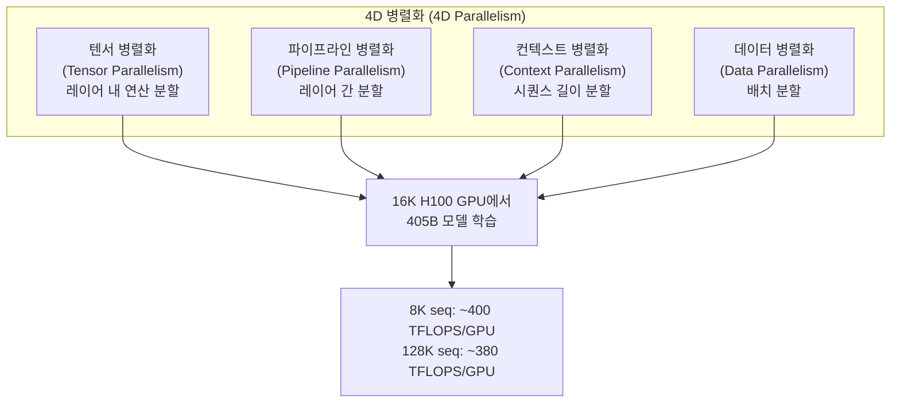
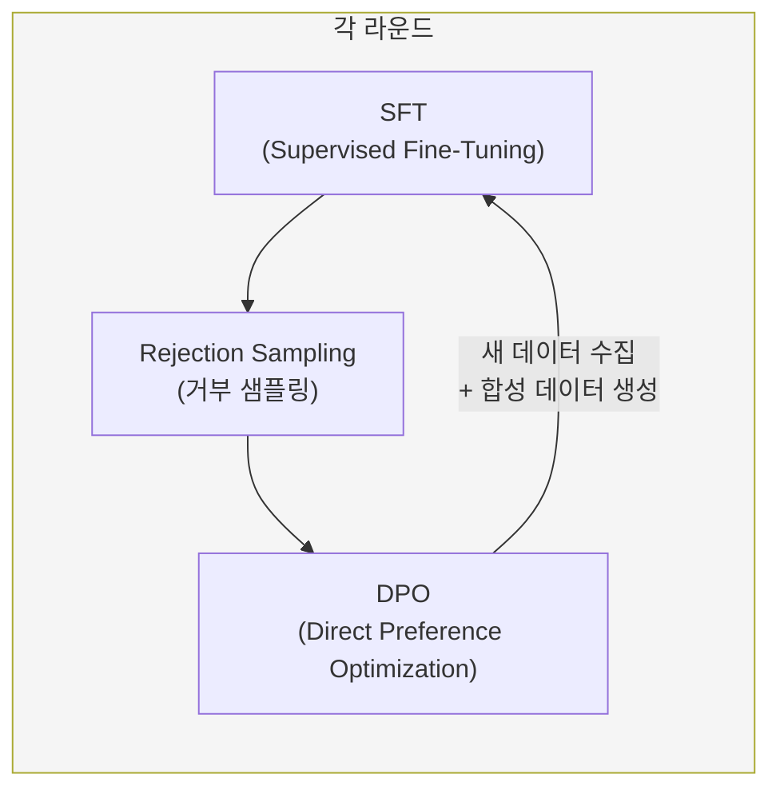

# Llama 3 학습 상세 (Meta 405B)

## 개요

Llama 3(정식 명칭 Llama 3.1)은 Meta가 2024년 7월에 공개한 오픈소스 LLM 시리즈로, 8B/70B/405B 세 가지 크기로 출시되었다. 최대 모델인 405B는 16,000대의 NVIDIA H100 GPU에서 15.6조(T) 토큰으로 사전학습되었으며, 공개 당시 최대 규모의 오픈소스 LLM이었다. 4D 병렬화(4D Parallelism) 전략, 6라운드 반복 후학습, 128K 컨텍스트 길이 확장 등 대규모 학습의 핵심 기술을 체계적으로 문서화한 기술 보고서로서도 중요한 의미를 갖는다.

논문: "The Llama 3 Herd of Models" (arXiv: 2407.21783)

## 아키텍처

Llama 3 405B는 단순성과 학습 안정성을 우선하여 표준 디코더 전용 트랜스포머(decoder-only Transformer)를 채택했다. Mixture-of-Experts(MoE)를 사용하지 않고 밀집(dense) 아키텍처를 선택한 것이 특징이다.

| 항목 | 사양 |
|------|------|
| 파라미터 | 405B (4,050억) |
| 레이어 | 126 |
| 어텐션 헤드 | 128 (GQA, KV 헤드 8) |
| 히든 차원 | 16,384 |
| FFN 차원 | 53,248 (SwiGLU) |
| 어휘 크기 | 128,256 (tiktoken 기반) |
| 컨텍스트 길이 | 128K 토큰 |

### Grouped-Query Attention (GQA)

Llama 3는 추론 확장성(inference scalability)을 위해 GQA를 도입했다. 128개 쿼리 헤드에 8개 키-값 헤드를 사용하여, 전통적 Multi-Head Attention 대비 KV 캐시 메모리를 16배 절감하면서 성능 저하를 최소화한다.

## 사전학습 (Pre-training)

### 학습 데이터

- **총 토큰 수**: 15.6조(T) 토큰
- **데이터 구성**: 일반 지식 약 50%, 수학/추론 약 25%, 코드 약 17%, 다국어 약 8%
- **데이터 품질**: 대규모 웹 크롤링 데이터에 품질 필터링과 중복 제거를 적용

### 4D 병렬화 전략

16,000대의 H100 GPU에서 405B 모델을 효율적으로 학습하기 위해 Meta는 4가지 병렬화 기법을 결합한 4D 병렬화를 사용했다.

각 병렬화 기법의 역할:

- **[[tensor-pipeline-parallelism|텐서 병렬화(TP)]]**: 단일 레이어의 행렬 연산을 여러 GPU에 분할. 어텐션과 FFN의 행렬을 행/열 방향으로 분할하여 GPU 간 병렬 처리
- **[[tensor-pipeline-parallelism|파이프라인 병렬화(PP)]]**: 126개 레이어를 여러 스테이지로 나누어 GPU 그룹에 배치. 마이크로배치로 파이프라인 버블을 최소화
- **컨텍스트 병렬화(CP)**: 긴 시퀀스(128K)를 여러 GPU에 분산. 특히 128K 컨텍스트 학습 단계에서 핵심 역할
- **[[data-parallelism-fsdp|데이터 병렬화(DP/FSDP)]]**: 동일한 모델 복제본에 다른 데이터 배치를 할당. FSDP(Fully Sharded Data Parallelism)로 메모리 효율 극대화

### 학습 효율성

- **하드웨어**: Meta Grand Teton AI 서버 플랫폼, H100 GPU (80GB HBM3, 700W TDP)
- **연산 효율**: 8K 시퀀스에서 약 400 TFLOPS/GPU, 128K 시퀀스에서 약 380 TFLOPS/GPU
- **[[mixed-precision-training|혼합 정밀도]]**: BF16 학습으로 메모리와 연산 효율 균형

### 컨텍스트 길이 확장

사전학습은 두 단계로 진행되었다:

1. **표준 사전학습**: 8K 컨텍스트 길이에서 대부분의 토큰으로 학습
2. **장문맥 사전학습**: 800B 토큰에 걸쳐 컨텍스트 길이를 8K에서 128K까지 6단계로 점진 확장

### 어닐링(Annealing)

사전학습 최종 단계에서 학습률을 선형으로 0까지 감소시키는 어닐링을 수행했다. 이 단계에서 데이터 배합을 조정하여 고품질 데이터의 비중을 높였으며, 128K 컨텍스트 길이를 유지했다. 어닐링 과정에서 [[neural-scaling-laws|스케일링 법칙]] 예측 대비 추가적인 성능 향상이 관찰되었다.

## 후학습 (Post-training)

### 6라운드 반복 후학습

Llama 3의 후학습은 6라운드의 반복 과정으로 진행되었으며, 각 라운드는 세 단계로 구성된다:

각 라운드에서 수행되는 작업:

1. **[[supervised-fine-tuning|SFT]]**: 인간 주석 데이터와 합성 데이터로 지도 미세조정
2. **Rejection Sampling**: 프롬프트당 10-30개 응답을 생성하고, [[reward-model-training|보상 모델]]로 최고 품질 응답을 선별
3. **[[direct-preference-optimization|DPO]]**: "확연히 나은(significantly better)" 또는 "나은(better)"으로 라벨된 선호도 쌍으로 학습. 유사한 품질의 쌍은 제외

### 데이터 수집 전략

- 매 라운드마다 새로운 인간 선호도 주석과 SFT 데이터 수집
- 최신 모델에서 합성 데이터를 샘플링하여 학습 데이터 보강
- 총 2,500만 건의 인간 및 합성 데이터 예시로 미세조정

### 안전 학습

Llama 3의 후학습에는 안전 관련 학습이 통합되어 있다. 안전 SFT 데이터, 안전 관련 보상 모델 학습, 그리고 레드팀 테스트를 통한 반복적 안전성 개선이 6라운드에 걸쳐 수행되었다.

## 학습 인프라와 안정성

### 대규모 학습의 도전

16,000대 GPU 규모의 학습에서는 하드웨어 실패가 일상적이다. Meta는 다음 전략으로 학습 안정성을 확보했다:

- **자동 체크포인트/재개**: 실패 감지 시 자동으로 최근 체크포인트에서 재개
- **Loss spike 대응**: 비정상적 loss spike 발생 시 해당 데이터 배치를 건너뛰는 전략
- **통신 최적화**: GPU 간 통신 오버헤드를 연산과 중첩(overlap)하여 최소화

### 에너지와 비용

405B 모델의 사전학습에는 약 3,080만 GPU-시간이 소요되었다. Meta는 자체 데이터센터를 활용하여 클라우드 대비 비용을 절감했으나, 정확한 학습 비용은 공개하지 않았다.

## 성능과 의의

### 오픈소스 의의

Llama 3 405B는 공개 당시 GPT-4, Claude 3 등 폐쇄형 모델과 경쟁 가능한 성능을 보인 최초의 오픈소스 밀집 모델이었다. 학습 방법론을 상세히 문서화한 기술 보고서는 대규모 모델 학습의 레퍼런스로 활용되고 있다.

### 핵심 기여

1. **4D 병렬화**: [[tensor-pipeline-parallelism|텐서/파이프라인 병렬화]]에 컨텍스트 병렬화를 추가한 4차원 병렬 전략의 체계적 문서화
2. **반복 후학습**: 6라운드 SFT + RS + DPO 반복 파이프라인의 효과 입증
3. **밀집 아키텍처 확장**: MoE 없이 405B까지 밀집 모델을 확장한 사례
4. **오픈소스 생태계**: 가중치, 코드, 학습 방법론을 포함한 포괄적 공개

## 관련 페이지

- [[tensor-pipeline-parallelism|텐서/파이프라인 병렬화]] - 4D 병렬화의 핵심 구성요소
- [[data-parallelism-fsdp|데이터 병렬화 (FSDP)]] - 4D 병렬화의 데이터 병렬 축
- [[direct-preference-optimization|DPO]] - 6라운드 후학습의 선호도 최적화 단계
- [[supervised-fine-tuning|SFT]] - 6라운드 후학습의 지도 미세조정 단계
- [[reward-model-training|보상 모델 학습]] - Rejection Sampling에 사용되는 보상 모델
- [[neural-scaling-laws|신경망 스케일링 법칙]] - 모델/데이터 규모 결정의 이론적 근거
- [[mixed-precision-training|혼합 정밀도 학습]] - BF16 학습 전략
- [[rlhf-pipeline|RLHF 파이프라인]] - 후학습 전체 프로세스
