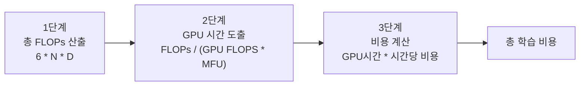
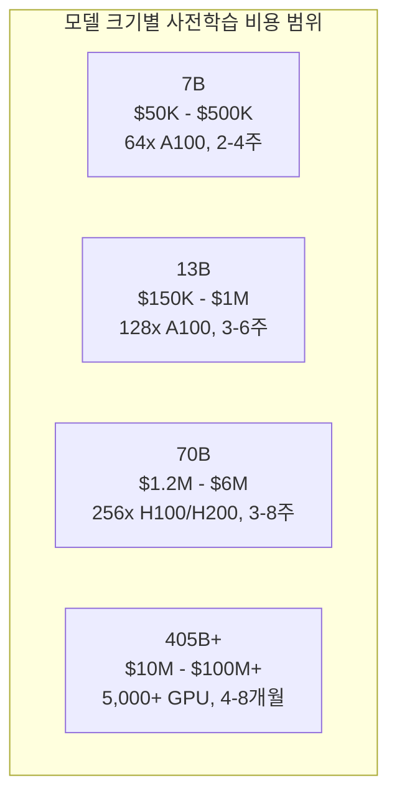

# LLM 학습 비용 가이드

## 개요

LLM 학습 비용은 모델 크기, 학습 토큰 수, 사용 GPU 종류, 클러스터 규모에 의해 결정되며, 7B 모델의 수만 달러부터 405B+ 프론티어 모델의 수억 달러까지 폭넓은 스펙트럼을 가진다. 비용 추정의 핵심은 필요한 총 연산량(FLOPs)을 산출하고, 이를 하드웨어의 실제 처리량(MFU 기반)으로 나누어 GPU 시간을 도출하며, GPU 시간당 비용을 곱하는 3단계 과정이다. [[neural-scaling-laws]]가 "모델 크기와 데이터 양의 관계"를 규명하는 이론이라면, 이 가이드는 그 이론을 실제 예산으로 변환하는 실무 도구이다.

## 비용 추정 3단계 프레임워크



### 1단계: 총 FLOPs 산출

Chinchilla(Hoffmann et al., 2022)의 추정에 따르면 Transformer 모델의 학습에 필요한 총 부동소수점 연산량은 다음으로 근사된다:

```
총 FLOPs ~= 6 * N * D
```

| 변수 | 의미 |
|------|------|
| N | 모델 파라미터 수 |
| D | 학습 토큰 수 |
| 6 | forward(2) + backward(4)의 연산 비율 |

예: 7B 모델을 2T 토큰으로 학습하면 6 * 7e9 * 2e12 = 8.4e22 FLOPs.

### 2단계: GPU 시간 도출

```
GPU 시간 = 총 FLOPs / (GPU BF16 FLOPS * MFU * 3600)
```

MFU(Model FLOPs Utilization)는 GPU 이론 성능 대비 학습에서의 실제 활용률이다. 대규모 학습에서의 전형적 MFU는 35-55% 범위이며, [[gpu-cluster-scheduling]]의 효율, [[mixed-precision-training]] 설정, 통신 오버헤드에 따라 달라진다.

| GPU | BF16 이론 FLOPS | 실전 MFU 범위 |
|-----|----------------|-------------|
| A100 80GB | 312 TFLOPS | 35-45% |
| H100 80GB | 989 TFLOPS | 40-50% |
| H200 141GB | 989 TFLOPS | 40-50% |
| B200 192GB | 2,250 TFLOPS | 45-55% |

### 3단계: 비용 계산

GPU 시간에 시간당 비용을 곱한다. 클라우드 vs 자체 보유에 따라 비용 구조가 크게 달라진다.

| GPU | 클라우드 시간당 비용 (참고) | 자체 보유 단가 (참고) |
|-----|----------------------|------------------|
| A100 80GB | $1.5-2.5/hr | ~$15,000 |
| H100 80GB | $2.5-4.0/hr | ~$25,000 |
| H200 141GB | $3.5-5.0/hr | ~$30,000 |
| B200 192GB | $5.0-8.0/hr | ~$40,000 |

## 모델 크기별 비용 추정

아래는 2025-2026년 기준 사전학습(pretraining) 비용의 대략적 범위이다. 실제 비용은 MFU, 학습 토큰 수, GPU 종류, 클라우드/자체보유 여부에 따라 크게 변동한다.



| 모델 규모 | GPU 구성 (참고) | 학습 기간 | 추정 비용 범위 |
|----------|--------------|---------|-------------|
| 7B | 64x A100 | 2-4주 | $50K - $500K |
| 13B | 128x A100 | 3-6주 | $150K - $1M |
| 70B | 256x H100/H200 | 3-8주 | $1.2M - $6M |
| 405B+ | 5,000+ B200 | 4-8개월 | $10M - $100M+ |

### 실제 사례 참고

| 모델 | 보고된 학습 비용 | 비고 |
|------|--------------|------|
| Llama 3 405B | 약 $30M+ (추정) | 15.6T 토큰, 16K H100 |
| DeepSeek-V3 | 약 $5.6M | 671B MoE, FP8, H800 |
| GPT-4 | $78-100M+ (추정) | Stanford AI Index 2025 |

DeepSeek-V3의 사례는 FP8 [[mixed-precision-training]]과 MoE 아키텍처의 결합이 비용 효율에 극적인 영향을 미칠 수 있음을 보여준다.

## 파인튜닝 vs 사전학습 비용

파인튜닝은 사전학습 대비 60-90% 비용을 절감할 수 있다.

| 방법 | 70B 모델 기준 비용 범위 | 비고 |
|------|---------------------|------|
| 전체 파라미터 SFT | $10K - $100K | 전체 학습의 1-5% |
| LoRA/QLoRA | $500 - $5,000 | [[lora-qlora-finetuning]] |
| RLHF (PPO) | $20K - $200K | 4-모델 동시 운영 ([[rlhf-pipeline]]) |
| DPO | $5K - $50K | 2-모델만 필요 ([[direct-preference-optimization]]) |

## 비용 최적화 전략

### 하드웨어 최적화

1. **최신 GPU 활용**: H100은 A100 대비 3x FP8 처리량, B200은 H100 대비 2x+ 향상
2. **혼합 정밀도**: BF16 기본, FP8 적극 도입 ([[mixed-precision-training]])
3. **메모리 최적화**: [[gradient-accumulation-checkpointing]]으로 GPU당 유효 배치 크기 극대화

### 소프트웨어 최적화

1. **MFU 극대화**: 통신-연산 오버랩, 효율적 파이프라인 스케줄링
2. **학습 효율**: [[learning-rate-scheduling]] 최적화, 커리큘럼 학습으로 동일 성능에 적은 토큰 사용
3. **체크포인팅**: 비동기 체크포인팅으로 I/O 오버헤드 최소화

### 비용 모델 선택

| 사용 패턴 | 권장 방식 | 이유 |
|----------|----------|------|
| 단기 실험 (1-2주) | 클라우드 on-demand | 초기 투자 불필요 |
| 중기 프로젝트 (1-3개월) | Reserved Instance / Spot | 30-70% 할인 |
| 장기 운영 (6개월+) | 자체 보유 또는 장기 계약 | TCO 최적화 |

## 주의 사항

- 위 비용은 순수 GPU 연산 비용만 포함하며, 스토리지, 네트워킹, 전력, 냉각, 인건비 등은 별도
- 클라우드 가격은 지역과 제공업체에 따라 크게 변동
- MFU는 모델 아키텍처, 배치 크기, 시퀀스 길이, 클러스터 네트워크 토폴로지에 민감
- 학습 불안정([[loss-spike-debugging]])으로 인한 재시작/롤백 비용을 예산에 포함할 것

## 대표 자료

- [Training Compute-Optimal Large Language Models (Chinchilla, Hoffmann et al., 2022)](https://arxiv.org/abs/2203.15556)
- [Behind the Millions: Estimating the Scale of Large Language Models (Towards Data Science)](https://towardsdatascience.com/behind-the-millions-estimating-the-scale-of-large-language-models-97bd7287fb6b/)
- [AI Model Training Costs 2026 (LocalAI Master)](https://localaimaster.com/blog/ai-model-training-costs-2025-analysis)

## 관련 문서

- [[neural-scaling-laws]] -- 모델 크기와 데이터 양의 스케일링 법칙
- [[gpu-cluster-scheduling]] -- GPU 클러스터 스케줄링과 자원 관리
- [[mixed-precision-training]] -- FP16/BF16/FP8 혼합 정밀도 학습
- [[gradient-accumulation-checkpointing]] -- 메모리 최적화
- [[learning-rate-scheduling]] -- 학습률 스케줄링
- [[loss-spike-debugging]] -- 학습 불안정으로 인한 추가 비용 요인
- [[rlhf-pipeline]] -- RLHF 학습의 비용 구조
- [[direct-preference-optimization]] -- DPO의 비용 이점
