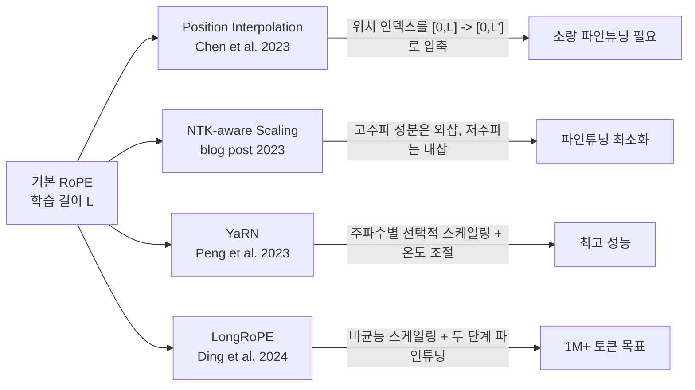

# 긴 컨텍스트 학습 (Long-Context Training)

## 개념 요약

현대 LLM은 사전학습 시 제한된 시퀀스 길이(예: LLaMA-2는 4K 토큰)로 학습되지만, 실용적 응용은 32K~1M 토큰 이상의 컨텍스트를 요구한다. 긴 컨텍스트 학습(long-context training)은 이 격차를 메우기 위한 기법들의 집합이다.

## 왜 길이 확장이 어려운가

### 1. 메모리 O(N^2) 문제

표준 어텐션의 메모리 복잡도는 시퀀스 길이 N에 대해 `O(N^2)`. 128K 토큰은 4K 토큰 대비 어텐션 행렬이 1024배 커진다.

- 해결책: [[flash-attention]] - IO-aware 타일링으로 `O(N)` 메모리

### 2. 위치 외삽 실패

Transformer는 사전학습에서 본 위치 인덱스 범위 밖(out-of-distribution)에서 위치 임베딩이 무너진다. RoPE(Rotary Position Embedding, Su et al. 2021)를 사용하는 모델도 학습 길이를 초과하면 성능이 급격히 저하된다.

## RoPE 확장 방법 비교

### Position Interpolation (PI)

- 위치 인덱스를 원래 범위로 선형 압축 (8K 목표면 각 위치를 0.5 배 스케일)
- 소량의 파인튜닝(~1000 스텝)으로 적응 가능
- 단점: 고주파 위치 정보 손실로 근거리 주의가 약화될 수 있음

### NTK-aware Scaling

- RoPE의 베이스 값(기본 10000)을 목표 길이에 맞게 증가
- 이론적 근거: 신경 탄젠트 커널(NTK) 관점에서 고주파/저주파 분리
- 파인튜닝 없이도 어느 정도 외삽 가능 ("NTK-aware interpolation")

### YaRN (Yet Another RoPE Extension)

- 주파수 성분별로 다른 스케일링 전략 적용
- 어텐션 온도(temperature) 조절로 길이 증가에 따른 어텐션 희석 보정
- LLaMA-2 기준 7B 파인튜닝으로 128K 컨텍스트 달성

### LongRoPE

- 비균등(non-uniform) 스케일링: 각 RoPE 차원별로 최적 스케일 탐색
- 두 단계 파인튜닝: 256K -> 2M 순서로 점진적 확장
- Phi-3-Mini 등에 적용되어 1M+ 토큰 컨텍스트 달성

## Ring Attention / Sequence Parallelism

긴 시퀀스는 단일 GPU의 메모리를 초과한다. 이를 분산 처리하는 기법:

- **Sequence Parallelism**: 시퀀스를 청크로 나눠 여러 GPU에 분배. 어텐션은 All-Gather로 전체 KV를 공유
- **Ring Attention** (Liu et al. 2023): 각 GPU가 링(ring) 구조로 KV를 순환하며 자신의 Q 청크와 어텐션 계산. 통신과 계산이 오버랩

## 점진적 길이 확장 전략

처음부터 긴 시퀀스로 학습하는 것은 비효율적이다. 실전 전략:

1. **짧은 시퀀스로 사전학습** (예: 4K)
2. **중간 길이로 워밍업** (예: 32K, 수십억 토큰)
3. **목표 길이로 파인튜닝** (예: 128K, 수억 토큰)

데이터도 점진적으로 긴 문서 비율을 높이는 **Sequence Length Curriculum**을 병행한다.

## 관련 문서

- [[flash-attention]] - 긴 시퀀스의 메모리 문제 해결
- [[sequence-length-curriculum]] - 점진적 길이 확장 커리큘럼
- [[tensor-pipeline-parallelism]] - 분산 학습 기초
- [[rope-scaling-ntk-yarn|rope-extension]] - RoPE 외삽 상세 (있는 경우)
- [[llama-3-training]] - 긴 컨텍스트 학습 적용 사례
