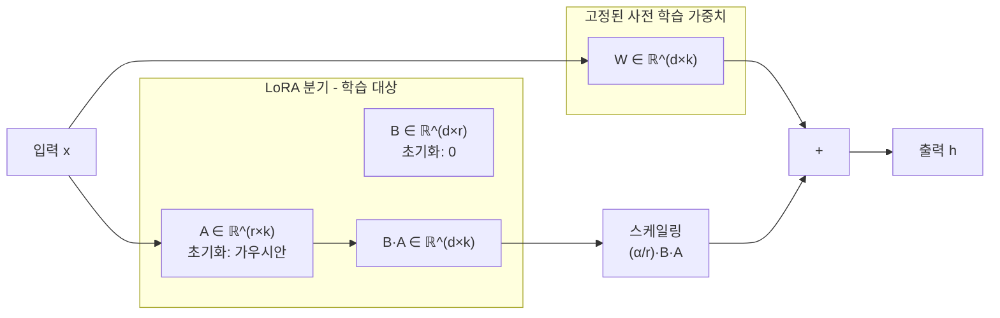
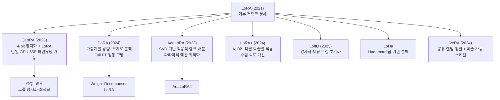
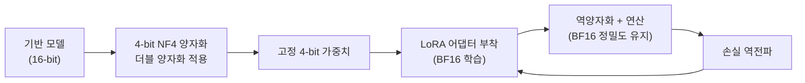
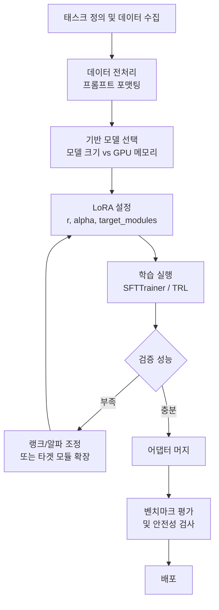

# LoRA - 저랭크 적응 파인튜닝 (Low-Rank Adaptation)

## 개념 정의

LoRA(Low-Rank Adaptation, Hu et al. 2021)는 사전 학습된 모델의 **가중치 행렬을 고정**하고, 각 대상 레이어에 **저랭크 분해 행렬 쌍(A, B)**만 추가로 학습하는 파라미터 효율적 파인튜닝(PEFT, Parameter-Efficient Fine-Tuning) 기법이다.

전체 파라미터를 업데이트하는 Full Fine-tuning 대비 학습 파라미터 수를 1/1000 수준으로 줄이면서 유사한 성능을 달성한다. 현재 LLM 파인튜닝의 사실상 표준(de facto standard)으로 자리 잡았다.



위 구조에서 초기 학습 시작 시 $B = 0$이므로 $\Delta W = BA = 0$이 되어 사전 학습 가중치의 출력이 그대로 보존된다.

---

## 핵심 수식

### 기본 수식

원본 선형 레이어 연산:

$$h = Wx$$

LoRA 적용 후:

$$h = Wx + \frac{\alpha}{r} BAx$$

- $W \in \mathbb{R}^{d \times k}$: 고정된 사전 학습 가중치
- $A \in \mathbb{R}^{r \times k}$: 학습되는 다운 프로젝션 (랭크-$r$)
- $B \in \mathbb{R}^{d \times r}$: 학습되는 업 프로젝션 (랭크-$r$)
- $r \ll \min(d, k)$: 랭크 (보통 4~64)
- $\alpha$: 스케일링 하이퍼파라미터 (보통 랭크의 절반~동일)

### 파라미터 절감률

전체 업데이트 파라미터: $d \times k$

LoRA 파라미터: $r \times k + d \times r = r(d + k)$

절감률: $\frac{r(d+k)}{dk} = r \left(\frac{1}{k} + \frac{1}{d}\right)$

예) $d = k = 4096$, $r = 8$: 전체 대비 약 0.4%만 학습

---

## 설계 선택과 하이퍼파라미터

### 랭크(r) 선택

| 랭크 | 적합 상황 | 트레이드오프 |
|------|----------|-------------|
| r = 1~4 | 소규모 도메인 적응, 리소스 제한 | 표현력 제한 |
| r = 8~16 | 일반적인 태스크 특화 | 균형적 |
| r = 32~64 | 복잡한 태스크, 대형 모델 | 메모리 증가 |
| r = 128+ | 전체 파인튜닝에 근접 | Full FT 대비 이점 감소 |

### 어느 레이어에 적용할 것인가

원논문에서는 Transformer의 $Q, V$ 행렬에만 적용했으나, 이후 연구에서 $Q, K, V, O, \text{FFN}$ 전체에 적용하는 것이 성능이 더 좋음이 밝혀졌다.

```python
# Hugging Face PEFT 라이브러리를 사용한 LoRA 적용 예시
from peft import LoraConfig, get_peft_model, TaskType
from transformers import AutoModelForCausalLM

model = AutoModelForCausalLM.from_pretrained("meta-llama/Llama-2-7b-hf")

lora_config = LoraConfig(
    r=8,                          # 랭크
    lora_alpha=16,                # 스케일링 파라미터
    target_modules=["q_proj", "v_proj", "k_proj", "o_proj"],
    lora_dropout=0.05,
    bias="none",
    task_type=TaskType.CAUSAL_LM,
)

model = get_peft_model(model, lora_config)
model.print_trainable_parameters()
# 출력 예: trainable params: 4,194,304 || all params: 6,742,609,920 || trainable%: 0.0622
```

### alpha 설정 관례

- `lora_alpha = r`: 스케일링 없음 (보통 이것이 시작점)
- `lora_alpha = 2r`: 적응 속도 2배 증폭
- `lora_alpha = 32` (고정): 일부 가이드에서 r과 무관하게 고정 권장

---

## 머지(Merge)와 서빙

학습 완료 후 LoRA 가중치를 원본에 합산하면 **추론 시 추가 레이턴시가 없다**:

$$W_{\text{merged}} = W + \frac{\alpha}{r} BA$$

```python
# PEFT로 가중치 머지
merged_model = model.merge_and_unload()
# merged_model은 일반 모델처럼 사용 가능 (LoRA 오버헤드 없음)
merged_model.save_pretrained("./lora-merged")
```

**다중 어댑터 서빙**: 하나의 기반 모델에 여러 LoRA 어댑터를 런타임에 교체하는 방식으로 다양한 태스크를 효율적으로 서빙할 수 있다.

---

## LoRA 진화 계보



### 주요 변형 비교

| 방법 | 핵심 아이디어 | 장점 | 단점 |
|------|-------------|------|------|
| LoRA | 저랭크 분해 A, B | 단순, 검증됨 | 고정 랭크 |
| QLoRA | NF4 양자화 + LoRA | 극한의 메모리 효율 | 속도 오버헤드 |
| DoRA | 방향(방향벡터)+크기 분리 | Full FT 근접 성능 | 복잡도 증가 |
| AdaLoRA | SVD + 동적 랭크 | 파라미터 예산 최적화 | 구현 복잡 |
| LoRA+ | A/B 학습률 분리 | 수렴 속도 향상 | 하이퍼파라미터 추가 |
| VeRA | 공유 랜덤 행렬 | 극소 파라미터 | 성능 상한 제한 |

자세한 내용은 각각 [[dora-weight-decomposed-lora]], [[adalora-adaptive-rank]] 참조.

---

## QLoRA: 소비자 GPU에서 대형 모델 파인튜닝

QLoRA(Dettmers et al. 2023)는 기반 모델을 4-bit NormalFloat(NF4)로 양자화하여 메모리를 극적으로 줄이면서 LoRA 어댑터는 BF16으로 학습한다.



**메모리 비교** (LLaMA-2 65B 기준):

| 방법 | 필요 GPU | 메모리 |
|------|----------|-------|
| Full FT (BF16) | 16 x A100 80GB | ~1280 GB |
| LoRA (BF16) | 2 x A100 80GB | ~160 GB |
| QLoRA (NF4) | 1 x A100 80GB | ~48 GB |

---

## 실무 파인튜닝 워크플로우



```python
from trl import SFTTrainer
from transformers import TrainingArguments

training_args = TrainingArguments(
    output_dir="./output",
    num_train_epochs=3,
    per_device_train_batch_size=4,
    gradient_accumulation_steps=4,
    learning_rate=2e-4,
    fp16=True,
    logging_steps=10,
    save_strategy="epoch",
    warmup_ratio=0.03,
    lr_scheduler_type="cosine",
)

trainer = SFTTrainer(
    model=model,           # PEFT 적용된 모델
    train_dataset=dataset,
    args=training_args,
    dataset_text_field="text",
    max_seq_length=2048,
)

trainer.train()
```

---

## 성능 특성과 한계

### 강점
- 학습 파라미터가 수백만 개로 적어 **수시간 내 파인튜닝 가능**
- 기반 모델 가중치 불변 → 여러 어댑터를 한 기반 모델로 공유
- 어댑터 파일이 수 MB 수준 → 버전 관리, 배포 용이

### 한계

| 한계 | 설명 |
|------|------|
| 표현력 상한 | 랭크가 낮을수록 표현할 수 있는 업데이트 방향이 제한됨 |
| 랭크 균일 배분 | 모든 레이어에 동일 랭크 → 중요도 차이 무시 (AdaLoRA가 해결) |
| 카타스트로픽 포겟 | 특정 도메인 집중 훈련 시 범용 능력 저하 가능 |
| 최적 하이퍼파라미터 | r, alpha, target_modules 탐색이 필요 |

---

## 다중 태스크 / 컴포지션

여러 LoRA 어댑터를 동시에 적용하거나 결합하는 연구가 활발하다:

- **LoRA Merge**: 서로 다른 태스크로 학습된 어댑터를 선형 보간으로 합산
- **MoLoRA / LoRAMoE**: Mixture-of-Experts 구조로 어댑터 라우팅
- **LM-Cocktail**: 여러 어댑터를 가중 평균으로 합성

---

## 관련 문서

- [[lora-paper]] - LoRA 원논문 (Hu et al. 2021) 요약
- [[lora-qlora-finetuning]] - QLoRA 실전 파인튜닝 가이드
- [[dora-weight-decomposed-lora]] - DoRA: 방향/크기 분리 LoRA
- [[adalora-adaptive-rank]] - AdaLoRA: 적응적 랭크 할당
- [[fine-tuning]] - 파인튜닝 전반 개요
- [[quantization]] - 양자화 기법 (QLoRA 기반)
