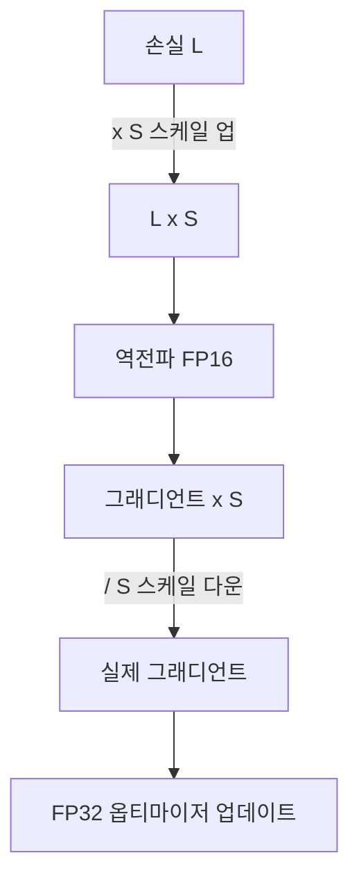

# Loss Scaling

[[mixed-precision-training|혼합 정밀도 학습]]에서 FP16 그래디언트의 **언더플로우(underflow)**를 방지하기 위해 손실 값을 스케일 업한 후 역전파하고, 옵티마이저 업데이트 전 다시 스케일 다운하는 기법.

## 문제: FP16 언더플로우

FP16의 최소 양수 정규값은 $\approx 6 \times 10^{-8}$. 작은 그래디언트가 이 범위 아래로 떨어지면 0으로 플러시되어 학습 정보가 손실된다.

## Static vs Dynamic Loss Scaling

| 방식 | 원리 | 장단점 |
|------|------|--------|
| **Static** | 고정 스케일 (예: 128, 1024) | 단순하지만 최적값 수동 탐색 |
| **Dynamic** | 스케일 자동 조절: Inf/NaN 없으면 증가, 있으면 감소 | 범용, PyTorch GradScaler 기본 |

Dynamic loss scaling (PyTorch `torch.amp.GradScaler`):
- 매 N 스텝마다 스케일 2x 증가 시도
- Inf/NaN 감지 시 스케일 0.5x 감소 + 해당 스텝 스킵

## [[fp8-training|FP8 학습]]에서

FP8은 E4M3/E5M2의 작은 동적 범위로 loss scaling이 더 중요. NVIDIA Transformer Engine이 텐서별 동적 스케일링을 자동 관리.

## 관련 문서

- [[mixed-precision-training]] -- 혼합 정밀도 학습
- [[fp8-training]] -- FP8 학습
- [[distributed-training-overview]] -- 분산 학습
