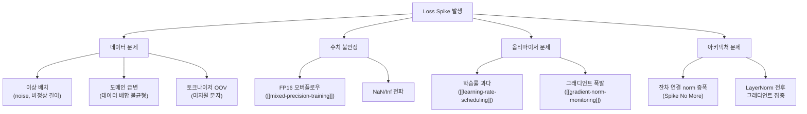
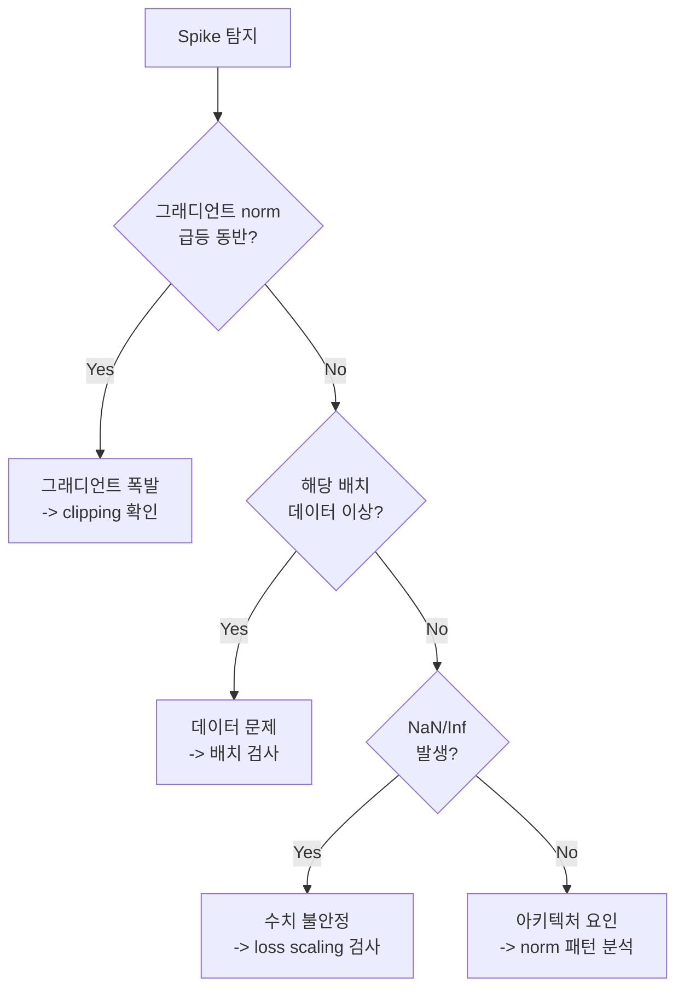
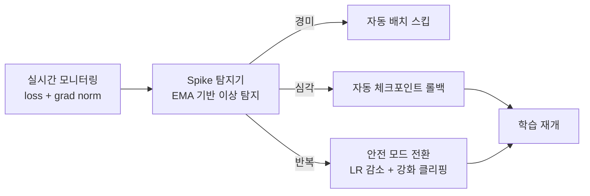

# Loss Spike 디버깅

## 개요

Loss spike는 LLM 사전학습 도중 손실(loss)이 갑자기 비정상적으로 급등하는 현상으로, 학습 불안정성의 가장 직접적인 신호이다. 수일에서 수주에 걸친 대규모 학습에서 loss spike가 발생하면 모델 품질 저하, 학습 실패, 비용 낭비로 이어질 수 있다. Google PaLM(2022), Meta Llama 3(2024) 등 프론티어 모델 학습에서도 loss spike에 대한 수동 개입이 필요했음이 보고되었다. "Spike No More"(Takase et al., 2023/COLM 2025) 등 최근 연구는 spike의 근본 원인을 분석하고 체계적 예방 기법을 제시한다.

## Loss Spike의 원인

Loss spike는 단일 원인보다는 여러 요인의 복합 작용으로 발생한다.



### 데이터 기인 원인

- **이상 배치(Anomalous Batch)**: 비정상적으로 긴 시퀀스, 반복 패턴, 인코딩 오류가 포함된 미니배치가 학습에 유입
- **도메인 급변**: 학습 데이터 셔플이 불완전하여 특정 도메인의 데이터가 집중 배치
- **토크나이저 영역 밖 문자**: 토크나이저의 어휘에 없는 특수 문자나 이모지가 대량 포함

### 수치 불안정 원인

- **FP16 오버플로우**: [[mixed-precision-training]]에서 loss scaling이 부적절하면 FP16 범위를 초과. BF16은 범위가 넓어 이 문제에 강건
- **NaN/Inf 전파**: 하나의 NaN이 발생하면 그래디언트를 통해 전체 모델로 전파

### 아키텍처 기인 원인

"Spike No More" 논문이 밝힌 두 가지 주요 메커니즘:

1. **잔차 연결의 shortcut 부분 norm이 forward 과정에서 급속 증폭**: 깊은 Transformer에서 잔차 경로의 norm이 레이어를 거칠수록 누적되어 특정 시점에 폭발
2. **LayerNorm 전후에서 그래디언트가 집중**: 정규화 경계에서 그래디언트가 극단적으로 커져 파라미터 업데이트가 불안정

## 진단 워크플로우

### 1단계: 탐지 (Detection)

- **자동 탐지**: loss의 이동 평균 대비 N배(예: 3-5배) 이상 급등 시 알림
- **모니터링 도구**: TensorBoard, Weights & Biases에서 학습 스텝별 loss 추적
- **보조 지표**: [[gradient-norm-monitoring]]의 그래디언트 norm, 파라미터 norm, 활성값 통계를 동시 모니터링

### 2단계: 원인 격리 (Isolation)



- **배치 로깅**: spike 발생 스텝의 샘플 인덱스를 기록하고, 해당 데이터를 수동 검사
- **그래디언트 분석**: per-layer [[gradient-norm-monitoring]]으로 어느 레이어에서 폭발이 시작되는지 확인
- **수치 검사**: loss scaler 상태, 활성값의 NaN/Inf 비율 확인

### 3단계: 대응 (Response)

상황에 따라 세 가지 대응 전략을 선택한다.

## 대응 전략

### 전략 1: 데이터 스킵 (Data Skip)

문제 배치를 건너뛰고 학습을 계속하는 가장 가벼운 개입이다.

- **조건**: spike가 특정 배치에 국한되고, 모델 파라미터에 심각한 손상이 없는 경우
- **방법**: spike를 유발한 미니배치의 인덱스를 블랙리스트에 추가하고 해당 스텝의 파라미터 업데이트를 건너뜀
- **위험**: spike가 이미 모델을 손상시킨 경우 효과 없음

### 전략 2: 체크포인트 롤백 (Checkpoint Rollback)

spike 이전의 체크포인트로 되돌리고 문제 구간을 우회하여 재시작한다.

- **조건**: spike 후 loss가 회복되지 않거나, 여러 스텝에 걸쳐 불안정이 지속
- **방법**:
  1. spike 직전의 체크포인트 로드 (옵티마이저 상태 포함)
  2. 문제 배치를 스킵하도록 데이터 로더 설정
  3. 선택적으로 학습률을 일시적으로 낮추어 재시작
- **핵심**: [[model-checkpointing-sharding]]에서 충분한 빈도로 체크포인트를 저장하고 있어야 함

Google PaLM 학습에서는 이 전략이 실제로 사용되었으며, 드문 loss spike 발생 시 최근 체크포인트에서 재시작하고 문제 배치를 건너뛰는 수동 개입이 수행되었다.

### 전략 3: 학습률 감쇠 (Learning Rate Reduction)

spike의 원인이 학습률과 관련된 경우 적용한다.

- **조건**: spike가 학습률 스케줄의 특정 구간(warmup 종료 직후 등)에서 반복
- **방법**: [[learning-rate-scheduling]]의 최대 학습률을 낮추거나, warmup을 연장
- **보조 조치**: 그래디언트 클리핑 임계값을 함께 조정

## 예방 기법

### 그래디언트 클리핑

[[gradient-norm-monitoring]]과 연동하여 그래디언트 norm이 임계값을 초과할 때 스케일링한다. 대부분의 LLM 학습에서 max_grad_norm=1.0이 기본이다.

### QK-Norm

Attention 레이어에서 Query와 Key 벡터에 정규화를 적용하여 attention logit의 폭발을 방지한다. Llama 3, Gemma 2 등 최신 모델에서 채택되었다.

### z-loss

Softmax 출력의 로짓 크기를 정규화하는 보조 손실 항으로, PaLM에서 도입되었다:

```
L_z = 1e-4 * log(sum(exp(z)))^2
```

로짓이 과도하게 커지는 것을 방지하여 수치 안정성을 확보한다.

### SPAM Optimizer

spike를 감지하면 옵티마이저의 모멘텀을 리셋하고 선택적으로 클리핑하는 기법. Adam의 이점을 유지하면서 spike를 제어한다.

### ZClip

최근 제안된 적응적 그래디언트 클리핑 알고리즘으로, 고정 임계값 대신 최근 그래디언트 norm의 이동 평균(EMA)을 기반으로 동적 임계값을 설정한다. 1B LLaMA 실험에서 고정 클리핑 및 백분위 기반 접근 대비 우수한 성능을 보였다.

## 자동화된 안정성 파이프라인

대규모 학습 시스템은 spike 대응을 자동화하는 추세이다.



- **Spike 탐지기**: loss와 그래디언트 norm의 온라인 통계를 유지하고 이상치를 자동 탐지
- **자동 롤백**: 심각한 spike 시 가장 최근의 건전한 체크포인트로 자동 복원
- **Safe Mode**: 반복적 spike 발생 시 학습률 감소, 클리핑 강화, 배치 크기 조정 등을 자동 적용

## 대표 자료

- [Spike No More: Stabilizing the Pre-training of Large Language Models (Takase et al., 2023; COLM 2025)](https://arxiv.org/abs/2312.16903)
- [PaLM: Scaling Language Modeling with Pathways (Chowdhery et al., 2022)](https://arxiv.org/abs/2204.02311)
- [ZClip: Adaptive Spike Mitigation for LLM Pre-Training (2025)](https://arxiv.org/abs/2504.02507)
- [Loss spikes in training: causes, detection, and mitigations (Better ML, 2026)](https://medium.com/better-ml/loss-spikes-in-training-causes-detection-and-mitigations-ed66e591b1a1)

## 관련 문서

- [[gradient-norm-monitoring]] -- 그래디언트 폭발 탐지와 per-layer 추적
- [[mixed-precision-training]] -- FP16/BF16 수치 안정성과 loss scaling
- [[learning-rate-scheduling]] -- 학습률 스케줄의 안정성 영향
- [[model-checkpointing-sharding]] -- 롤백을 위한 체크포인팅 전략
- [[optimizer-selection]] -- Adam, SPAM 등 옵티마이저 선택
- [[evaluation-during-training]] -- 학습 중 모델 품질 모니터링
- [[gradient-accumulation-checkpointing]] -- 활성값 체크포인팅과 메모리 관리
