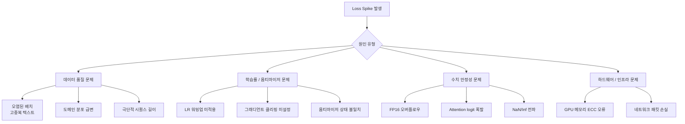
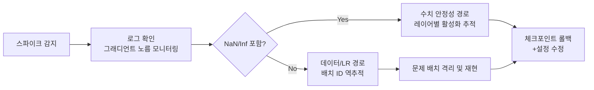

# Loss Spike와 훈련 불안정성

## 개요

Loss Spike는 LLM 사전학습 또는 파인튜닝 중 손실(loss) 값이 갑자기 급등하는 현상이다. 단순 노이즈와 달리 수렴 궤적을 크게 이탈하며, 복구되지 않으면 체크포인트 롤백이나 재훈련이 필요하다. 수백 GPU-일이 소요되는 대규모 훈련에서 Loss Spike는 가장 치명적인 운영 리스크 중 하나다.

## 주요 원인 분류

### 1. 데이터 품질 문제

가장 흔한 원인이다. 전처리 파이프라인에서 걸러지지 않은 "독성 배치(toxic batch)"가 투입될 때 발생한다.

- **반복 텍스트**: 동일 문장이 수백 번 반복된 문서 - Cross-Entropy 손실이 비정상적으로 낮아졌다 급등
- **인코딩 오류**: 깨진 UTF-8, 이진 데이터가 텍스트로 혼입
- **극단적 시퀀스**: 컨텍스트 길이의 수배에 달하는 문서가 슬라이딩 윈도우 경계에서 배치 구성 오류 야기
- **도메인 급변**: 데이터 믹싱 비율이 특정 스텝에서 갑자기 바뀌어 분포 충격(distribution shift) 발생

### 2. 학습률 / 옵티마이저 문제

[[learning-rate-scheduling]] 설정 오류는 훈련 초반 스파이크의 주된 원인이다.

- **워밍업 미적용**: 초기 파라미터가 랜덤 상태에서 높은 LR을 바로 적용하면 그래디언트가 폭발
- **과도한 LR**: 특히 Attention 레이어의 쿼리/키 투영 가중치에 민감
- **그래디언트 클리핑 부재**: `gradient_clip_norm`을 설정하지 않으면 배치 하나가 전체 모델을 흔들 수 있음
- **체크포인트 재개 시 옵티마이저 상태 불일치**: 파라미터만 로드하고 Adam의 $m_t$, $v_t$를 초기화하면 스텝 재개 시 폭발

### 3. 수치 안정성 문제

[[mixed-precision-training]] 환경에서 FP16 또는 BF16 사용 시 특유의 수치 문제가 발생한다.

| 상황 | 증상 | 대응 |
|------|------|------|
| FP16 오버플로우 | loss = inf | BF16으로 전환 또는 loss scaling 조정 |
| Attention logit 폭발 | softmax 입력이 ±60 이상 | QK Norm 또는 Logit Soft-capping 적용 |
| Layer Norm 수치 불안정 | 특정 레이어 활성화 폭발 | RMSNorm으로 교체 또는 eps 값 증가 |
| NaN 전파 | 이후 모든 스텝 NaN | NaN 발생 레이어 추적 후 롤백 |

## 진단 방법

**모니터링 지표**:
- `grad_norm`: 배치마다 기록, 스파이크 전 이상 징후 포착
- `param_norm`: 레이어별 파라미터 크기 추적
- `loss_scale`: FP16 혼합 정밀도에서 스케일 팩터 동향
- `batch_id`: 데이터 재현성을 위해 스텝마다 배치 ID 기록

## 복구 전략

1. **직전 안정 체크포인트로 롤백**: 스파이크 발생 직전 저장된 체크포인트 사용
2. **문제 배치 스킵 또는 제거**: 데이터 파이프라인에 문제 배치 목록 블랙리스트 추가
3. **LR 임시 감소**: 롤백 후 학습률을 절반으로 줄이고 안정화 후 원복
4. **그래디언트 클리핑 강화**: 기존 `clip_norm=1.0`을 `0.3`으로 줄이는 등 일시적 강화
5. **스킵 업데이트**: 그래디언트 노름이 임계값 초과 시 해당 스텝 파라미터 업데이트를 건너뜀

## 예방 설계

대규모 훈련에서 스파이크를 사전 방지하는 설계 원칙:

- **데이터 사전 필터링**: [[pretraining-data-curation]] 파이프라인에서 이상 문서 제거
- **Spike-Aware LR 스케줄**: 스파이크 직후 LR을 자동으로 일시 낮추는 적응형 스케줄러
- **QK Norm**: Attention 레이어에 쿼리/키 정규화를 추가해 logit 폭발 방지 (Gemma, OLMo 2 채택)
- **z-loss**: Softmax 분모에 정규화 항을 추가해 logit이 지나치게 커지지 않도록 억제

## 관련 문서

- [[learning-rate-scheduling]] - LR 스케줄 설계와 워밍업 전략
- [[mixed-precision-training]] - BF16/FP16 수치 안정성 설계
- [[gradient-clipping]] - 그래디언트 클리핑 기법
- [[nan-inf-debugging]] - NaN/Inf 발생 시 디버깅 절차
- [[training-stability]] - 훈련 안정성 전반 개요
- [[loss-spike-debugging]] - Loss Spike 실전 디버깅 가이드
