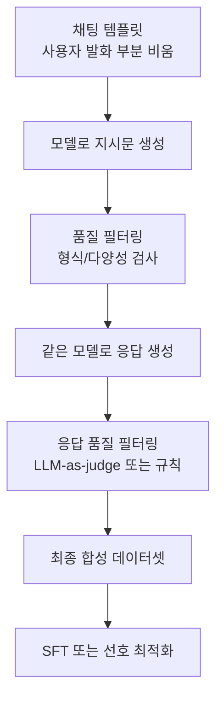
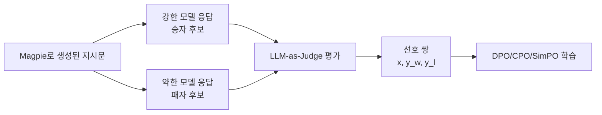

# Magpie - 합성 지시문 데이터 생성

## 배경과 문제 의식

고품질 지시문-응답 데이터는 LLM 정렬의 핵심 자원이다. 그러나 인간이 직접 지시문을 작성하면 비용이 높고 다양성이 제한된다. [[self-instruct-original|Self-Instruct]], [[evol-instruct-method|Evol-Instruct]] 같은 방법은 시드 데이터에서 지시문을 확장하지만, 시드의 편향이 전파되고 외부 강력한 모델(GPT-4 등)이 필요한 경우가 많다.

Magpie는 완전히 다른 관점에서 접근한다. **정렬된 LLM 자체가 시스템 프롬프트만 주어지면 지시문과 응답을 모두 스스로 생성**할 수 있다는 관찰을 활용한다. 인간 시드도, 외부 모델도 필요 없이 모델 자체의 정렬 능력을 데이터 생성에 역으로 활용한다.

## 핵심 아이디어: 빈 템플릿 주입

정렬된 LLM(예: Llama-3-Instruct, Qwen-Instruct)은 특정 채팅 템플릿 형식으로 학습되어 있다. 이 템플릿에서 **사용자 발화 부분을 비워두면**, 모델은 다음으로 올 것이 사용자 메시지임을 인식하고 그 자리에 자연스러운 지시문/질문을 생성하려 한다.

```
[시스템 프롬프트]
<|system|>
You are a helpful assistant.
<|user|>          ← 여기까지만 제공

↓ 모델이 자동으로 채움

<|user|>
"파이썬으로 피보나치 수열을 구현하는 방법을 알려주세요."
```

이후 이 생성된 지시문을 입력으로 사용해 응답까지 완성하면 완전한 (지시문, 응답) 쌍이 만들어진다.

## 생성 파이프라인



단 두 번의 추론(지시문 생성 + 응답 생성)으로 완전한 훈련 쌍을 만들 수 있다.

## 다양성 확보 전략

### 다양한 시스템 프롬프트

시스템 프롬프트에 역할/도메인/난이도 힌트를 넣어 생성 지시문의 분포를 제어한다:

- "You are a senior software engineer" -> 코드 관련 지시문
- "You are a creative writing assistant" -> 창의적 글쓰기 지시문
- 시스템 프롬프트 없음 -> 일반 범용 지시문

### 온도 샘플링

temperature를 높여 동일 템플릿에서 다양한 지시문을 반복 생성한다. 온도 0.9~1.2 범위에서 다양성과 품질의 균형을 맞춘다.

### 도메인별 프리픽스 조절

일부 변형에서는 `<|user|>` 이후에 도메인 키워드(예: "In Python,", "Can you explain")를 추가해 특정 유형의 지시문을 유도한다.

## 대규모 데이터 생성

원논문과 관련 작업에서 Magpie 방법으로 생성된 데이터 규모:

| 데이터셋 | 규모 | 기반 모델 | 특징 |
|----------|------|-----------|------|
| Magpie-Pro-1M | 100만 | Llama-3.1-70B-Instruct | 고품질 필터링 적용 |
| Magpie-Air-3M | 300만 | Llama-3-8B-Instruct | 대규모 다양성 |
| Magpie-Align | 30만 | 복수 모델 혼합 | 선호 쌍 포함 |

총 4M 이상의 합성 지시문 데이터가 공개 사용 가능한 수준으로 생성된 것으로 알려져 있다.

## 품질 필터링

대규모 자동 생성의 핵심 과제는 저품질 샘플 제거다. Magpie에서 사용되는 필터링:

### 규칙 기반 필터

- 최소/최대 토큰 길이 제한
- 특수 문자 비율 임계값
- 코드 응답의 실행 가능성 검사
- 언어 일관성 검사

### LLM 품질 평가

[[ultrafeedback-dataset|UltraFeedback]] 스타일로 자동 평가 모델(GPT-4 또는 오픈소스 모델)이 지시문과 응답의 품질을 0-5점으로 평가. 낮은 점수 샘플을 제거한다.

### 다양성 필터

임베딩 기반 중복 제거: 의미적으로 유사한 지시문이 대량으로 포함되지 않도록 코사인 유사도 임계값으로 필터링.

## 선호 데이터 확장

Magpie는 단순 (지시문, 응답) 쌍을 넘어 선호 쌍 생성에도 활용된다:



동일 지시문에 대해 강한 모델(Llama-3.1-70B)과 약한 모델(Llama-3-8B)이 각각 응답하면, 자연스럽게 품질 차이가 있는 선호 쌍이 만들어진다.

## Self-Instruct와의 비교

| 특성 | Self-Instruct | Magpie |
|------|--------------|--------|
| 시드 데이터 | 175개 인간 작성 예시 | 불필요 |
| 생성 방식 | 시드에서 새 지시문 생성 | 빈 템플릿 자동 완성 |
| 외부 모델 | 필요 (강력한 모델로 생성) | 정렬 모델 자체 활용 |
| 다양성 제어 | 시드 분포에 의존 | 시스템 프롬프트로 제어 |
| 확장성 | 시드 의존 한계 | 거의 무한 확장 가능 |

## 실험 결과

- Magpie 데이터로만 학습한 Llama-3-8B가 동일 크기의 공개 정렬 모델(Llama-3-8B-Instruct)과 AlpacaEval 2에서 경쟁.
- UltraFeedback(GPT-4 생성) 대비 동등 또는 우월한 다운스트림 성능.
- 선호 쌍 버전으로 DPO 학습 시 Arena-Hard 점수가 추가 향상.

## 실무 적용 관점

### 데이터 생성 파이프라인 구축

```python
from transformers import AutoTokenizer, AutoModelForCausalLM

# 정렬된 모델 로드
tokenizer = AutoTokenizer.from_pretrained("meta-llama/Meta-Llama-3.1-8B-Instruct")
model = AutoModelForCausalLM.from_pretrained(...)

# 사용자 발화만 채팅 템플릿에서 비워두는 방식으로 지시문 생성
# 모델이 다음으로 올 사용자 메시지를 자동 생성
```

실제 구현에서는 모델별 채팅 템플릿 형식을 정확히 맞추는 것이 핵심이다.

### 활용 시나리오

- **저자원 도메인**: 특정 도메인(의료, 법률, 코드)에 맞는 시스템 프롬프트로 도메인 특화 데이터 생성.
- **다국어**: 시스템 프롬프트를 한국어로 작성해 한국어 지시문 데이터 대량 생성.
- **선호 데이터 부트스트래핑**: 초기 선호 데이터 없이 RLHF 파이프라인 시작.

## 한계

- **정렬 모델 의존**: 기반 모델이 정렬되어 있어야 함. 기반 모델(base model)에서는 작동하지 않음.
- **분포 편향**: 생성된 지시문이 정렬 모델의 학습 데이터 분포를 반영할 수 있음.
- **안전성 리스크**: 필터링 없이 대량 생성 시 유해하거나 편향된 지시문이 포함될 수 있음.

## 관련 문서

- [[self-instruct-original]] - 합성 지시문의 원조 방법론
- [[evol-instruct-method]] - 진화적 지시문 합성
- [[synthetic-data-training]] - 합성 데이터 훈련 전반
- [[synthetic-data-generation-pipeline]] - 합성 데이터 생성 파이프라인
- [[instruction-tuning]] - 지시 튜닝 개요
- [[ultrafeedback-dataset]] - 대규모 선호 데이터셋
- [[preference-data-collection]] - 선호 데이터 수집 방법
- [[rlhf-and-alignment]] - 정렬 학습 전반 맥락
