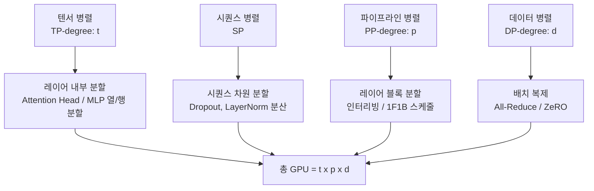
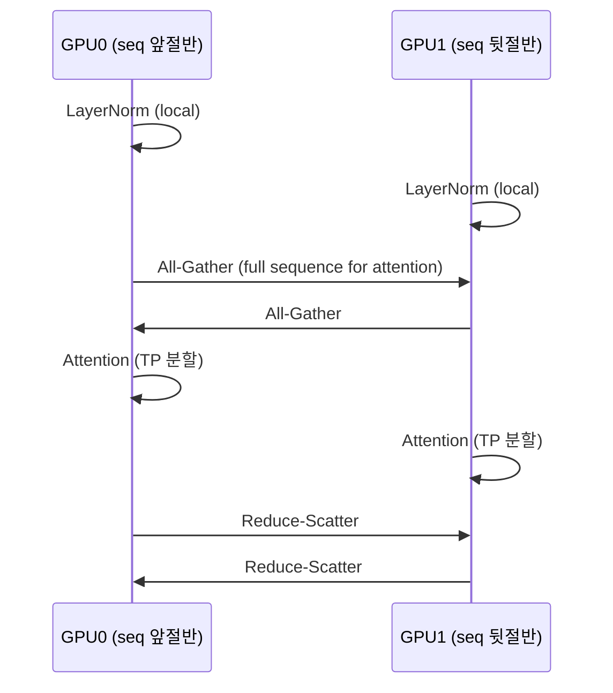

# Megatron-LM 내부 구조

Megatron-LM은 NVIDIA Research가 개발한 대규모 언어 모델 학습 프레임워크로, 수백억~수천억 파라미터 모델을 수천 개의 GPU에서 효율적으로 학습하기 위해 설계됐다. 텐서 병렬(Tensor Parallelism), 시퀀스 병렬(Sequence Parallelism), 파이프라인 병렬(Pipeline Parallelism) 세 가지 병렬화 차원을 동시에 통합하는 것이 핵심이다.

## 3D 병렬화 구조

[[megatron-lm]]의 병렬화 전략은 세 축을 조합한다:



[[distributed-training-overview]]에서 다루는 데이터 병렬(DP)까지 포함하면 4차원 병렬화가 된다.

## 텐서 병렬 (Tensor Parallelism)

텐서 병렬은 단일 레이어의 가중치 행렬을 여러 GPU에 분산한다. Transformer 블록의 두 핵심 연산인 **셀프 어텐션**과 **MLP**에 각각 다른 분할 패턴을 적용한다.

### MLP에서의 텐서 병렬

```
[입력 X] → [A 행렬: 열 방향 분할 → GPU0, GPU1, ...] → GeLU → [B 행렬: 행 방향 분할] → All-Reduce → [출력]
```

- 첫 번째 행렬(A)는 **열(column) 방향**으로 분할 - 각 GPU가 독립적으로 다른 피처를 계산
- 두 번째 행렬(B)는 **행(row) 방향**으로 분할 - All-Reduce로 결과 합산

이 방식으로 하나의 MLP 전방향 연산에 정확히 **2번의 All-Reduce**만 필요하다.

### 어텐션에서의 텐서 병렬

멀티헤드 어텐션은 헤드(head) 단위로 GPU에 배정한다. 각 GPU가 서로 다른 어텐션 헤드를 담당하므로 헤드 수가 텐서 병렬 degree의 배수여야 한다.

## 시퀀스 병렬 (Sequence Parallelism)

텐서 병렬 구간 사이(LayerNorm, Dropout)에서는 All-Reduce가 아닌 All-Gather / Reduce-Scatter를 사용하고, 시퀀스 차원을 분할해 메모리 절감을 추가로 달성한다.



이를 통해 텐서 병렬 구간 외부(LayerNorm/Dropout)의 **활성화 메모리를 TP degree만큼 분산**한다.

## 파이프라인 병렬 (Pipeline Parallelism)

파이프라인 병렬은 레이어 블록을 여러 스테이지로 나누어 각 스테이지를 별도 GPU 그룹에 배정한다. 가장 중요한 구현 세부사항은 **1F1B (One Forward, One Backward)** 스케줄과 **인터리빙(Interleaving)** 스케줄이다.

| 스케줄 | 특징 | 버블 오버헤드 |
|--------|------|---------------|
| GPipe (동기) | 마이크로배치 순차 실행, 메모리 많음 | 높음 |
| 1F1B | 순전파/역전파 교대, 메모리 효율 | 중간 |
| 인터리빙 1F1B | 레이어를 청크로 나눠 인터리빙 | 낮음 (pp-1)/pp 대비 개선) |

인터리빙 스케줄에서는 각 GPU가 연속된 레이어가 아닌 **교차 배치된 레이어 청크**를 담당하므로 파이프라인 버블(pipeline bubble)을 크게 줄인다.

## 모델 초기화와 Activation Recomputation

Megatron-LM은 **선택적 활성화 재계산(selective activation recomputation)**을 지원한다. 메모리 절감을 위해 일부 활성화(특히 Attention softmax 이후 값)만 저장하고 나머지는 역전파 시 재계산한다.

```python
# Megatron-LM 실행 예시
python pretrain_gpt.py \
    --tensor-model-parallel-size 4 \
    --pipeline-model-parallel-size 4 \
    --num-layers 96 \
    --hidden-size 12288 \
    --recompute-activations  # 선택적 재계산
```

## 통신 패턴과 최적화

Megatron-LM의 통신 비용은 크게 두 범주다:

- **TP 내부**: All-Reduce / All-Gather / Reduce-Scatter (노드 내 NVLink 경유)
- **PP 경계**: P2P send/recv (노드 간 InfiniBand 경유)

노드 내 TP(NVLink), 노드 간 PP(IB)로 배치하는 것이 표준 전략이다. DP는 ZeRO와 조합하거나 별도 All-Reduce로 처리한다.

## 관련 문서

- [[megatron-lm]] - Megatron-LM 프로젝트 전체 개요 및 모델 구조
- [[distributed-training-overview]] - 데이터 병렬, FSDP, ZeRO 등 분산 학습 전체 그림
- [[pipeline-parallelism-1f1b]] - 1F1B 파이프라인 스케줄 상세 분석
- [[tensor-pipeline-parallelism]] - 텐서/파이프라인 병렬화 비교
