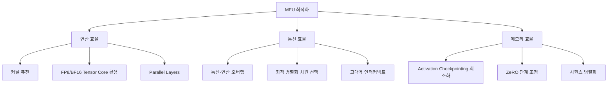

# 모델 FLOP 활용률 (Model FLOPs Utilization, MFU)

## 개요

MFU(Model FLOPs Utilization)는 LLM 학습 시 하드웨어 연산 자원이 실제로 얼마나 효율적으로 활용되고 있는지를 측정하는 핵심 지표다. Google의 PaLM 논문(Chowdhery et al., 2022)에서 공식적으로 제안되었으며, 실제 관측된 연산 처리량과 하드웨어의 이론적 최대 처리량의 비율로 정의된다. 100%에 가까울수록 하드웨어를 효율적으로 사용하고 있다는 의미이지만, 통신 오버헤드, 메모리 병목, 데이터 로딩 지연 등으로 인해 실전에서 100%는 불가능하다. [[mixed-precision-training]]의 정밀도 선택, [[tensor-pipeline-parallelism]]의 병렬화 전략, [[gpu-cluster-scheduling]]의 클러스터 구성이 모두 MFU에 직접적 영향을 미친다.

## 핵심 개념

### 정의와 수식

MFU는 다음과 같이 정의된다.

```
MFU = 관측된 모델 FLOP/s / 하드웨어 이론적 최대 FLOP/s
```

여기서 각 항은 다음과 같다.

- **관측된 모델 FLOP/s**: 학습 스텝 1회에 필요한 이론적 연산량을 실제 스텝 소요 시간으로 나눈 값
- **하드웨어 이론적 최대 FLOP/s**: 사용 중인 가속기의 공식 스펙상 최대 처리 성능 (예: H100 SXM BF16 기준 989 TFLOPS)

### Transformer 모델의 FLOP 계산

Transformer 모델의 학습 스텝당 이론적 연산량은 근사적으로 다음과 같이 계산한다.

```
FLOP_per_token = 6 * P + 12 * L * H * Q * T
```

| 변수 | 의미 |
|------|------|
| P | 모델 파라미터 수 |
| L | 레이어 수 |
| H | 어텐션 헤드 수 |
| Q | 헤드 차원 |
| T | 시퀀스 길이 |

첫 번째 항 `6P`는 Forward(2P) + Backward(4P)의 행렬 곱셈 연산을 반영하며, 두 번째 항 `12LHQT`는 셀프 어텐션의 QK^T 및 Attention*V 연산을 포함한다. 시퀀스 길이가 짧은 경우 어텐션 항이 상대적으로 작아 `6P`만으로 근사하기도 한다.

### MFU vs HFU


| 지표 | 포함 범위 | 용도 |
|------|-----------|------|
| MFU | 모델 정의에서 나오는 순수 이론 연산량만 | 모델/시스템 간 공정 비교 |
| HFU | activation recomputation 등 실제 추가 연산 포함 | 하드웨어 활용도 정밀 측정 |

activation checkpointing(gradient checkpointing)을 사용하면 forward pass를 재수행하므로 HFU는 MFU보다 높게 나타난다. 예를 들어 전체 activation recomputation 시 HFU는 MFU의 약 1.33배가 된다.

## 주요 모델의 MFU 비교

| 모델 | 파라미터 | 하드웨어 | MFU | 출처 |
|------|---------|---------|-----|------|
| GPT-3 | 175B | A100 | ~21.3% | Brown et al. (2020) |
| Gopher | 280B | TPU v3 | ~32.5% | Rae et al. (2021) |
| PaLM | 540B | TPU v4 | 46.2% | Chowdhery et al. (2022) |
| Llama 3.1 | 405B | H100 | 38-43% | Meta (2024) |
| DeepSeek-V3 | 671B (MoE) | H800 | ~30-35% | DeepSeek (2024) |

GPT-3에서 PaLM까지 약 2배 이상의 MFU 개선이 이루어졌다. PaLM의 높은 MFU는 TPU v4 Pod의 효율적 병렬화와 "parallel layers" 기법(어텐션과 FFN을 병렬 배치)에 기인한다.

## MFU에 영향을 미치는 요소

### 하드웨어 및 네트워크

- **가속기 세대**: A100(BF16 312 TFLOPS) -> H100(BF16 989 TFLOPS)으로 이론 성능이 올라가면 같은 모델에서도 MFU가 달라질 수 있다
- **인터커넥트 대역폭**: NVLink, NVSwitch, InfiniBand 대역폭이 all-reduce 등 집합 통신의 오버헤드를 결정
- **GPU 메모리 크기**: HBM 용량이 부족하면 activation recomputation이나 추가적 통신이 필요해져 MFU가 하락

### 소프트웨어 및 학습 설정

- **병렬화 전략**: [[tensor-pipeline-parallelism]]에서 텐서/파이프라인/시퀀스 병렬화의 조합이 통신 대 연산 비율을 결정
- **배치 크기**: 배치가 클수록 GPU 연산 유닛의 활용률이 올라가지만, 메모리 한계와 수렴 품질 트레이드오프 존재
- **[[mixed-precision-training]]**: BF16/FP8 사용 시 Tensor Core 활용률이 높아져 MFU 향상
- **컴파일러 최적화**: XLA(TPU), torch.compile(GPU)가 커널 퓨전과 메모리 액세스 최적화로 MFU를 끌어올림
- **통신-연산 오버랩**: backward pass 중 gradient all-reduce를 overlap시키면 유휴 시간을 줄일 수 있음

### 모델 아키텍처

- **MoE(Mixture of Experts)**: 활성 파라미터 대비 전체 파라미터가 크고 전문가 간 통신이 추가되어 Dense 모델 대비 MFU 측정이 복잡하다
- **어텐션 변형**: FlashAttention, Grouped-Query Attention 등이 어텐션 연산의 메모리 효율을 높여 간접적으로 MFU에 기여

## MFU 최적화 전략



1. **Parallel Layers**: PaLM에서 도입한 기법으로, 어텐션과 FFN을 순차가 아닌 병렬로 수행하여 연산 밀도를 높임
2. **통신-연산 오버랩**: [[data-parallelism-fsdp]]의 gradient all-reduce를 backward 연산과 동시에 수행
3. **배치 크기 최대화**: GPU 메모리가 허용하는 범위 내에서 마이크로배치를 최대화하여 Tensor Core 활용률 극대화
4. **커널 최적화**: FlashAttention-2/3, 퓨전된 LayerNorm + dropout 등으로 메모리 바운드 연산을 줄임

## 실전에서의 MFU 해석

40-50% MFU는 현재 기준으로 우수한 수치로 평가된다. 그러나 MFU만으로 학습 효율의 전체 그림을 파악할 수 없다. 실제 비용 효율(달러당 토큰 처리량), 수렴 품질(동일 토큰에서의 손실), 장애 복구 시간(체크포인트 복원 오버헤드) 등을 종합적으로 고려해야 한다. [[neural-scaling-laws]]가 예측하는 최적 연산 예산을 실제로 달성하려면, MFU를 최대한 높여 주어진 하드웨어 투자에서 최대 유효 연산량을 뽑아내는 것이 핵심이다.

## 대표 자료

- [PaLM: Scaling Language Modeling with Pathways (Chowdhery et al., 2022)](https://arxiv.org/abs/2204.02311)
- [Stas Bekman, ML Engineering - Training Performance](https://github.com/stas00/ml-engineering/blob/master/training/performance/README.md)
- [Understanding FLOPs, MFU, and Computational Efficiency in LLM Training](https://debjitpaul.github.io/blog/2025/compute/)

## 관련 문서

- [[mixed-precision-training]] -- 정밀도 선택이 Tensor Core 활용률과 MFU에 미치는 영향
- [[tensor-pipeline-parallelism]] -- 병렬화 전략에 따른 통신 오버헤드와 MFU 트레이드오프
- [[data-parallelism-fsdp]] -- 데이터 병렬화와 gradient 통신이 MFU에 미치는 영향
- [[gpu-cluster-scheduling]] -- 클러스터 수준의 스케줄링이 전체 학습 효율에 미치는 영향
- [[neural-scaling-laws]] -- MFU가 높을수록 동일 하드웨어에서 더 많은 유효 연산 확보
