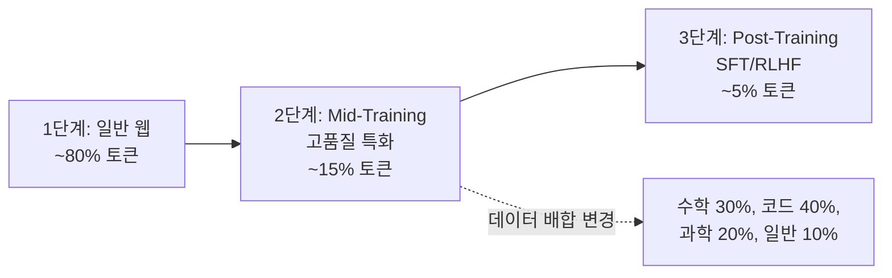

# Mid-Training Phase

사전학습을 2단계로 나누는 커리큘럼 전략. 1단계에서 일반 웹 데이터로 광범위 지식을 학습하고, 2단계(Mid-Training)에서 **고품질 특화 데이터**로 전환하여 추론/코딩 능력을 집중 강화한다. Phi-3, MiniCPM 등이 채택.

## 1단계와의 차이

| 측면 | 1단계 | Mid-Training |
|------|-------|-------------|
| 데이터 | 일반 웹 (FineWeb 등) | 교과서, 합성 데이터, 코드 |
| 목적 | 광범위 언어 이해 | 추론/코딩 집중 강화 |
| 학습률 | [[warmup-stable-decay-wsd\|WSD]] 안정 구간 | LR 재가열 또는 안정 유지 |
| 배합 비율 | 웹 80%+ | 특화 데이터 60-80% |

## Phi-3의 Mid-Training

Phi-3는 합성 데이터 40%를 Mid-Training에 집중 투입하여 교사 모델(GPT-4)을 초월하는 추론 능력을 소형 모델에서 달성. [[synthetic-data-generation-pipeline|합성 데이터 파이프라인]]이 핵심 역할.

## 관련 문서

- [[pretraining-data-curation]] -- 사전학습 데이터 선별
- [[data-mixing-strategy]] -- 데이터 배합 전략
- [[warmup-stable-decay-wsd]] -- WSD 스케줄러
- [[synthetic-data-generation-pipeline]] -- 합성 데이터 생성
