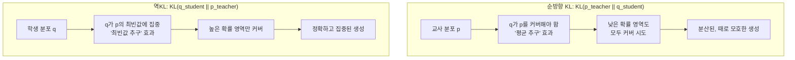
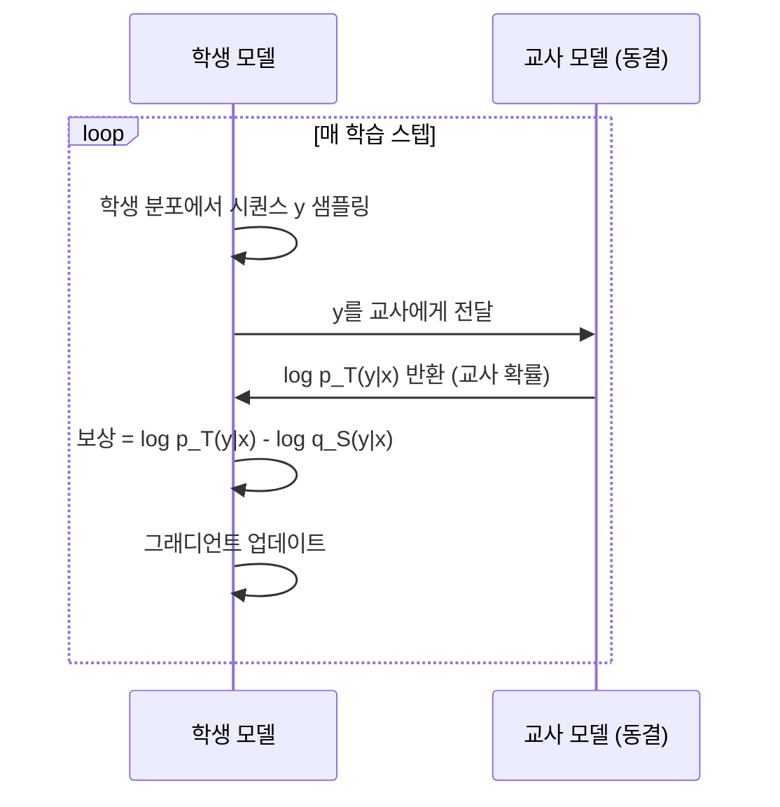
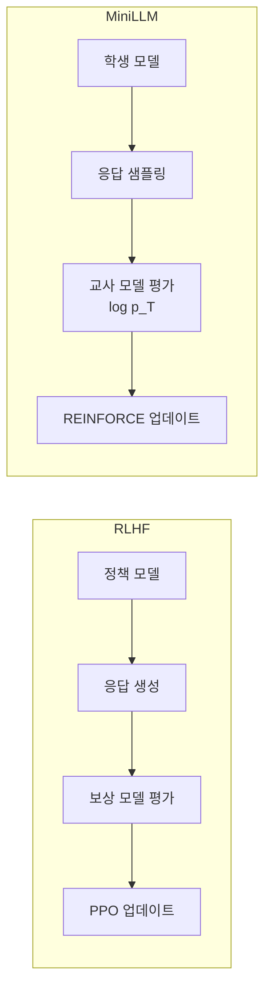

# MiniLLM - LLM 텍스트 증류와 역KL 발산

MiniLLM은 Microsoft Research(2023)가 제안한 LLM 지식 증류 방법론이다. 기존 최대우도추정(MLE) 기반 증류가 **순방향 KL 발산(forward KL divergence)**을 최소화하는 것에 반해, MiniLLM은 **역KL 발산(reverse KL divergence)**을 최소화하는 방식으로 학생 모델이 교사보다 더 정확하고 간결한 응답을 생성하도록 한다.

## 핵심 통찰: KL 발산 방향의 중요성

KL 발산은 비대칭적이다. $KL(p||q)$와 $KL(q||p)$는 다른 최적화 목표를 만든다.



LLM의 텍스트 생성에서 역KL은 학생 모델이 교사의 고확률 패턴(정확한 답변)에 집중하도록 유도한다.

## 수학적 정식화

### 표준 MLE 증류 (순방향 KL)

$$L_{MLE} = -\mathbb{E}_{y \sim p_T(y|x)} [\log q_S(y|x)]$$

교사 분포 $p_T$에서 샘플링한 시퀀스에 대해 학생의 로그 확률을 최대화. 교사 출력을 새 정답으로 학습.

### MiniLLM (역KL)

$$L_{MiniLLM} = KL(q_S || p_T) = \mathbb{E}_{y \sim q_S(y|x)} \left[\log \frac{q_S(y|x)}{p_T(y|x)}\right]$$

학생 분포 $q_S$에서 샘플링하고, 그 샘플에 대한 교사 확률을 보상으로 사용.

## On-Policy 증류의 의미

역KL을 최소화하려면 학생 자신의 분포에서 샘플링해야 한다 - 이를 **on-policy** 학습이라 한다.



이는 RLHF의 PPO와 구조적으로 유사하지만, 보상 모델 대신 교사 LLM이 보상을 제공한다.

## 알고리즘 구현

```python
import torch
import torch.nn.functional as F

def minillm_loss(student_model, teacher_model, inputs, num_samples=4):
    """MiniLLM 역KL 손실 함수"""
    batch_size = inputs["input_ids"].shape[0]

    # 1. 학생 분포에서 시퀀스 샘플링 (on-policy)
    with torch.no_grad():
        student_samples = student_model.generate(
            **inputs,
            do_sample=True,
            num_return_sequences=num_samples,
            max_new_tokens=256,
        )

    # 2. 교사 확률 계산 (log p_T)
    with torch.no_grad():
        teacher_logits = teacher_model(**{
            "input_ids": student_samples,
            "attention_mask": student_samples.ne(0).long()
        }).logits
        teacher_log_prob = F.log_softmax(teacher_logits, dim=-1)

    # 3. 학생 확률 계산 (log q_S)
    student_logits = student_model(**{
        "input_ids": student_samples,
        "attention_mask": student_samples.ne(0).long()
    }).logits
    student_log_prob = F.log_softmax(student_logits, dim=-1)

    # 4. 역KL: E_q[log q - log p]
    token_rewards = student_log_prob - teacher_log_prob
    seq_rewards = token_rewards.sum(dim=-1)  # 시퀀스 레벨 집계

    # 5. REINFORCE 스타일 그래디언트 (베이스라인으로 분산 감소)
    baseline = seq_rewards.mean(dim=0, keepdim=True)
    advantages = seq_rewards - baseline

    loss = (advantages * student_log_prob.sum(dim=-1)).mean()
    return loss
```

## 핵심 구성 요소

### 단일 단계 분해 (Single-Step Decomposition)

전체 시퀀스 수준의 역KL을 효율적으로 계산하기 위해, MiniLLM은 이를 토큰별 단계로 분해한다.

$$KL(q_S||p_T) = \sum_t \mathbb{E}_{y_{<t} \sim q_S} \left[ KL(q_S(\cdot|y_{<t},x) || p_T(\cdot|y_{<t},x)) \right]$$

이 분해를 통해 시퀀스 레벨 최적화가 토큰 레벨 계산으로 환원된다.

### 분산 감소 기법

역KL의 그래디언트 추정은 분산이 크다. MiniLLM은 다음 기법으로 안정화한다:

1. **베이스라인 빼기**: $\text{advantage} = R(y) - V(x)$ 형태로 분산 감소
2. **여러 샘플 평균**: 배치 내 다수 샘플로 추정
3. **클리핑**: TRPO/PPO 스타일 KL 제약

## 실험 결과: 학생이 교사를 능가하는 경우

MiniLLM의 주목할 결과는 일부 시나리오에서 **학생 모델이 교사 모델보다 높은 품질의 응답**을 생성한다는 것이다.

| 태스크 | MLE 증류 (GPT-2-Large) | MiniLLM (GPT-2-Large) | 교사 (GPT-4) |
|--------|----------------------|----------------------|-------------|
| Rouge-L (요약) | 27.3 | 29.1 | 28.6 |
| 도움성 평가 | 60.2% | 67.8% | 65.3% |

이는 역KL의 "최빈값 추구" 특성 덕분에 학생이 교사의 "평균적" 응답보다 더 확실한 답변을 생성하기 때문이다.

## 기존 방법론과 비교

| 특성 | SFT (fine-tuning) | [[seq-knowledge-distillation|Seq-KD]] | MiniLLM |
|------|-------------------|--------------------------------------|---------|
| 학습 신호 | 인간 레이블 | 교사 생성 데이터 | 역KL 그래디언트 |
| KL 방향 | N/A | 순방향 KL | 역KL |
| 샘플링 | Off-policy | Off-policy | On-policy |
| 안정성 | 높음 | 높음 | 중간 |
| 구현 복잡도 | 낮음 | 낮음 | 높음 |
| 교사 필요 시점 | 학습 전 | 학습 전 | 학습 중 |

## MiniLLM과 RLHF의 관계

MiniLLM은 RLHF([[rlhf-and-alignment]])와 구조적으로 매우 유사하다.



차이점: RLHF는 인간 선호도 기반 보상 모델을 사용하고, MiniLLM은 교사 LLM의 확률을 보상으로 사용한다.

## 한계와 후속 연구

1. **훈련 불안정성**: On-policy 샘플링으로 인한 높은 분산
2. **교사 접근 필요**: 학습 중 실시간으로 교사에게 쿼리해야 함 (비용)
3. **길이 제어 어려움**: 역KL은 짧고 확실한 답변을 선호하는 경향

후속으로 DistiLLM(2024)이 MiniLLM의 샘플링 효율을 개선하고, GKD(Generalized Knowledge Distillation)가 다양한 KL 방향을 통합했다.

## 관련 문서

- [[knowledge-distillation]] - 지식 증류 기본 개념
- [[seq-knowledge-distillation]] - 시퀀스 레벨 증류 (MiniLLM의 기반)
- [[distilbert-distillation]] - 트랜스포머 증류의 고전적 사례
- [[rlhf-and-alignment]] - MiniLLM과 구조적으로 유사한 정렬 방법
- [[direct-preference-optimization]] - 또 다른 오프-폴리시 정렬 접근
