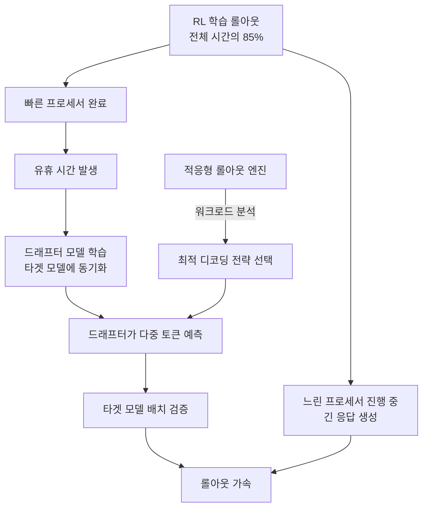

# MIT LLM 학습 효율화 (Taming the Long Tail)

## 개요

MIT 연구팀이 개발한 TLT(Taming the Long Tail) 시스템은 강화학습 기반 LLM 학습에서 유휴 시간을 활용하여 학습 속도를 70-210% 가속하는 기법이다. 핵심 아이디어는 학습 중 대기하는 프로세서에서 작은 "드래프터(drafter)" 모델을 학습시켜 큰 [[deepseek-r1-paper|추론 모델]]의 출력을 예측하게 하는 것이다. 정확도 손실 없이 학습 비용과 에너지 소비를 대폭 줄인다.

논문 제목은 "Taming the Long-Tail: Efficient Reasoning RL Training with Adaptive Drafter"이며, ACM International Conference on Architectural Support for Programming Languages and Operating Systems(ASPLOS)에서 발표되었다.

## 핵심 개념

### 롤아웃 병목

강화학습 기반 LLM 학습에서 롤아웃(rollout) -- 여러 가능한 답변을 생성하는 과정 -- 이 전체 실행 시간의 최대 85%를 차지한다. 일부 프로세서가 빠르게 완료되어도 긴 응답을 생성하는 프로세서를 기다려야 하므로, 대량의 연산 자원이 유휴 상태로 낭비된다. 이것이 "긴 꼬리(long tail)" 문제이며, TLT가 해결하려는 핵심 병목이다.

### 적응형 드래프터 학습기 (Adaptive Drafter Trainer)

TLT의 첫 번째 핵심 구성요소다. 유휴 프로세서 시간을 활용하여 경량 드래프터 모델을 지속적으로 학습한다. 핵심 특성:

- 드래프터는 진화하는 타겟 모델에 계속 동기화됨
- 추가 연산 오버헤드 없이 학습이 이루어짐 (기존 유휴 자원만 활용)
- 고정된(static) 드래프터가 아닌 동적으로 업데이트되는 적응형 모델
- 학습 중 타겟 모델이 변화하면 드래프터도 함께 적응

### 적응형 롤아웃 엔진 (Adaptive Rollout Engine)

TLT의 두 번째 핵심 구성요소다. 현재 학습 워크로드 특성에 따라 최적의 추측적 디코딩([[eagle-3-speculative-decoding|speculative decoding]]) 전략을 자동으로 선택한다. 선택 기준:

- 드래프트 모델의 입력 볼륨
- 타겟 모델의 검증 수락률(acceptance rate)
- 현재 배치의 워크로드 분포

워크로드가 변화함에 따라 전략도 적응적으로 조정된다.

### 추측적 디코딩 활용

기존 추측적 디코딩은 추론(inference) 단계에서만 사용되었으나, TLT는 이를 학습(training) 단계에 적용한다. 드래프터가 빠르게 여러 토큰을 예측하고, 타겟 모델이 이를 배치 단위로 한꺼번에 검증한다. 순차적 생성 대비 병렬 검증이 가능하므로 롤아웃이 가속된다.

## 작동 원리

1. RL 학습 중 롤아웃 수행 -- 전체 시간의 85% 차지
2. 빠르게 완료된 프로세서에서 유휴 시간 발생
3. 유휴 시간에 경량 드래프터 모델을 타겟 모델 출력 예측으로 학습
4. 학습된 드래프터가 추측적 디코딩으로 롤아웃 가속
5. 적응형 엔진이 워크로드에 따라 최적 전략 자동 선택

## 성능/효과

- **학습 속도**: 70-210% 가속 (다수 추론 LLM에서 검증)
- **정확도**: 완전 보존 -- 무손실(lossless) 가속
- **추가 연산**: 오버헤드 없음 (기존 유휴 자원만 활용)
- **보너스**: 학습된 드래프터 모델을 추론 배포에도 재활용 가능 ("free byproduct")
- **에너지**: 동일 성능 달성에 필요한 에너지 소비 대폭 절감
- **적용 분야**: 금융 예측, 전력망 리스크 탐지 등 고급 LLM 활용 분야의 개발 비용 절감

## 연구팀

- **Qinghao Hu**: MIT 박사후연구원 (공동 제1저자)
- **Shang Yang**: MIT EECS 대학원생 (공동 제1저자)
- **Song Han**: MIT EECS 부교수, NVIDIA Distinguished Scientist (교신저자)
- 공동 연구 기관: NVIDIA, ETH Zurich, MIT-IBM Watson AI Lab, UMass Amherst

논문: [arxiv.org/pdf/2511.16665](https://arxiv.org/pdf/2511.16665)

## 기존 기법 대비 차별점

| 특성 | TLT | 기존 추측적 디코딩 | 표준 RL 학습 |
|------|-----|-------------------|-------------|
| 적용 단계 | 학습(training) | 추론(inference) | 학습 |
| 드래프터 업데이트 | 동적 적응 | 고정(static) | 없음 |
| 유휴 자원 활용 | O | X | X |
| 추가 연산 비용 | 없음 | 드래프터 실행 비용 | - |
| 정확도 영향 | 무손실 | 무손실 | 기본 |

## 실용적 의의

TLT의 가장 큰 실용적 가치는 기존 RL 학습 인프라를 변경하지 않고 유휴 자원만 활용한다는 점이다. 추가 GPU를 구매하거나 클러스터를 확장할 필요 없이 이미 낭비되고 있던 연산을 드래프터 학습에 전용한다. 학습 완료 후 드래프터 모델은 추론 배포에도 재활용되므로, 학습 과정의 "무료 부산물(free byproduct)"로서 이중 가치를 제공한다.

에너지 소비 관점에서도 동일 성능 달성에 필요한 총 에너지가 줄어든다. 금융 예측, 전력망 리스크 탐지, 과학 연구 등 대규모 RL 학습이 필요한 분야에서 개발 비용과 탄소 발자국을 동시에 절감할 수 있다.

현재 TLT는 추론 LLM(reasoning LLM)의 RL 학습에 초점을 맞추고 있으나, 유휴 자원 활용이라는 핵심 아이디어는 다른 대규모 분산 학습 시나리오에도 일반화될 가능성이 있다.

## 관련 문서
- [[data-parallelism-fsdp]]

- [[speculative-speculative-decoding]] -- 추측적 디코딩의 고급 병렬화
- [[mirror-speculative-decoding]] -- 이기종 가속기 활용 추측적 디코딩
- [[rl-scaling-laws]] -- 강화학습 기반 학습의 스케일링 법칙
- [[grpo]] -- RL 기반 후학습 기법
