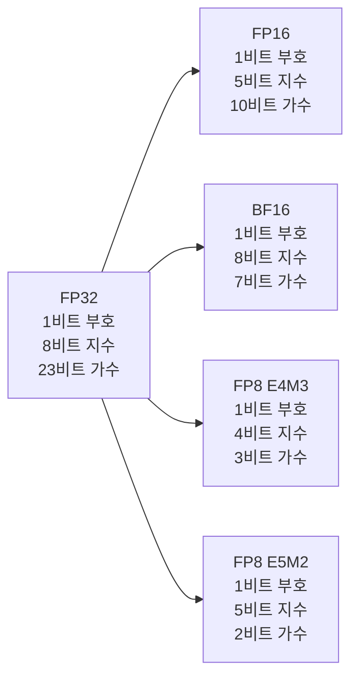
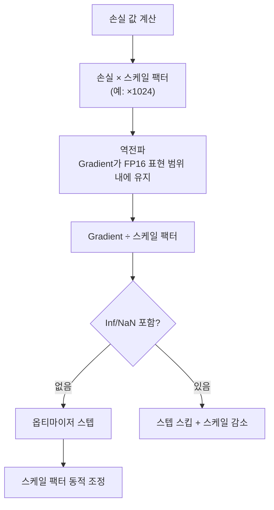
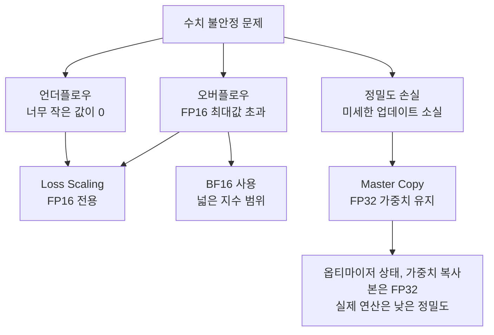

# 혼합 정밀도 학습 상세

혼합 정밀도 학습(Mixed Precision Training)은 FP32 대신 더 낮은 정밀도의 부동소수점 포맷을 사용해 **메모리를 절반으로 줄이고 연산 처리량을 크게 높이는** 기법이다. [[mixed-precision-training]]의 개요에서 한 단계 더 들어가, 각 포맷의 수치적 특성과 실무 선택 기준을 다룬다.

## 부동소수점 포맷 비교



| 포맷 | 비트 | 최대값 | 최소 양수 | 지수 범위 | 정밀도 |
|------|------|--------|-----------|-----------|--------|
| FP32 | 32 | 3.4e38 | 1.2e-38 | -126~127 | 높음 |
| FP16 | 16 | 65504 | 6.1e-5 | -14~15 | 중간 |
| BF16 | 16 | 3.4e38 | 1.2e-38 | -126~127 | 낮음 |
| FP8 E4M3 | 8 | 448 | 1.9e-3 | -6~7 | 매우 낮음 |
| FP8 E5M2 | 8 | 57344 | 1.5e-5 | -14~15 | 매우 낮음 |

## FP16의 특성과 한계

FP16은 지수 비트가 5개뿐이라 **표현 가능한 값의 범위(dynamic range)가 매우 좁다**. 최대값이 65504로, 딥러닝에서 자주 등장하는 대형 gradient 값이 여기를 초과하면 **오버플로우(Inf)**가 발생한다. 반대로 너무 작은 gradient는 0으로 처리되는 **언더플로우** 문제도 있다.

### [[loss-scaling]]이 필요한 이유



PyTorch의 `torch.cuda.amp.GradScaler`가 이 과정을 자동화한다.

## BF16: LLM 학습의 사실상 표준

BF16(Brain Float 16)은 Google Brain이 TPU를 위해 설계한 포맷으로, FP32와 **지수 비트 수가 동일(8비트)**하다. 이 덕분에:

- FP32와 동일한 동적 범위를 가지므로 **오버플로우 위험이 거의 없다**
- Loss scaling 없이 학습 가능
- 가수 정밀도는 FP16보다 낮지만, 대규모 모델 학습에서 수렴에 충분하다

**GPT-4, LLaMA-3, Gemma 등 최근 대형 모델은 BF16으로 학습**된다. BF16 지원 GPU는 A100, H100, RTX 3090 이후 세대다.

```python
# BF16 혼합 정밀도 학습 (PyTorch)
with torch.autocast(device_type="cuda", dtype=torch.bfloat16):
    output = model(input)
    loss = criterion(output, target)
# BF16에서는 GradScaler 불필요
loss.backward()
optimizer.step()
```

## FP8: H100 세대의 새 표준

NVIDIA H100은 FP8 Tensor Core를 지원하며, Transformer Engine 라이브러리를 통해 **FP8 학습**이 가능하다. FP8은 BF16 대비 **2배 처리량**과 **절반 메모리**를 제공한다.

### E4M3 vs E5M2 용도 분리

FP8에는 두 포맷이 있으며 역할이 다르다:

| 포맷 | 정밀도 | 범위 | 주요 용도 |
|------|--------|------|-----------|
| E4M3 | 더 높음 | 더 좁음 | 순전파 (가중치, 활성화) |
| E5M2 | 더 낮음 | 더 넓음 | 역전파 (gradient) |

gradient는 넓은 범위를 필요로 하고, 활성화/가중치는 정밀도가 중요하기 때문이다.

### FP8 스케일링

FP8은 FP16보다 범위가 훨씬 좁아 더 정교한 스케일링이 필요하다. **Per-tensor** 또는 **per-channel** 스케일 팩터를 학습 중 동적으로 추정한다.

## 수치 안정성 전략 종합



**Master Weight Copy 패턴**: 가중치의 FP32 복사본을 옵티마이저가 보유하고, 순전파/역전파는 FP16/BF16으로 수행. 최종 업데이트는 FP32 복사본에 적용 후 다시 저정밀도로 캐스팅.

## 포맷 선택 가이드

- **V100 / 이전 세대 GPU**: FP16 + Loss Scaling (BF16 미지원)
- **A100 / RTX 3090+**: BF16 추천 (안정적, 간단)
- **H100**: BF16 또는 FP8 (처리량 우선 시 FP8)
- **TPU**: BF16 (Google 설계 목적)
- **추론 전용**: INT8 또는 INT4까지 고려 (학습과 별개 주제)

## 관련 문서

- [[mixed-precision-training]] - 혼합 정밀도 학습 개요 및 기본 개념
- [[loss-scaling]] - Loss Scaling 알고리즘 상세
- [[fp8-training]] - FP8 학습 상세 및 Transformer Engine
- [[distributed-training-overview]] - 분산 학습에서 혼합 정밀도의 역할
