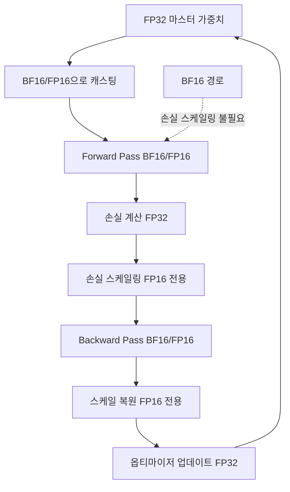

# 혼합 정밀도 학습

## 개요

혼합 정밀도 학습(Mixed Precision Training)은 학습 과정에서 FP32(32비트 부동소수점) 대신 FP16, BF16, FP8 등 낮은 정밀도의 수치 형식을 활용하여 메모리 사용량을 절감하고 연산 속도를 높이는 기법이다. "혼합"이라는 이름은 모든 연산을 저정밀도로 수행하는 것이 아니라, 정밀도에 민감한 연산(손실 계산, 소프트맥스 등)은 FP32를 유지하고 행렬 곱셈 등 대량 연산은 저정밀도로 수행하는 전략적 조합을 의미한다. 2026년 현재 BF16이 사실상 기본이며, Hopper(H100) 이후 GPU에서 FP8 학습이 점진적으로 확산되고 있다.

## 핵심 개념

### 수치 형식 비교

| 형식 | 부호 | 지수 | 가수 | 동적 범위 | 정밀도 | 메모리 |
|------|------|------|------|----------|--------|--------|
| FP32 | 1 | 8 | 23 | ~1e-38 ~ 3e38 | 높음 | 4 bytes |
| FP16 | 1 | 5 | 10 | ~6e-5 ~ 6.5e4 | 중간 | 2 bytes |
| BF16 | 1 | 8 | 7 | ~1e-38 ~ 3e38 | 낮음 | 2 bytes |
| FP8 (E4M3) | 1 | 4 | 3 | ~0.002 ~ 448 | 매우 낮음 | 1 byte |
| FP8 (E5M2) | 1 | 5 | 2 | ~1e-7 ~ 5.7e4 | 최소 | 1 byte |

### FP16: 범위 부족 문제

FP16은 5비트 지수로 인해 동적 범위가 매우 좁다. 최대값이 약 65,504이므로 큰 활성화 값에서 오버플로(overflow)가, 매우 작은 그래디언트에서 언더플로(underflow)가 발생한다. 이를 보완하기 위해 손실 스케일링(Loss Scaling)이 필수적이다.

**손실 스케일링**: backward 전에 손실을 큰 상수로 곱하여(scale up) 그래디언트 값을 언더플로 범위 밖으로 밀어낸 뒤, 옵티마이저 업데이트 전에 다시 나눈다(scale down). PyTorch AMP의 GradScaler가 이를 자동으로 관리하며, 동적 손실 스케일링은 스케일 팩터를 학습 중 적응적으로 조절한다.

### BF16: 범위 우선 설계

BF16은 FP32와 동일한 8비트 지수를 사용하여 동적 범위 문제를 근본적으로 해결한다. 대신 가수가 7비트로 줄어 정밀도가 낮지만, LLM 학습에서는 정밀도보다 범위가 중요하므로 BF16이 FP16보다 안정적이다. 손실 스케일링이 불필요하여 구현이 단순하며, 2026년 현재 대부분의 LLM 학습에서 기본 형식이다.

### FP8: 차세대 학습 정밀도

NVIDIA Hopper(H100) 아키텍처부터 지원되는 8비트 형식이다. 두 가지 변형이 존재한다:

- **E4M3**: 4비트 지수, 3비트 가수. forward pass에 적합 (범위 좁지만 정밀도 상대적으로 높음)
- **E5M2**: 5비트 지수, 2비트 가수. backward pass에 적합 (넓은 범위로 그래디언트 표현)

FP8은 BF16 대비 메모리를 절감하지는 않고(학습 중 마스터 가중치는 여전히 BF16/FP32), Tensor Core의 FP8 연산 FLOPS를 활용하여 행렬 곱셈 처리량을 향상시키는 것이 주된 이점이다. 단, 일정 규모(약 200만 토큰/배치, 충분한 모델 크기) 이상에서만 유의미한 속도 향상이 관측된다.

### AMP (Automatic Mixed Precision)

PyTorch의 `torch.amp.autocast`가 연산별로 적절한 정밀도를 자동 선택한다. 행렬 곱셈은 BF16/FP16으로, 소프트맥스와 손실 계산은 FP32로 유지하는 방식이다.

## 작동 원리

1. FP32 마스터 가중치를 BF16/FP16으로 캐스팅
2. Forward pass를 저정밀도로 수행 (Tensor Core 활용)
3. 손실을 FP32로 계산 (정밀도 유지)
4. FP16 사용 시 손실 스케일링 적용 (BF16은 건너뜀)
5. Backward pass를 저정밀도로 수행
6. 옵티마이저 업데이트를 FP32 마스터 가중치에 적용

## 성능과 메모리 비교

### 정밀도별 학습 특성

| 특성 | FP32 | FP16 + AMP | BF16 | FP8 |
|------|------|-----------|------|-----|
| GPU 메모리 | 기준 | ~50% 절감 | ~50% 절감 | FLOPS 향상 위주 |
| 연산 속도 | 기준 | ~2x | ~2x | ~2-3x (대규모) |
| 손실 스케일링 | 불필요 | 필수 | 불필요 | 텐서별 스케일링 |
| 수치 안정성 | 높음 | 오버/언더플로 위험 | 안정적 | 민감한 레이어 주의 |
| 하드웨어 요구 | 범용 | Tensor Core | Ampere+ | Hopper+ |
| 2026 채택도 | 레거시 | 감소 추세 | 사실상 기본 | 확산 중 |

### [[deepspeed-zero]] 및 [[data-parallelism-fsdp]]와의 결합

혼합 정밀도는 분산 학습 기법과 직교적으로 결합된다. ZeRO Stage 2 + BF16 조합이 통신 오버헤드와 메모리 효율의 최적 균형으로 가장 널리 사용된다. FSDP에서는 `MixedPrecision` 정책으로 파라미터, 그래디언트, 버퍼의 정밀도를 개별 지정할 수 있다.

### FP8 실전 적용 현황

NVIDIA GTC 2025에서 여러 조직이 FP8 정밀도로 LLM 사전학습/계속학습(continual pre-training)을 성공적으로 수행한 사례를 발표했다. 주요 전략:

- 초기 학습률을 일찍 감소시켜 FP8 수치 불안정 완화
- 정밀도에 민감한 레이어(임베딩, LayerNorm, 최종 출력)는 BF16 유지
- NVIDIA Transformer Engine을 통한 자동 FP8 관리

## 실전 도입 가이드

### 형식 선택 기준

| 상황 | 권장 형식 | 이유 |
|------|----------|------|
| Ampere 이상 GPU | BF16 | 손실 스케일링 불필요, 안정적 |
| V100 등 구형 GPU | FP16 + AMP | BF16 미지원 |
| Hopper+ GPU, 대규모 모델 | FP8 (선택적) | FLOPS 향상 |
| 파인튜닝 ([[lora-qlora-finetuning]]) | BF16 | QLoRA는 4비트 모델 + BF16 어댑터 |

### 흔한 실수

- **FP16에서 손실 스케일링 누락**: NaN/Inf 그래디언트 발생의 주원인
- **모든 연산을 저정밀도로 강제**: softmax, cross-entropy 등은 반드시 FP32 유지
- **FP8을 소규모 모델에 적용**: 토큰 수와 모델 크기가 임계값 미만이면 오버헤드만 증가

## 관련 문서
- [[omni-modal-training]] -- 옴니모달 통합 학습 (Omni-Modal Training)
- [[mixed-precision-training-detail]] -- 혼합 정밀도 학습 상세 (FP16/BF16/FP8 비교)

- [[data-parallelism-fsdp]] -- FSDP MixedPrecision 정책
- [[deepspeed-zero]] -- ZeRO + 혼합 정밀도 결합
- [[gradient-accumulation-checkpointing]] -- 메모리 추가 절감
- [[nvidia-vera-rubin]] -- FP4/FP8 지원 차세대 GPU
- [[dgx-spark]] -- 소규모 환경의 정밀도 선택
- [[lora-qlora-finetuning]] -- QLoRA의 4비트 양자화 + BF16
