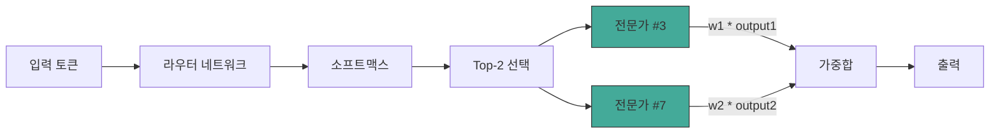
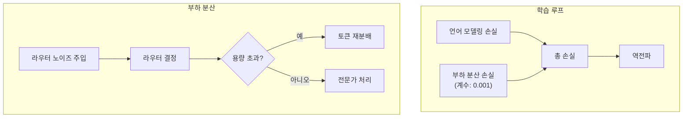

# Mixtral 학습

## 개요

Mixtral 8x7B는 Mistral AI가 2023년 12월 Apache 2.0 라이선스로 공개한 희소 전문가 혼합(Sparse Mixture of Experts, SMoE) 언어 모델이다. 전체 파라미터 약 46.7B 중 토큰당 활성 파라미터는 12.9B에 불과하여, 추론 비용은 13B급 모델과 유사하면서 Llama 2 70B에 필적하거나 능가하는 성능을 보인다. 핵심 설계 원리는 트랜스포머의 FFN(Feed-Forward Network) 블록을 8개 전문가(expert)로 교체하고, 라우터가 토큰별로 상위 2개 전문가를 선택하는 top-2 게이팅 메커니즘이다.

## 아키텍처

### 기본 구조

Mixtral의 백본은 Mistral 7B와 동일한 디코더 전용 트랜스포머이다. 32개 순차 트랜스포머 블록으로 구성되며, 각 블록의 MLP 레이어가 8개 전문가를 포함하는 SMoE 블록으로 대체된다. 어텐션 레이어는 공유되고 MoE 레이어만 복제되므로, 총 파라미터가 7B x 8 = 56B가 아닌 46.7B인 이유가 여기에 있다.

| 사양 | 값 |
|------|------|
| 총 파라미터 | 46.7B |
| 토큰당 활성 파라미터 | 12.9B |
| 전문가 수 (레이어당) | 8 |
| 활성 전문가 수 (토큰당) | 2 |
| 트랜스포머 블록 수 | 32 |
| 컨텍스트 길이 | 32,768 토큰 |
| 어텐션 | Sliding Window + Full Attention |

### 전문가 구조

각 전문가는 SwiGLU 활성화 함수를 사용하는 1-레이어 MLP이다. 모든 전문가는 동일한 차원과 구조를 가지며, 학습 과정에서 자연적으로 서로 다른 역할에 특화된다. 어텐션 파라미터(Q, K, V 프로젝션)는 모든 전문가가 공유하므로, 토큰 표현의 기본적인 문맥 이해는 공통으로 수행되고 전문가는 변환(transformation) 단계만 분담한다.

## Top-2 라우팅 메커니즘

라우팅 과정은 다음과 같다:

1. **라우터 계산**: 각 토큰의 히든 스테이트가 학습 가능한 게이팅 네트워크(선형 레이어)를 통과하여 8개 전문가에 대한 로짓을 생성한다
2. **소프트맥스 적용**: 로짓에 소프트맥스를 적용하여 확률 분포를 얻는다
3. **Top-2 선택**: 가장 높은 확률을 가진 2개 전문가를 선택한다
4. **가중 결합**: 선택된 전문가의 출력을 해당 라우팅 가중치로 곱한 뒤 합산한다

이 방식에서 라우터 가중치는 학습 과정에서 역전파를 통해 업데이트되며, 각 전문가가 처리할 토큰 유형에 자연스럽게 특화되도록 유도한다.

## 부하 분산 전략

MoE 모델의 핵심 과제는 전문가 간 부하 불균형이다. 소수의 전문가에 토큰이 집중되면 나머지 전문가는 유휴 상태가 되어 파라미터 효율이 급격히 저하된다.

### 보조 부하 분산 손실 (Auxiliary Load Balancing Loss)

Mixtral은 기본 언어 모델링 손실에 보조 손실항을 추가한다. 이 보조 손실은 각 전문가가 받는 토큰 비율의 분산을 최소화하도록 설계되었다. 기본 계수(coefficient)는 0.001로 설정되어 있어 주 학습 목표를 방해하지 않으면서도 균형을 유도한다.

### 라우터 노이즈

학습 중 라우터 로짓에 소량의 노이즈를 주입하여 탐색(exploration)을 촉진한다. 이 노이즈는 초기 학습에서 특정 전문가로의 조기 수렴을 방지하고, 각 전문가가 다양한 토큰을 경험하도록 돕는다.

### 동적 토큰 재분배

전문가가 용량(capacity)을 초과하면, 초과 토큰을 부하가 적은 전문가로 재분배하는 전략도 적용된다. 이는 학습 처리량(throughput)을 유지하면서 전문가 활용률을 높인다.

### 자연적 특화 현상

흥미로운 점은 Mixtral의 전문가들이 명시적인 도메인 할당 없이도 자연적으로 서로 다른 역할에 특화된다는 것이다. 분석 결과 특정 전문가가 코드, 수학, 또는 특정 언어 패턴에 더 자주 활성화되는 경향이 관찰되었다. 그러나 이 특화는 엄격한 분할이 아니라 부드러운 선호(soft preference)에 가깝다.

## 학습 세부사항

### 데이터 및 규모

Mixtral은 인터넷에서 수집한 오픈 웹 데이터로 사전학습되었다. 정확한 토큰 수와 데이터 구성은 공개되지 않았으나, 32k 컨텍스트 길이를 완전히 활용하는 학습이 수행되었다.

### 효율성 이점

MoE 구조의 핵심 이점은 계산 효율성이다. 토큰당 활성 파라미터가 12.9B이므로, 동일한 연산 예산으로 훨씬 많은 총 파라미터를 활용할 수 있다. [[neural-scaling-laws]]의 관점에서, 이는 같은 FLOPS에서 더 많은 지식을 저장할 수 있는 구조적 이점을 제공한다.

### 벤치마크 성능

Mixtral 8x7B는 대부분의 표준 벤치마크에서 Llama 2 70B를 능가하거나 동등한 성능을 보이면서, 활성 파라미터는 5배 적다. 특히 수학, 코드 생성, 다국어 과제에서 강점을 보인다.

## DeepSeek-V3와의 비교: MoE 학습의 진화

Mixtral 이후 MoE 학습은 빠르게 발전했다. DeepSeek-V3(671B, 37B 활성)는 보조 손실 없는(auxiliary-loss-free) 부하 분산 전략을 도입하여, 보조 손실이 주 학습 목표를 왜곡하는 문제를 해결했다. 또한 FP8 [[mixed-precision-training]]을 전면 적용하여 학습 비용을 $5.6M으로 절감했다. 이는 Mixtral의 접근법이 MoE 학습의 초기 단계였으며, 부하 분산과 정밀도 최적화 모두에서 상당한 개선 여지가 있었음을 보여준다.

## 실전 시사점

- **MoE 학습의 시작점**: Mixtral은 오픈소스 MoE 모델의 표준을 정립했으며, top-2 라우팅과 보조 부하 분산 손실 조합이 효과적임을 입증했다
- **효율성-성능 트레이드오프**: 총 파라미터 대비 활성 파라미터 비율(약 28%)이 핵심 설계 변수이며, [[optimizer-selection]]과 [[learning-rate-scheduling]]은 밀집 모델과 유사하게 적용된다
- **전문가 수 확장**: 이후 연구들은 전문가 수를 64개 이상으로 늘리면서 세분화된(fine-grained) MoE 구조를 탐구하고 있다

## 관련 문서

- [[mixed-precision-training]] -- MoE 학습에서의 정밀도 전략
- [[neural-scaling-laws]] -- MoE 구조의 스케일링 특성
- [[optimizer-selection]] -- MoE 학습에 적합한 옵티마이저
- [[learning-rate-scheduling]] -- 대규모 MoE 모델의 학습률 스케줄링
- [[knowledge-distillation]] -- MoE에서 밀집 모델로의 지식 증류
- [[evaluation-during-training]] -- MoE 모델의 학습 중 평가 전략
