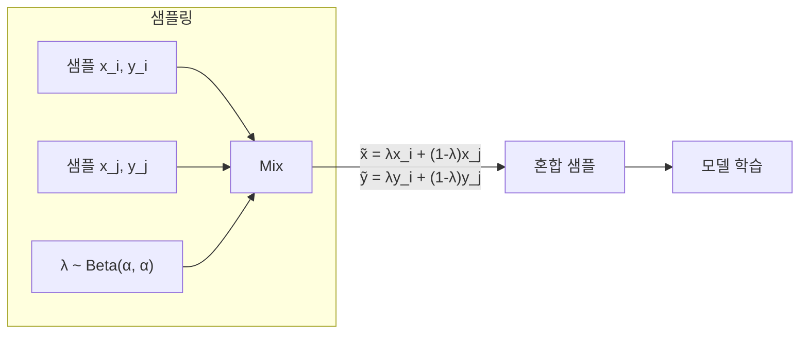

# Mixup 데이터 증강

Mixup은 Zhang et al. (2017, ICLR 2018)이 제안한 데이터 증강 기법으로, 두 학습 샘플과 레이블을 선형 결합하여 새로운 학습 데이터를 생성한다. 단순하지만 일반화 성능과 신뢰도 캘리브레이션(confidence calibration)을 동시에 향상시킨다.

## 배경 - 경험적 위험 최소화의 한계

표준 학습은 경험적 위험 최소화(ERM) 원리를 따른다:

$$\text{ERM} = \frac{1}{n} \sum_{i=1}^n \mathcal{L}(f(x_i), y_i)$$

ERM은 학습 데이터 분포에만 최적화되므로 분포 외(out-of-distribution) 샘플에 취약하고, 과신(overconfidence) 문제를 유발한다. Mixup은 이를 **진동 위험 최소화(Vicinal Risk Minimization)**로 대체한다.

## 핵심 메커니즘 - 선형 보간



### 수식

$$\tilde{x} = \lambda x_i + (1 - \lambda) x_j$$
$$\tilde{y} = \lambda y_i + (1 - \lambda) y_j$$

- $\lambda \sim \text{Beta}(\alpha, \alpha)$, 일반적으로 $\alpha \in [0.1, 0.4]$
- $x_i, x_j$: 미니배치에서 무작위로 선택한 두 샘플 (같은 클래스일 필요 없음)
- $y_i, y_j$: 원-핫 레이블 벡터

**Beta 분포 특성:**
- $\alpha \to 0$: $\lambda$가 0 또는 1에 집중 -> 원본 샘플에 가까워짐 (증강 효과 없음)
- $\alpha = 1$: 균등 분포 -> 완전히 무작위 혼합
- $\alpha \to \infty$: $\lambda \to 0.5$ 수렴 -> 항상 반씩 혼합

실무에서 `alpha=0.2`가 이미지 분류, `alpha=0.4`가 NLP에 자주 쓰인다.

## 코드 예시

```python
import torch
import numpy as np

def mixup_data(x: torch.Tensor, y: torch.Tensor, alpha: float = 0.2):
    """
    배치에 Mixup 증강 적용.
    Returns: mixed_x, y_a, y_b, lam
    """
    if alpha > 0:
        lam = np.random.beta(alpha, alpha)
    else:
        lam = 1.0

    batch_size = x.size(0)
    # 미니배치 내에서 무작위 인덱스 섞기
    index = torch.randperm(batch_size, device=x.device)

    mixed_x = lam * x + (1 - lam) * x[index]
    y_a, y_b = y, y[index]
    return mixed_x, y_a, y_b, lam


def mixup_criterion(criterion, pred, y_a, y_b, lam):
    """Mixup 손실: λ * L(pred, y_a) + (1-λ) * L(pred, y_b)"""
    return lam * criterion(pred, y_a) + (1 - lam) * criterion(pred, y_b)


# 학습 루프 예시
import torch.nn as nn

criterion = nn.CrossEntropyLoss()

for batch_x, batch_y in dataloader:
    batch_x, batch_y = batch_x.cuda(), batch_y.cuda()
    mixed_x, y_a, y_b, lam = mixup_data(batch_x, batch_y, alpha=0.2)

    optimizer.zero_grad()
    outputs = model(mixed_x)
    loss = mixup_criterion(criterion, outputs, y_a, y_b, lam)
    loss.backward()
    optimizer.step()
```

### PyTorch 기반 원-핫 레이블 버전

```python
def mixup_soft_labels(x, y_onehot, alpha=0.2):
    """원-핫 레이블로 혼합 - soft target 직접 생성"""
    lam = np.random.beta(alpha, alpha)
    index = torch.randperm(x.size(0), device=x.device)

    mixed_x = lam * x + (1 - lam) * x[index]
    mixed_y = lam * y_onehot + (1 - lam) * y_onehot[index]
    return mixed_x, mixed_y
```

## 왜 동작하는가 - 이론적 설명

### 1. 선형 보간 귀납 편향 (Inductive Bias)

Mixup은 모델이 특징 공간에서 **선형 행동**을 학습하도록 유도한다. 두 샘플 사이의 직선 경로에 대해서도 합리적인 예측을 해야 하므로, 결정 경계가 더 매끄러워진다.

```
[개 이미지] ---(λ=0.7)--- [고양이 이미지]
    ↑                           ↑
  y=[1,0]        y=[0.7, 0.3]  y=[0,1]
```

### 2. 레이블 평활화(Label Smoothing) 효과

원-핫 레이블 대신 혼합 레이블을 사용하면 과도한 확신(overconfidence)이 억제된다. 이는 [[label-smoothing]]과 유사하나, Mixup은 각 배치마다 동적으로 혼합 비율이 달라진다.

### 3. 적대적 예시 강인성

혼합 공간에서 학습한 모델은 입력 공간에서 더 평탄한 그래디언트를 가지므로, 작은 perturbation에 덜 민감해진다.

## 성능 및 비교

| 방법 | ImageNet Top-1 | CIFAR-10 | 캘리브레이션 |
|------|---------------|---------|-------------|
| 기준 (ERM) | 76.1% | 95.0% | ECE 0.058 |
| Mixup (α=0.2) | +0.9% | +0.3% | ECE -0.012 |
| [[label-smoothing]] (ε=0.1) | +0.3% | +0.1% | ECE -0.008 |
| [[cutmix-augmentation]] (α=1.0) | +1.2% | +0.4% | ECE -0.009 |

Mixup은 특히 **신뢰도 캘리브레이션** 지표(ECE: Expected Calibration Error)에서 뛰어난 개선을 보인다. 즉, 모델이 "80% 확신"이라고 말할 때 실제로 약 80% 맞는 비율이 높아진다.

## 변형 및 확장

### 1. Manifold Mixup

입력 공간 대신 **은닉 표현(hidden representation) 공간**에서 혼합:

```python
# 중간 레이어 출력에서 Mixup 적용
hidden = model.get_intermediate(x)   # 임의 레이어 선택
mixed_hidden = lam * hidden + (1 - lam) * hidden[index]
output = model.from_intermediate(mixed_hidden)
```

- 더 고수준의 의미적 보간이 이루어짐
- 입력 공간 Mixup보다 성능이 같거나 소폭 우수

### 2. Feature Mixup (CutMix와의 결합)

[[cutmix-augmentation]]과 Mixup을 확률적으로 선택:

```python
def augment(x, y, alpha=1.0, cutmix_prob=0.5):
    if np.random.rand() < cutmix_prob:
        return cutmix(x, y, alpha)
    return mixup_data(x, y, alpha)
```

### 3. NLP에서의 Mixup

텍스트는 이산(discrete)이므로 임베딩 공간에서 혼합:

```python
# 워드 임베딩 혼합 (SentMix 등)
emb_a = embed_layer(tokens_a)
emb_b = embed_layer(tokens_b)
mixed_emb = lam * emb_a + (1 - lam) * emb_b
logits = classifier(mixed_emb)
loss = mixup_criterion(criterion, logits, label_a, label_b, lam)
```

## 실무 가이드라인

| 상황 | 권장 설정 |
|------|----------|
| ImageNet 분류 | `alpha=0.2`, 전체 학습에 적용 |
| CIFAR 소규모 | `alpha=0.1` ~ `0.2` |
| NLP 파인튜닝 | `alpha=0.4`, 임베딩 공간 Mixup |
| 검출/분할 | 주의 필요 (레이블 정합 복잡) |
| 의료 이미지 | `alpha=0.1` (강한 혼합은 임상 의미 훼손) |

## 한계

- **객체 검출/분할**: 박스 레이블을 혼합하기 어려움. [[cutmix-augmentation]]이 더 적합
- **미세 분류(Fine-grained)**: 클래스 간 혼합이 비현실적인 이미지를 만들 수 있음
- **클래스 불균형**: 샘플 선택이 균등하면 소수 클래스 보간 효과가 줄어들 수 있음

## 관련 문서

- [[cutmix-augmentation]] - 패치 교체 방식 혼합 증강
- [[randaugment-policy]] - 자동 증강 정책
- [[autoaugment-search]] - RL 기반 증강 탐색
- [[label-smoothing]] - 레이블 평활화 정규화
- [[overfitting-regularization]] - 일반화 향상 기법 개요
