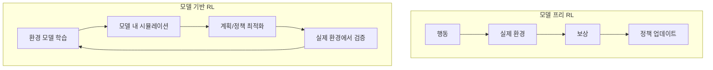

# 모델 기반 강화학습

환경의 **동역학 모델(world model)**을 학습하고, 이 모델 안에서 시뮬레이션하며 정책을 개선하는 RL 패러다임. 모델 프리 RL(PPO, DQN 등) 대비 **샘플 효율성**이 훨씬 높다.

## 대표 알고리즘

| 알고리즘 | 핵심 |
|---------|------|
| **Dreamer (V1/V2/V3)** | RSSM 잠재 동역학 + 상상 속 행동 학습 |
| **MuZero** | 관측->표현->동역학->예측, 게임 규칙 불필요 |
| **MBPO** | 학습된 모델로 샘플 생성 + SAC |
| **TD-MPC2** | 잠재 공간 MPC + TD 학습, 범용 로보틱스 |

## [[world-model-architectures|세계 모델]]과의 관계

최근 세계 모델 연구(Genie 3, Cosmos)는 모델 기반 RL의 확장으로 볼 수 있다: 비디오/3D 세계의 동역학을 대규모로 학습하고 에이전트 학습/계획에 활용한다.

## 관련 문서

- [[world-model-architectures]] -- 세계 모델
- [[policy-gradient-ppo]] -- PPO (모델 프리)
- [[q-learning-dqn]] -- DQN (모델 프리)
- [[markov-decision-process]] -- MDP
