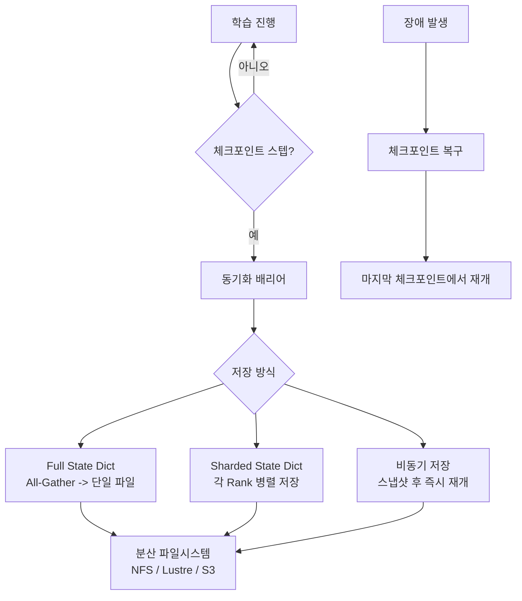

# 모델 체크포인팅과 샤딩

## 개요

모델 체크포인팅(Model Checkpointing)은 학습 중 모델의 전체 상태를 주기적으로 저장하여 장애 발생 시 학습을 재개할 수 있게 하는 내결함성(fault tolerance) 메커니즘이다. 대규모 분산 학습에서는 모델 상태가 여러 GPU에 걸쳐 분산(sharding)되어 있으므로, 체크포인트도 샤딩된 형태로 저장/복구하는 분산 체크포인팅이 필수적이다. 수백~수천 GPU에서 수주~수개월 동안 진행되는 LLM 사전학습에서 체크포인팅 전략은 학습 안정성과 인프라 비용에 직접적 영향을 미친다.

## 핵심 개념

### 체크포인트 구성요소

체크포인트는 학습 상태의 스냅샷으로, 다음을 포함한다:

| 구성요소 | 내용 | 크기 비율 |
|---------|------|----------|
| 모델 파라미터 | 가중치, 바이어스 | ~1x (FP16/BF16) |
| 옵티마이저 상태 | 1차/2차 모멘트 (AdamW 기준) | ~4x (FP32) |
| 학습 스케줄러 | 현재 스텝, 학습률 | 미미 |
| RNG 상태 | 난수 생성기 시드 | 미미 |
| 데이터 로더 상태 | 현재 데이터 위치, 셔플 순서 | 미미 |

70B 모델의 체크포인트 크기는 약 700GB(파라미터 140GB + 옵티마이저 560GB)에 달한다. [[optimizer-selection]]에서 AdamW는 파라미터당 12바이트의 상태를 유지하므로 옵티마이저가 체크포인트의 대부분을 차지한다.

### Full State Dict vs Sharded State Dict

| 방식 | 설명 | 장점 | 단점 |
|------|------|------|------|
| Full | 모든 파라미터를 단일 파일에 수집 | 로딩 단순, 병렬도 변경 용이 | all-gather 필요, 메모리 2배, 느림 |
| Sharded | 각 rank가 자신의 샤드만 저장 | 병렬 I/O, 메모리 효율, 빠름 | 동일 병렬 구성에서만 복구 |

분산 학습에서는 샤딩된 체크포인트가 표준이다. [[data-parallelism-fsdp]]의 FSDP2는 per-parameter 샤딩 덕분에 통신 없이 샤딩된 상태를 직접 저장할 수 있어 FSDP1 대비 체크포인팅 오버헤드를 크게 절감한다.

### 체크포인트 빈도와 비용

체크포인트 저장은 학습을 일시 중단하는 동기적 연산이다. 체크포인트 빈도가 높을수록 장애 복구 시 손실되는 학습 진행이 줄어들지만, I/O 오버헤드가 증가한다.

| 모델 크기 | 체크포인트 크기 | 동기 저장 시간 | 권장 빈도 |
|----------|-------------|-------------|----------|
| 7B | ~70GB | 수 분 | 매 1,000 스텝 |
| 70B | ~700GB | 10분+ | 매 500-1,000 스텝 |
| 400B+ | 수 TB | 30분+ | 비동기 필수 |

### 비동기 체크포인팅

대형 모델에서 동기 체크포인팅의 학습 중단 시간을 제거하기 위해, 체크포인트를 백그라운드에서 비동기적으로 저장하는 기법이 발전하고 있다:

- **스냅샷 후 계속 학습**: 메모리에 상태 스냅샷을 찍고 즉시 학습 재개, 백그라운드에서 디스크에 기록
- **ARC (Asynchronous Redundant Copying)**: 비동기적으로 다른 노드에 상태 복제본을 저장
- **AEC (Asynchronous Erasure Coding)**: 이레이저 코딩으로 일부 노드 장애에도 복구 가능한 분산 저장

### 체크포인트 리샤딩 (Resharding)

학습 중 GPU 구성을 변경하거나(탄력적 학습), 학습된 모델을 다른 병렬 구성에서 파인튜닝하려면 체크포인트의 샤딩 구조를 변환해야 한다. PyTorch의 Distributed Checkpoint(DCP)가 이를 지원하며, 다음 시나리오에서 사용된다:

- 학습 GPU 수 변경 (scale up/down)
- [[tensor-pipeline-parallelism]] 구성 변경 (TP/PP 차원 조정)
- FSDP 샤딩에서 Full 모델로 변환 (추론 배포용)
- [[deepspeed-zero]]에서 FSDP 체크포인트로 변환

## 작동 원리

### 장애 복구 절차

1. 장애 감지 (NCCL 타임아웃, GPU 에러, 노드 다운)
2. [[gpu-cluster-scheduling]] 시스템이 대체 노드 할당 또는 탄력적 재구성
3. 마지막 유효 체크포인트 로딩
4. 필요 시 리샤딩 (GPU 구성 변경된 경우)
5. 학습 재개 (RNG 상태, 데이터 로더 위치 복원)

## TorchTitan 분산 체크포인팅 성능

PyTorch TorchTitan 프로젝트의 분산 체크포인팅 최적화 결과:

| 모델 | 기존 PyTorch | TorchTitan DCP | 개선 |
|------|-------------|---------------|------|
| Nemotron-4 15B | 기준 | 50배 빠름 | I/O 병렬화 + 비동기 |
| Nemotron-4 340B | 기준 | 26배 빠름 | 샤딩 I/O + 프리페치 |

## 실전 도입 가이드

### 체크포인팅 전략 선택

| 학습 규모 | 권장 전략 | 빈도 | 보관 정책 |
|----------|----------|------|----------|
| 단일 GPU | Full State Dict | 매 에포크 | 최근 3-5개 |
| 소규모 분산 (8-32 GPU) | Sharded, 동기 | 매 1,000 스텝 | 최근 3개 + 마일스톤 |
| 대규모 분산 (100+ GPU) | Sharded, 비동기 | 매 500 스텝 | 최근 3개 + 마일스톤 |
| 초대규모 (1000+ GPU) | 비동기 + 중복 복제 | 매 200-500 스텝 | 다중 스토리지 |

### 흔한 실수

- **RNG 상태 미저장**: 체크포인트에서 재개 시 데이터 순서/드롭아웃이 달라져 학습 재현성 상실
- **체크포인트 검증 누락**: 손상된 체크포인트로 복구 시도 시 학습 전체 손실. 저장 후 검증 필수
- **단일 스토리지 의존**: 스토리지 장애 시 모든 체크포인트 손실. 다중 위치 저장 권장
- **[[mixed-precision-training]] 상태 누락**: FP32 마스터 가중치와 손실 스케일러 상태도 체크포인트에 포함 필요

## 관련 문서

- [[data-parallelism-fsdp]] -- FSDP2 샤딩된 체크포인팅
- [[deepspeed-zero]] -- ZeRO 분산 체크포인팅
- [[tensor-pipeline-parallelism]] -- 다차원 병렬 체크포인트 리샤딩
- [[gpu-cluster-scheduling]] -- 장애 복구 시 스케줄링
- [[optimizer-selection]] -- 옵티마이저 상태의 체크포인트 비중
- [[lora-qlora-finetuning]] -- 어댑터 체크포인트 관리
