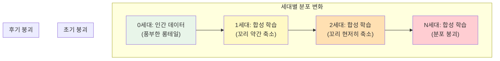
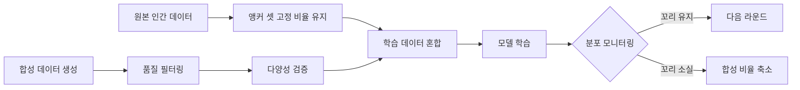

# 모델 붕괴 - 합성 데이터 반복 학습의 분포 퇴화

## 개요

모델 붕괴(Model Collapse)는 AI 모델이 다른 모델의 출력(합성 데이터)을 반복적으로 학습할 때, 원래 데이터의 진짜 분포(true underlying distribution)를 점진적으로 망각하여 출력의 다양성과 품질이 퇴화하는 현상이다. Shumailov et al.이 2024년 Nature(vol. 631, pp. 755-759)에 발표한 "AI models collapse when trained on recursively generated data"에서 이 용어와 메커니즘이 체계적으로 정립되었다.

[[synthetic-data-training]]이 LLM 학습의 핵심 전략으로 부상한 현재, 모델 붕괴는 합성 데이터를 무분별하게 사용할 때 발생하는 근본적 위험이다. 웹에 AI 생성 콘텐츠가 급증하면서, 웹 크롤 기반 [[pretraining-data-curation]]에서도 이 문제가 실질적 위협이 되고 있다.

## 붕괴 메커니즘

모델 붕괴는 두 단계로 진행된다.

### 초기 붕괴 (Early Model Collapse)

분포의 꼬리(tail)에서 정보가 소실되기 시작한다. 소수 데이터(minority data)에 대한 성능이 먼저 하락하지만, 전체적인 성능 지표는 오히려 개선되는 것처럼 보일 수 있어 탐지가 어렵다. 이 단계에서 모델은 분포의 주요 모드(mode)는 유지하되, 드문 패턴과 롱테일 데이터를 점진적으로 잃는다.

### 후기 붕괴 (Late Model Collapse)

모델이 분산(variance)이 극도로 낮은 축소된 분포로 수렴한다. 출력의 다양성이 현저히 감소하고, 어휘적(lexical) 및 구문적(syntactic) 품질이 일관되게 하락한다. 극단적 경우 모델이 소수의 패턴만 반복 생성하게 된다.

## 수학적 직관

생성 모델 M이 데이터 분포 p_data를 학습하여 근사 분포 p_model을 생성한다고 하자. p_model에서 생성된 합성 데이터로 다음 세대 모델 M'을 학습하면, M'의 분포 p_model'은 p_data가 아닌 p_model을 근사한다. 이 과정이 반복될수록 각 세대의 근사 오차가 누적되며, 특히 분포의 꼬리 영역(확률 밀도가 낮은 영역)에서 오차 누적이 가속된다.

이는 **함수적 근사의 반복 합성(iterated composition of approximate functions)**에서 오차가 지수적으로 증폭되는 현상과 본질적으로 동일하다. Shumailov et al.은 이 현상이 LLM뿐 아니라 변분 오토인코더(VAE), 가우시안 혼합 모델(GMM)에서도 동일하게 나타남을 실증했다.

## 꼬리 분포 소실의 의미

분포의 꼬리(tail)가 사라지는 것은 단순히 "드문 데이터를 잃는 것" 이상의 의미를 갖는다.

- **다양성 감소**: 창의적이고 비전형적인 표현, 소수 언어, 전문 도메인 지식이 소실
- **편향 증폭**: 주류 패턴만 남으면서 기존 편향이 강화됨
- **고정관념 고착**: 특정 문화/관점의 과소 대표가 심화
- **오류 전파**: 초기 모델의 환각(hallucination) 패턴이 후속 세대에서 "사실"로 고착

이 문제는 웹 생태계 전반에 영향을 미친다. AI가 생성한 콘텐츠가 웹에 축적되면, 이를 크롤링하여 다음 세대 모델을 학습하는 순환 구조가 형성되기 때문이다.

## 완화 전략

### 인간 데이터 혼합

순수 합성 데이터만으로 학습할 경우 모델 붕괴는 피할 수 없다. 그러나 실제 인간 데이터를 일정 비율 이상 혼합하면 붕괴를 회피할 수 있다. 핵심은 합성 데이터의 비율에 상한선이 존재한다는 것이며, 이 임계값 이하로 유지해야 한다.

### 합성 데이터 품질 관리

[[synthetic-data-training]]에서 다루듯, 합성 데이터의 무분별한 사용이 아닌 검증-필터링 파이프라인을 통한 품질 관리가 필수적이다.

- **다양성 기반 샘플링**: 온도(temperature)를 높이거나 핵 샘플링(nucleus sampling)의 top-p를 넓혀 생성 다양성을 확보
- **필터링 파이프라인**: 생성된 데이터를 품질 점수, 독성 점수, 중복도 등으로 필터링
- **출처 추적**: 합성 데이터에 출처 메타데이터를 부착하여 세대(generation) 정보를 보존

### 데이터 출처 식별

웹 크롤 데이터에서 AI 생성 콘텐츠를 식별하고 분리하는 기술이 중요해지고 있다. 워터마킹, 통계적 탐지, 메타데이터 기반 분류 등의 방법이 연구되고 있으며, [[data-decontamination]]의 확장된 형태로 볼 수 있다.

### 앵커 데이터셋 유지

각 학습 라운드마다 원본 인간 데이터의 "앵커 셋(anchor set)"을 고정 비율로 포함하여, 분포의 꼬리 정보를 보존하는 전략이다.

## 실제 사례와 영향

- **Llama 3 학습**: Meta는 사전 학습에 합성 데이터를 사용하지 않고 인간 데이터만 활용했으며, 후학습(post-training)에서만 합성 데이터를 제한적으로 사용
- **Phi-4**: Microsoft는 학습 데이터의 약 40%를 합성 데이터로 구성하되, 교사 모델 기반 생성과 엄격한 품질 필터링을 적용
- **웹 크롤 오염**: 2024년 이후 Common Crawl에서 AI 생성 콘텐츠 비율이 지속적으로 증가하고 있어, [[pretraining-data-curation]]에서 AI 콘텐츠 필터링이 새로운 과제로 부상

## 과대 우려와 현실적 평가

일부 후속 연구는 모델 붕괴의 실질적 영향이 우려만큼 심각하지 않을 수 있다고 지적한다. 실제 웹 환경에서는 인간 생성 콘텐츠가 합성 콘텐츠와 함께 계속 축적되므로, 논문에서 가정한 "순수 합성 데이터 반복 학습" 시나리오보다 위험이 낮다. 그러나 예방적 관점에서 합성 데이터의 비율 관리와 품질 검증은 여전히 필수적인 실무 관행이다.

## 관련 페이지

- [[synthetic-data-training]] - 합성 데이터 학습 파이프라인
- [[pretraining-data-curation]] - 사전 학습 데이터 큐레이션
- [[data-decontamination]] - 데이터 오염 제거
- [[rlaif-scalable-oversight]] - AI 피드백 기반 학습과 품질 관리
