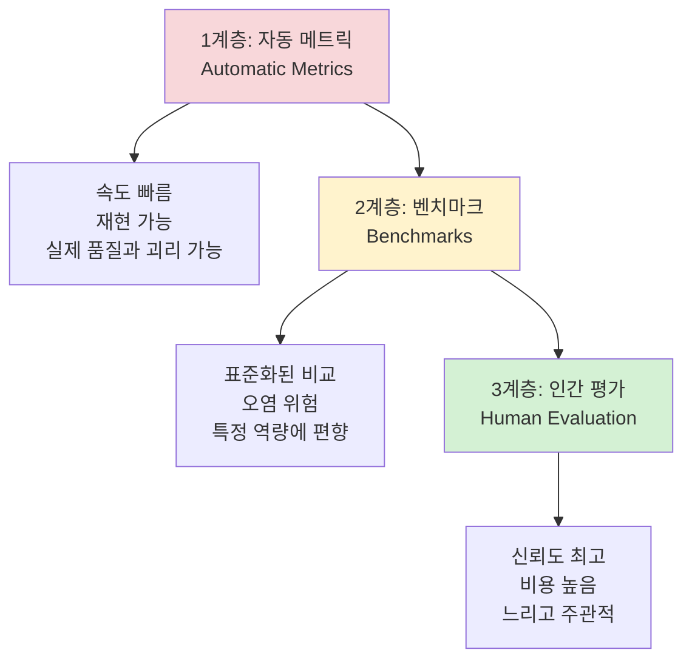
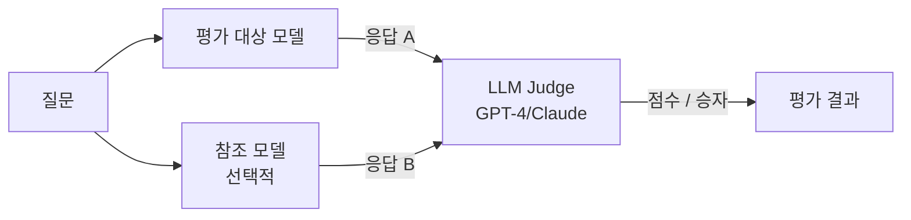

# 모델 평가 프레임워크 (Model Evaluation Framework)

## 평가의 3계층 구조

LLM 평가는 자동화 정도와 신뢰도에 따라 세 계층으로 나뉜다.

각 계층은 상호 보완적이다. 자동 메트릭은 빠른 반복을 가능하게 하고, 벤치마크는 표준화된 비교를 제공하며, 인간 평가는 최종 신뢰도를 담보한다.

## 1계층: 자동 메트릭 (Automatic Metrics)

### 퍼플렉서티 (Perplexity)

언어 모델이 테스트 코퍼스를 얼마나 잘 예측하는지 측정한다.

$$\text{PPL} = \exp\left(-\frac{1}{N} \sum_{i=1}^{N} \log p(w_i \mid w_1, \ldots, w_{i-1})\right)$$

- **낮을수록 좋음**: 모델이 텍스트를 잘 예측함을 의미
- **한계**: 다운스트림 태스크 성능과 반드시 일치하지 않음. PPL이 낮아도 지시 따르기가 나쁜 모델이 많음

### BLEU / ROUGE

- **BLEU**: 생성 텍스트와 참조 텍스트의 n-gram 정밀도. 번역 평가에서 시작
- **ROUGE**: n-gram 재현율 기반. 요약 평가에 주로 사용
- **한계**: 의미 동치(paraphrase)를 같은 n-gram이 없으면 낮게 평가. LLM 시대에 신뢰도 낮음

### Accuracy (정확도)

객관식 형태의 태스크에서 정답률. 계산이 명확하고 해석이 쉽다.

## 2계층: 벤치마크 (Benchmarks)

### 주요 벤치마크 카탈로그

| 벤치마크 | 측정 역량 | 형식 | 주의점 |
|---------|---------|------|--------|
| MMLU | 57개 분야 지식 | 4지선다 | 오염 위험 높음 |
| HumanEval | 코드 생성 | 함수 완성 | Python 편향 |
| GSM8K | 초등 수학 추론 | 주관식 | Chain-of-thought 필요 |
| MATH | 고등 수학 | 주관식 | 난이도 높음 |
| HellaSwag | 상식 추론 | 4지선다 | 포화 상태 |
| ARC-Challenge | 과학 질의응답 | 4지선다 | - |
| TruthfulQA | 사실 정확성 | 다지선다/생성 | LLM 환각 측정 |
| MT-Bench | 다중 턴 대화 | LLM 평가 | GPT-4 편향 의심 |

### 벤치마크 선택 원칙

- **목표 역량과의 정렬**: 코딩 모델이면 HumanEval + SWE-Bench, 지식 모델이면 MMLU
- **포화 확인**: 기존 SOTA가 90%+ 정확도이면 변별력 없음 → 더 어려운 벤치마크 선택
- **도메인 전용 벤치마크**: 법률(LegalBench), 의학(MedQA), 금융(FinanceBench) 등 도메인 특화 평가 우선

## 3계층: 인간 평가 (Human Evaluation)

### Chatbot Arena ELO

실제 사용자가 두 모델의 응답을 비교해 더 좋은 쪽을 투표하는 방식. ELO 레이팅으로 전체 순위를 산출한다.

- **강점**: 실제 사용 시나리오, 다양한 언어/도메인 커버
- **약점**: 특정 응답 스타일(길고 자신감 넘치는 답변)에 편향될 수 있음

### Side-by-Side 평가 (SxS)

전문 어노테이터가 두 모델의 응답을 비교해 더 나은 쪽을 선택하거나 세부 항목을 채점한다. 내부 모델 개선 사이클에 주로 사용된다.

## LLM-as-Judge (LLM을 평가자로)

GPT-4, Claude 등 강력한 모델이 다른 모델의 응답을 평가하는 방식이다.

**장점:** 빠르고 확장 가능. 사람이 보기에 자연스러운 평가 기준 적용 가능

**편향 주의:**
- **Position bias**: 응답 순서에 따라 판단이 달라짐 → 순서를 바꿔 두 번 평가 후 평균
- **Verbosity bias**: 길고 자세한 답변을 선호하는 경향
- **Self-enhancement bias**: 동일 회사/모델을 높게 평가하는 경향
- **Authority bias**: 권위 있어 보이는 답변 선호

## 평가 설계 원칙

### 구성 타당도 (Construct Validity)
벤치마크가 실제로 측정하고자 하는 역량을 측정하는가. MMLU가 '지식'을 측정하려 하지만 실제로는 '4지선다 형식 패턴 인식'을 측정하는 경우가 있다.

### 오염 방지 (Contamination Prevention)
- 평가 데이터가 학습 데이터에 포함되면 무효화
- 날짜 기반 분리: 모델 학습 컷오프 이후 데이터로 평가
- 동적 벤치마크(Dynamic Benchmark): 매번 새로운 문제 생성

### 다원적 평가 (Holistic Evaluation)
단일 메트릭에 의존하지 않고 여러 측면을 통합 평가한다.

| 평가 차원 | 예시 메트릭 |
|----------|-----------|
| 능력 | MMLU, HumanEval, GSM8K |
| 안전성 | TruthfulQA, 거절률, 독성 분류 |
| 효율성 | 토큰당 비용, 지연 시간 |
| 사용성 | Chatbot Arena ELO, SxS 인간 평가 |

## 실전 평가 파이프라인

1. **회귀 테스트(regression test)**: 코드 변경 시마다 핵심 지표가 하락하지 않는지 확인
2. **A/B 평가**: 새 모델 vs 현재 배포 모델을 Side-by-Side 비교
3. **레드팀 평가**: 의도적으로 실패를 유도하는 적대적 입력 테스트
4. **배포 후 모니터링**: 실제 사용 로그에서 실패 케이스 샘플링 → 지속 개선

> 완벽한 단일 평가 메트릭은 존재하지 않는다. Goodhart의 법칙: 메트릭이 목표가 되는 순간 좋은 메트릭이기를 멈춘다.

## 관련 문서

- [[perplexity-metric]] - 퍼플렉서티 상세 수식과 해석
- [[bleu-rouge-metrics]] - BLEU/ROUGE의 계산 방법과 한계
- [[benchmark-design-principles]] - 좋은 벤치마크 설계 원칙
- [[llm-as-judge-calibration]] - LLM 평가자의 캘리브레이션 편향
- [[evaluation-during-training]] - 학습 중 지속 평가 전략
