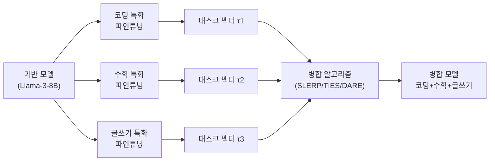
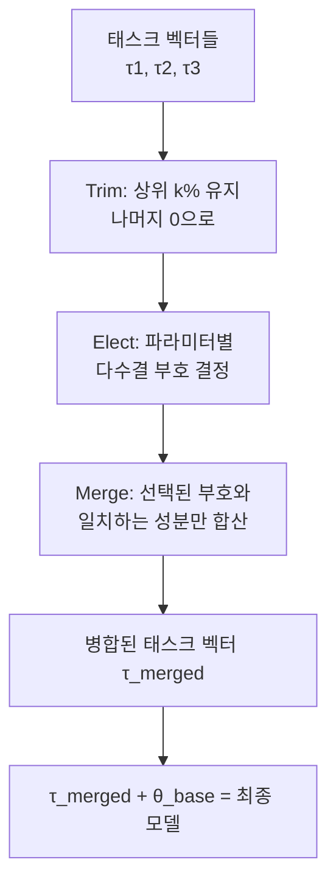

# 모델 병합 기법 - SLERP, TIES, DARE

## 개요

모델 병합(Model Merging)은 여러 파인튜닝 모델의 가중치를 **추가 학습 없이** 수학적으로 결합하여 새로운 모델을 만드는 기법이다. 같은 기반 모델(base model)에서 파인튜닝된 변형들은 가중치 공간의 유사한 영역에 위치하므로, 그 차이("태스크 벡터")를 합산하면 각 모델의 능력이 결합된다는 가정에 기반한다.

[[model-merging]] 페이지에서 모델 병합의 일반 원리를 다루며, 이 페이지는 SLERP, TIES, DARE 세 가지 핵심 알고리즘의 메커니즘과 차이에 집중한다.

## 태스크 벡터 (Task Vector) 개념

모든 병합 기법의 공통 기반인 **태스크 벡터**를 먼저 이해해야 한다:

$$\tau_i = \theta_{ft,i} - \theta_{base}$$

여기서 $\theta_{base}$는 기반 모델 가중치, $\theta_{ft,i}$는 태스크 $i$에 파인튜닝된 모델 가중치다. 태스크 벡터 $\tau_i$는 파인튜닝이 가중치 공간에서 만든 "이동 벡터"다.

## SLERP (Spherical Linear Interpolation)

SLERP는 두 모델을 **구면 선형 보간**으로 병합한다. 일반 선형 보간(LERP)은 두 벡터 사이를 직선으로 이동하는 반면, SLERP는 단위 구면 위의 호(arc)를 따라 이동한다.

$$\text{SLERP}(\theta_1, \theta_2, t) = \frac{\sin((1-t)\Omega)}{\sin\Omega}\theta_1 + \frac{\sin(t\Omega)}{\sin\Omega}\theta_2$$

여기서 $\Omega = \arccos\left(\frac{\theta_1 \cdot \theta_2}{|\theta_1||\theta_2|}\right)$는 두 벡터 사이의 각도, $t \in [0,1]$은 보간 비율이다.

**왜 SLERP인가:** 고차원 벡터 공간에서 단순 선형 보간은 크기(magnitude)를 줄이는 부작용이 있다. SLERP는 크기를 일정하게 유지하면서 방향만 보간하므로 가중치 분포를 더 잘 보존한다.

**한계:** 두 모델만 병합 가능. 세 모델 이상에는 반복 적용해야 하며, 이때 순서에 따라 결과가 달라진다.

## TIES (Trim, Elect, Merge)

TIES는 2023년 Yadav et al.이 제안한 기법으로, 여러 모델을 병합할 때 **충돌하는 태스크 벡터 성분을 처리**하는 방법을 제공한다. 세 단계로 구성된다:

### 1단계: Trim (가지치기)

태스크 벡터의 절댓값이 작은 성분(상위 k% 미만)을 0으로 만든다. 작은 변화는 노이즈일 가능성이 높으므로 제거한다.

$$\tau_i^{\text{trim}}[j] = \begin{cases} \tau_i[j] & \text{if } |\tau_i[j]| \geq \text{top-k threshold} \\ 0 & \text{otherwise} \end{cases}$$

### 2단계: Elect (부호 선택)

각 파라미터 위치에서 여러 모델의 태스크 벡터 부호가 충돌할 때, **다수결(majority voting)**로 최종 부호를 결정한다:

$$\gamma[j] = \text{sign}\left(\sum_i \tau_i^{\text{trim}}[j]\right)$$

### 3단계: Merge (조건부 병합)

선택된 부호 $\gamma[j]$와 같은 부호를 가진 성분만 합산한다:

$$\tau^{\text{merged}}[j] = \sum_{i: \text{sign}(\tau_i[j])=\gamma[j]} \tau_i[j]$$

TIES는 세 모델 이상도 처리 가능하며, 충돌 완화 메커니즘이 내장되어 있어 단순 합산보다 안정적이다.

## DARE (Drop And REscale)

DARE는 태스크 벡터의 성분을 **무작위로 드롭(drop)**하고, 드롭되지 않은 성분을 **재스케일(rescale)**하는 전처리 기법이다.

$$\tau_i^{\text{dare}}[j] = \begin{cases} \frac{\tau_i[j]}{1-p} & \text{확률 } (1-p) \\ 0 & \text{확률 } p \end{cases}$$

여기서 $p$는 드롭 비율(0.9-0.99가 전형적). 재스케일 계수 $\frac{1}{1-p}$가 기댓값을 원래 $\tau_i[j]$로 유지한다.

**핵심 발견:** LLM에서 파인튜닝 태스크 벡터의 90-99%를 무작위로 드롭해도 모델 성능이 거의 유지된다. 이는 태스크 벡터가 **극도로 희소한 정보 구조**를 가짐을 시사한다.

DARE는 단독 병합 기법이라기보다 **TIES의 전처리 단계**로 흔히 활용된다(DARE-TIES).

## LoRA 어댑터 병합

[[lora-paper]] 기반 파인튜닝에서 병합은 더 단순하다. 여러 LoRA 어댑터를 같은 기반 모델에 적용할 때, 어댑터의 $\Delta W = AB$를 선형 결합하거나 태스크 벡터로 변환해 위 기법들을 적용할 수 있다.

## 기법 선택 가이드

| 상황 | 권장 기법 |
|------|----------|
| 두 모델의 부드러운 혼합 | SLERP |
| 세 모델 이상 병합 | TIES 또는 DARE-TIES |
| 병합 전 노이즈 제거 원할 때 | DARE 전처리 후 TIES |
| 빠른 실험이 목적 | 선형 보간 (Merge Coefficient 조정) |

## 실용적 도구: MergeKit

오픈소스 라이브러리 MergeKit은 SLERP, TIES, DARE, Task Arithmetic 등 주요 병합 기법을 YAML 설정으로 실행할 수 있게 한다. Hugging Face Hub와 연동되어 병합 모델을 바로 배포 가능하다.

## 관련 문서

- [[model-merging]] -- 모델 병합 전반 개요 및 Task Arithmetic
- [[lora-paper]] -- LoRA 어댑터 기반 파인튜닝 (병합 대상)
- [[distributed-training-overview]] -- 병합 없이 여러 모델 조합하는 앙상블 비교
