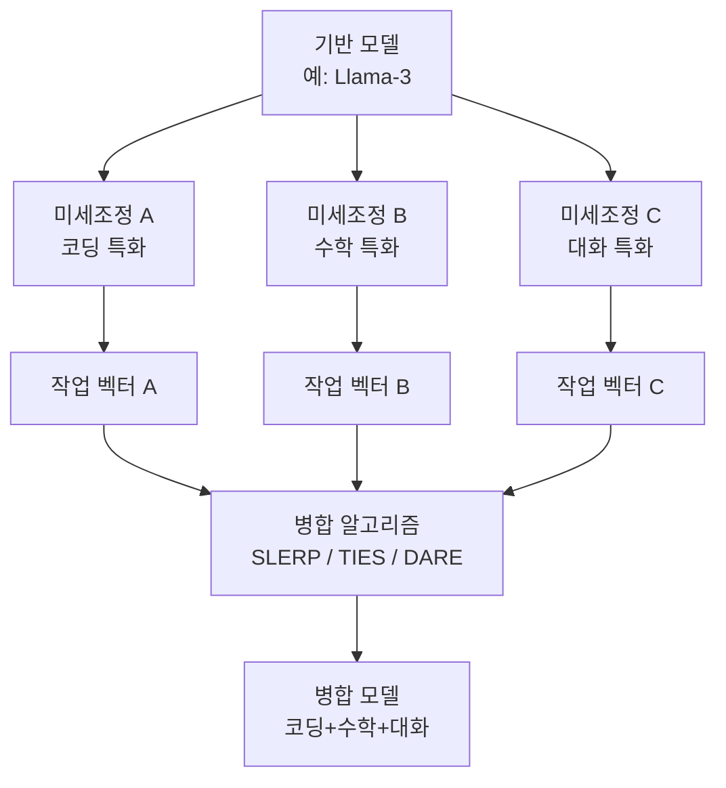
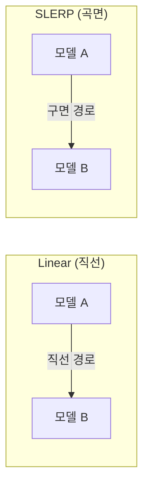

## 개요

Model Merging은 같은 기반 구조를 공유하는 여러 미세조정 모델의 가중치를 산술적으로 결합하여, 추가 훈련 없이 새로운 모델을 생성하는 기법이다. 원본 학습 데이터나 경사하강법이 필요 없이 텐서 연산만으로 각 모델의 강점(코딩, 창작, 추론 등)을 하나로 통합할 수 있다. Open LLM 리더보드에서 병합 모델이 상위를 점유하며, SAE(Sparse Autoencoder) 전이를 통해 50%의 비용 절감도 보고되었다. Model Stitching은 서로 다른 아키텍처의 레이어를 결합하는 확장 기법이다.

## 핵심 개념

### 왜 모델 병합이 작동하는가

같은 기반 모델에서 미세조정된 변형들은 가중치 공간의 유사한 영역에 위치한다. 각 모델 간의 차이("작업 벡터", task vector)는 상대적으로 작은 변동이며, 이러한 변동들을 결합하면 학습된 행동도 결합된다.

## 기술 상세

### 주요 병합 기법

| 기법 | 원리 | 특징 |
|------|------|------|
| **Linear** | 가중치의 단순 가중 평균 | 가장 단순, 2개 모델에 적합 |
| **SLERP** | 구면선형보간(Spherical Linear Interpolation) | 가중치 공간의 곡면을 따라 보간, 부드러운 결과 |
| **Task Arithmetic** | 작업 벡터를 더하고 빼는 산술 연산 | 특정 능력 추가/제거 가능 |
| **TIES-Merging** | 중복 매개변수 제거 + 부호 충돌 해결 | 모델 간 간섭 최소화 |
| **DARE** | 병합 전 델타 매개변수 무작위 삭제 | 정규화 효과, 더 많은 모델 수용 |
| **Model Soups** | 같은 훈련 실행의 여러 체크포인트 병합 | 일반화 성능 개선 |
| **Frankenmerging** | 다른 모델의 레이어를 직접 스택 | 개별 모델보다 큰 아키텍처 생성 가능 |

### SLERP vs Linear 보간

SLERP는 가중치 벡터의 방향성을 보존하면서 보간하여, 단순 평균보다 부드럽고 안정적인 결과를 생성한다. Linear 보간이 벡터 크기를 축소시킬 수 있는 반면, SLERP는 고차원 구면 위에서 이동하므로 가중치의 노름(norm)을 유지한다. 다만 SLERP는 2개 모델 간 보간에만 적용 가능하다는 제한이 있다.

### 기법별 적용 시나리오

| 시나리오 | 권장 기법 | 이유 |
|---------|----------|------|
| 2개 모델 단순 병합 | SLERP | 부드러운 보간, 방향성 보존 |
| 특정 능력 추가/제거 | Task Arithmetic | 작업 벡터 더하기/빼기로 정밀 제어 |
| 3개 이상 모델 병합 | TIES-Merging | 부호 충돌 해결, 간섭 최소화 |
| 다수 모델 대규모 병합 | DARE | 무작위 삭제로 정규화, 더 많은 모델 수용 |
| 동일 훈련의 체크포인트 앙상블 | Model Soups | 일반화 성능 극대화 |
| 더 큰 모델 생성 | Frankenmerging | 레이어 스택으로 크기 확장 |

### SAE 전이 (Sparse Autoencoder Transfer)

기존에 훈련된 SAE(Sparse Autoencoder)의 특성을 병합 모델로 전이하여, 해석 가능성(interpretability) 분석 비용을 약 50% 절감할 수 있다. 원본 모델의 SAE가 병합 후에도 유사한 특성 구조를 유지함을 활용한다.

### Model Stitching

서로 다른 아키텍처나 크기의 모델에서 특정 레이어를 추출하여 새로운 모델로 결합하는 기법이다. 단순 가중치 병합과 달리 아키텍처 수준의 결합이 가능하나, 레이어 간 호환성 확보가 핵심 과제다.

### Open LLM 리더보드에서의 위상

병합 모델들이 Open LLM 리더보드 상위를 점유하는 현상이 지속되고 있다. 수천 GPU-시간을 투입한 미세조정 모델을 능가하는 경우도 빈번하며, "병합 레시피"를 커뮤니티에서 공유하는 문화가 형성되었다.

### 민주적 모델 개선

모델 병합은 대규모 컴퓨팅 클러스터 없이도 모델을 개선할 수 있는 가장 접근성 높은 방법이다. GPU 1개로도 수행 가능하며, 필요한 것은 병합 레시피와 모델 상호 보완성에 대한 직관뿐이다. 수천 GPU-시간을 투입한 미세조정 모델을 능가하는 사례가 빈번하며, 병합 레시피를 커뮤니티에서 공유하는 문화가 형성되었다.

### 현재의 과제와 한계

- **레시피 분산**: 병합 레시피가 Discord 스레드, Reddit, Hugging Face 모델 카드에 산재. 중앙화된 검색/비교/시각화 체계 부재
- **모델 호환성**: 동일 기반 모델에서 미세조정된 변형만 안정적으로 병합 가능. 다른 아키텍처 간 병합은 Model Stitching 영역
- **평가 신뢰성**: 리더보드 점수가 실제 사용자 경험과 괴리될 수 있으므로, 대상 도메인에서의 직접 평가가 필수
- **재현성**: 하이퍼파라미터(보간 비율, 삭제 확률 등)에 민감하여 동일 레시피라도 결과 편차 존재

### MergeKit 생태계

| 도구 | 기능 |
|------|------|
| 병합 레시피 레지스트리 | 커뮤니티 제출 레시피 검색 |
| 병합 맵 | 모델 계보 대화형 시각화 |
| 특화 리더보드 | 병합 방식/기반 모델/도메인별 필터링 |

### 병합 vs 기타 전이 기법 비교

| 기법 | 추가 훈련 | 데이터 필요 | GPU 비용 | 아키텍처 제약 |
|------|----------|-----------|---------|------------|
| **Model Merging** | 불필요 | 불필요 | 최소 (1 GPU) | 동일 기반 모델 필수 |
| **Knowledge Distillation** | 필수 | 필수 | 중간-높음 | 교사-학생 아키텍처 |
| **Fine-tuning** | 필수 | 필수 | 높음 | 자유 |
| **[[lora-qlora-finetuning|LoRA]] Merging** | 불필요 | 불필요 | 최소 | 동일 기반 + LoRA |

## 관련 문서
- [[olmo-2-training]] -- OLMo 2 학습 (완전 오픈소스, 2단계 커리큘럼, 모델 수프)

- [[open-source-ai-movement-2026]] - 오픈소스 모델 생태계 (병합의 기반)
- [[ai-reasoning-models]] - 추론 모델 (병합 대상)
- [[test-time-compute-scaling]] - 추론 시 계산 확장 (병합 모델의 효율적 추론)
- [[on-policy-distillation]] - 지식 증류 (병합과 대비되는 전이 기법)
