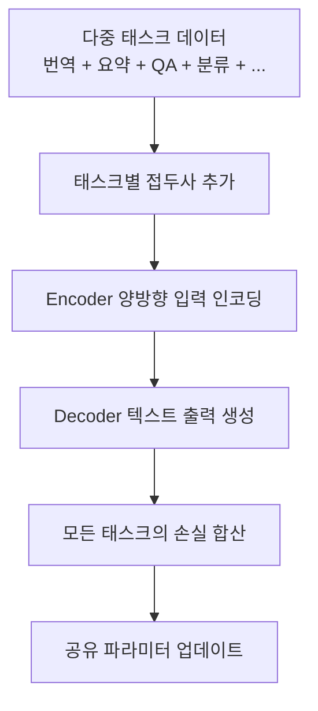

# 다중 태스크 학습 (Multi-Task Learning)

## 개요

다중 태스크 학습(Multi-Task Learning, MTL)은 하나의 모델이 여러 태스크를 동시에 학습하여 태스크 간 공유되는 표현을 활용하고 개별 태스크의 일반화 성능을 향상시키는 패러다임이다. T5(Raffel et al., 2020)가 "모든 NLP 태스크를 text-to-text로 통합"이라는 프레임워크를 제시하며 이 접근의 정점을 보여주었고, ExMix(Aribandi et al., 2022)는 107개 지도 학습 태스크로 확장하여 태스크 스케일링의 효과를 검증했다. [[instruction-tuning]]과 결합되면서, MTL의 원리는 현대 LLM의 범용 능력을 뒷받침하는 핵심 기반이 되었다.

## 핵심 개념

### Text-to-Text 프레임워크 (T5)

T5(Text-to-Text Transfer Transformer, Raffel et al., 2020)의 핵심 아이디어는 번역, 요약, 분류, QA 등 모든 NLP 태스크를 "텍스트 입력 -> 텍스트 출력" 형식으로 통합하는 것이다.

**태스크 변환 예시:**

| 태스크 | 입력 | 출력 |
|--------|------|------|
| 번역 | "translate English to German: That is good." | "Das ist gut." |
| 요약 | "summarize: {긴 문서}" | "{요약문}" |
| 분류 | "sst2 sentence: I love this movie" | "positive" |
| QA | "question: Who wrote Hamlet? context: ..." | "Shakespeare" |

각 태스크는 텍스트 접두사(prefix)로 구분된다. 모델은 접두사를 보고 어떤 태스크를 수행해야 하는지 파악한다.

### T5의 체계적 연구

T5 논문은 전이 학습의 다양한 측면을 체계적으로 비교한 대규모 실험으로도 유명하다.

| 비교 항목 | 탐색한 변수 |
|-----------|------------|
| 사전 학습 목적 함수 | CLM, MLM, 프리픽스 LM, 다양한 마스킹 비율 |
| 아키텍처 | encoder-only, decoder-only, encoder-decoder |
| 비라벨 데이터 | 규모, 도메인, 필터링 수준 |
| 전이 방법 | 다중 태스크 학습, 순차 파인튜닝, 어댑터 |

최종 결론으로 T5는 encoder-decoder 아키텍처 + span corruption(연속 토큰 마스킹) 사전 학습 + 다중 태스크 파인튜닝 조합을 권장했다.

### C4 (Colossal Clean Crawled Corpus)

T5와 함께 공개된 C4는 Common Crawl에서 추출한 약 750B 토큰 규모의 영어 코퍼스이다. 중복 제거, 문장 수준 필터링, 비영어 제거 등 [[pretraining-data-curation]]을 적용했으며, 이후 다수의 연구에서 사전 학습 데이터로 활용되었다.

### Encoder-Decoder vs Decoder-Only

T5가 채택한 encoder-decoder 구조와 GPT 계열의 decoder-only 구조의 다중 태스크 학습에서의 차이는 다음과 같다.

| 항목 | Encoder-Decoder (T5) | Decoder-Only (GPT) |
|------|---------------------|---------------------|
| 입력 처리 | 인코더가 양방향으로 입력 이해 | 왼쪽->오른쪽 단방향 |
| 태스크 구분 | 텍스트 접두사 | 프롬프트/지시문 |
| 조건부 생성 | 자연스러움 (encoder가 조건 인코딩) | 가능하나 입력-출력 경계 모호 |
| 사전 학습 | span corruption (마스크된 범위 복원) | [[causal-language-modeling]] |
| 2026년 주류 | 특화 태스크(번역 등)에 유지 | 범용 LLM의 지배적 구조 |

### ExMix와 태스크 스케일링

ExMix(Aribandi et al., 2022)는 107개의 지도 학습 NLP 태스크를 혼합하여 T5에 학습시킨 연구이다.

**핵심 발견:**
- 태스크 수를 늘리면 전이 학습 성능이 향상 (태스크 스케일링 효과 확인)
- 그러나 태스크 배합 비율이 중요 -- 무작위 혼합보다 전략적 배합이 효과적
- 특정 태스크 그룹 간의 양의 전이(positive transfer)와 음의 전이(negative transfer)가 공존

## 작동 원리

다중 태스크 학습의 이점은 공유 표현(shared representation)에서 나온다. 번역에서 학습한 언어 구조 지식이 요약 성능을 향상시키고, QA에서 학습한 정보 추출 능력이 분류 성능을 개선하는 식이다.

### 태스크 배합 전략

| 전략 | 설명 | 장단점 |
|------|------|--------|
| 비례 혼합 (Proportional) | 각 태스크 데이터 크기에 비례하여 샘플링 | 큰 태스크 편향 |
| 균등 혼합 (Equal) | 각 태스크에서 동일 수 샘플링 | 작은 태스크 과적합 |
| 온도 기반 (Temperature) | 크기^(1/T)로 샘플링 확률 조정 | 유연한 균형 |
| 학습 기반 (DoReMi 등) | 자동으로 최적 배합 비율 탐색 | 연산 비용 추가 |

## MTL과 현대 LLM의 관계

### Instruction Tuning과의 합류

[[instruction-tuning]]은 본질적으로 다중 태스크 학습의 확장이다. FLAN은 60개 이상의 태스크를, Flan-PaLM은 1,800개 태스크를 지시문 형태로 학습하며, T5의 text-to-text 원리를 지시문-응답 패러다임으로 자연스럽게 계승했다.

### 2026년 MTL의 위치

| 형태 | 설명 |
|------|------|
| 사전 학습 혼합 | 코드, 수학, 다국어 등 다양한 도메인 데이터를 사전 학습에 혼합 |
| SFT 데이터 다양성 | [[supervised-fine-tuning]] 데이터셋에 다양한 태스크 포함 |
| RL 보상 설계 | [[rlvr]] 등에서 다중 검증 기준을 동시에 최적화 |
| LoRA 멀티태스크 | [[lora-qlora-finetuning]]으로 태스크별 어댑터 운영 |

## 대표 자료

- [Exploring the Limits of Transfer Learning with a Unified Text-to-Text Transformer (T5, Raffel et al., 2020)](https://arxiv.org/abs/1910.10683)
- [ExT5: Towards Extreme Multi-Task Scaling for Transfer Learning (Aribandi et al., 2022)](https://arxiv.org/abs/2111.10952)
- [Multi-Task Learning in Natural Language Processing (survey)](https://arxiv.org/abs/2109.09138)

## 관련 문서

- [[instruction-tuning]] -- MTL 원리를 지시문 형태로 확장
- [[supervised-fine-tuning]] -- MTL 이후 또는 결합되어 적용되는 파인튜닝
- [[transfer-learning-for-nlp]] -- MTL이 전이 학습 패러다임에서 차지하는 위치
- [[pretraining-data-curation]] -- 다중 도메인 데이터 배합과 C4 코퍼스
- [[tokenizer-training]] -- T5의 SentencePiece/Unigram 토크나이저
- [[causal-language-modeling]] -- 대안적 사전 학습 방식 (decoder-only)
- [[masked-language-modeling]] -- T5의 span corruption과 관련된 마스킹 학습
