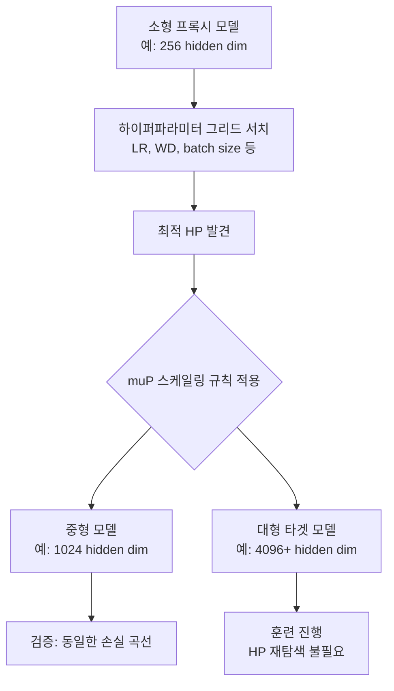

# muP (최대 업데이트 파라미터화)

## 개요

muP(Maximal Update Parametrization, 최대 업데이트 파라미터화)는 Greg Yang 등이 Microsoft Research에서 제안한 이론으로, 신경망 너비(width)가 무한대로 커져도 각 레이어의 활성화 분산과 그래디언트 크기가 안정적으로 유지되도록 파라미터 초기화와 학습률을 스케일링하는 방법이다. 핵심 실용적 결과는 **작은 프록시 모델(proxy model)에서 찾은 최적 하이퍼파라미터를 재조정 없이 훨씬 큰 타겟 모델에 그대로 전이(transfer)할 수 있다**는 것이다.

## 문제 의식: 하이퍼파라미터 전이의 어려움

기존 표준 파라미터화(Standard Parametrization, SP)에서는 모델 너비 $d$가 커질수록 최적 학습률이 달라진다. 이로 인해 대형 모델의 하이퍼파라미터를 탐색할 때 매우 비싼 그리드 서치가 필요하다.

[[scaling-laws]] 연구들은 학습 효율 예측에 초점을 맞추지만, 최적 학습률 자체가 스케일에 따라 변한다는 문제는 별도로 풀어야 한다. muP는 이 문제를 정면으로 해결한다.

## 핵심 이론: 최대 업데이트 조건

muP는 무한 너비 극한(infinite-width limit)에서 각 파라미터 업데이트 $\Delta \theta$가 활성화에 미치는 영향이 너비에 무관하게 $O(1)$이 되도록(즉, "최대"로 활용되도록) 스케일링 규칙을 유도한다.

주요 스케일링 규칙 (너비 $d$ 기준):

| 구성 요소 | SP | muP |
|-----------|-----|-----|
| 입력 레이어 초기화 | $O(1)$ | $O(1)$ |
| 은닉 레이어 초기화 | $O(1/\sqrt{d})$ | $O(1/\sqrt{d})$ |
| 출력 레이어 초기화 | $O(1/\sqrt{d})$ | $O(1/d)$ |
| 은닉 레이어 학습률 | $\eta$ | $\eta$ |
| 출력 레이어 학습률 | $\eta$ | $\eta / d$ |

출력 레이어의 초기화와 학습률을 너비에 반비례하게 조정하는 것이 핵심이다.

## 하이퍼파라미터 전이 워크플로우



프록시 모델에서의 HP 탐색 비용이 전체 비용의 극히 일부가 되므로, 실질적인 컴퓨팅 절감 효과가 크다.

## 구현 방법

PyTorch 기반 구현 예시 (간략화):

```python
# mup 라이브러리 사용 (microsoft/mup)
from mup import MuReadout, set_base_shapes, make_base_shapes

# 프록시 모델 정의 (작은 너비)
base_model = MyTransformer(d_model=256)

# 타겟 모델 정의 (큰 너비)
target_model = MyTransformer(d_model=4096)

# 기준 형상 설정
set_base_shapes(target_model, base_model)

# muP 호환 옵티마이저 사용
optimizer = MuAdamW(target_model.parameters(), lr=lr_from_proxy)
```

출력 레이어는 반드시 `MuReadout`으로 교체해야 한다. 일반 `nn.Linear`를 출력 레이어로 사용하면 muP 보장이 깨진다.

## 학습률 스케줄링과의 관계

[[learning-rate-scheduling]]과 함께 사용할 때, 학습률 스케줄 모양(워밍업, 코사인 감쇠 등)은 프록시 모델에서 찾은 것을 그대로 사용할 수 있다. 단, 스케줄의 절대적 최댓값(peak LR)은 muP 규칙에 따라 설정해야 한다.

## 실무에서의 검증 사례

- **Microsoft Phi 시리즈**: muP를 활용해 소규모에서 하이퍼파라미터를 탐색 후 대형 모델로 전이
- **Cerebras**: 하드웨어 효율 훈련에서 muP를 채택해 HP 탐색 반복을 최소화
- **오픈소스 사례**: EleutherAI 등 여러 그룹에서 재현 실험으로 HP 전이 효과 확인

## 주의사항 및 한계

1. **구조 일관성 필수**: 프록시와 타겟 모델은 레이어 수, attention head 수 등 너비 이외의 구조가 동일해야 함
2. **깊이 전이**: muP는 너비 스케일링에 특화됨. 깊이(depth) 스케일링에 대한 전이는 별도 연구 필요
3. **커스텀 아키텍처**: 표준 Transformer 외 구조에서는 적용 전 이론적 검토가 필요
4. **배치 크기**: 배치 크기 변화에 대한 최적 HP 전이는 별도 고려 필요

## 관련 문서

- [[scaling-laws]] - Chinchilla, Neural Scaling Laws — 컴퓨팅 최적 모델 크기
- [[learning-rate-scheduling]] - 워밍업, 코사인 감쇠 등 LR 스케줄 전략
- [[hyperparameter-search-llm]] - 대형 모델 HP 탐색 실용 가이드
- [[optimizer-selection]] - muP와 호환되는 옵티마이저 선택 기준
