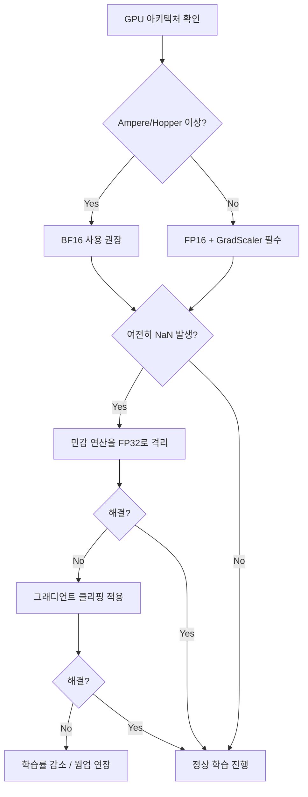

# NaN/Inf 디버깅과 수치 안정성

## 개요

대규모 모델 학습에서 NaN(Not a Number)과 Inf(Infinity)는 학습을 즉시 중단시키는 치명적 오류다. 특히 [[mixed-precision-training]]이 보편화되면서 FP16/BF16의 제한된 동적 범위와 정밀도로 인한 수치 불안정 문제가 빈번해졌다. NaN/Inf는 단일 텐서에서 발생하더라도 역전파를 통해 전체 모델로 전파되므로, 발생 원인을 정확히 진단하고 예방하는 체계적 접근이 필수적이다.

## 발생 원인 분류

### Overflow (오버플로우)

수치가 표현 가능한 최대값을 초과하여 Inf가 되는 현상이다.

| 수치 형식 | 최대값 | 오버플로우 위험 수준 |
|----------|--------|-------------------|
| FP32 | ~3.4e38 | 낮음 |
| FP16 | 65,504 | 높음 |
| BF16 | ~3.4e38 | 낮음 (FP32 동일 범위) |
| FP8 E4M3 | 448 | 매우 높음 |

FP16의 최대값이 65,504에 불과하므로, 대규모 모델의 활성값(activation)이나 그래디언트가 쉽게 이 범위를 넘긴다. BF16 사전학습 모델을 FP16으로 미세조정할 때 이 문제가 특히 심각하다 -- BF16은 FP32와 동일한 지수 범위(8비트)를 가지므로 FP16 범위(5비트 지수) 밖의 값이 존재할 수 있다.

**주요 발생 지점**:
- 소프트맥스(softmax) 입력의 큰 로짓값
- 잔차 연결(residual connection) 누적
- 어텐션 스코어의 폭발적 증가

### Underflow (언더플로우)

매우 작은 값이 0으로 반올림되는 현상이다. FP16의 최소 양수값은 약 6e-8(비정규화 포함)이므로, 그래디언트나 학습률이 극히 작을 때 유효 정보가 소실된다.

**주요 발생 지점**:
- 작은 학습률에서의 가중치 업데이트
- 깊은 네트워크의 역전파 그래디언트
- 로그 확률 계산 (log(p)에서 p가 0에 근접)

### 수학적 불안정 연산

특정 연산은 입력값에 따라 본질적으로 NaN을 생성한다:

```
0 / 0 = NaN
inf - inf = NaN
0 * inf = NaN
sqrt(음수) = NaN
log(0) = -Inf
log(음수) = NaN
exp(큰 값) = Inf
```

## 진단 도구와 방법

### torch.autograd.detect_anomaly

역전파 과정에서 NaN/Inf가 처음 발생하는 연산을 정확히 추적하는 PyTorch 내장 도구다.

```python
with torch.autograd.detect_anomaly():
    output = model(input)
    loss = criterion(output, target)
    loss.backward()  # NaN 발생 시 스택 트레이스 출력
```

NaN이 포함된 텐서가 역전파에 사용되면 에러를 발생시키며, 문제가 된 연산의 전체 스택 트레이스를 제공한다. 단, 모든 연산에 검사를 추가하므로 학습 속도가 크게 저하된다 -- 디버깅 시에만 사용하고 프로덕션 학습에서는 반드시 비활성화해야 한다.

### 수동 모니터링 패턴

```python
def check_tensor(tensor, name):
    if torch.isnan(tensor).any():
        logger.error(f"NaN detected in {name}")
    if torch.isinf(tensor).any():
        logger.error(f"Inf detected in {name}")

# 순전파 후 활성값 검사
for name, param in model.named_parameters():
    check_tensor(param.data, f"param:{name}")
    if param.grad is not None:
        check_tensor(param.grad, f"grad:{name}")
```

### GradScaler 동적 손실 스케일링 모니터링

[[mixed-precision-training]]에서 GradScaler의 스케일 팩터 변화를 추적하면 수치 불안정의 조기 신호를 포착할 수 있다:

```python
scaler = torch.amp.GradScaler()
# 학습 루프 내부
logger.info(f"Loss scale: {scaler.get_scale()}")
# 스케일이 지속적으로 감소하면 오버플로우가 반복 발생 중
```

스케일 팩터가 1 미만으로 떨어지면 그래디언트가 표현 가능한 범위를 지속적으로 초과하고 있다는 의미이며, 근본적 수정이 필요하다.

## 해결 전략

### 1. 수치 형식 선택



BF16은 FP32와 동일한 지수 범위(8비트)를 가지므로 오버플로우 위험이 FP16 대비 크게 낮다. Ampere(A100) 이상 GPU에서는 BF16을 기본으로 사용하는 것이 권장된다.

### 2. 민감 연산 FP32 격리

소프트맥스, 크로스엔트로피 손실, 레이어 정규화의 분산 계산 등 수치적으로 민감한 연산은 autocast 내부에서도 FP32로 강제 실행한다:

```python
with torch.amp.autocast(device_type="cuda", dtype=torch.bfloat16):
    logits = model(input)
    # 손실 계산은 FP32로 격리
    with torch.amp.autocast(device_type="cuda", enabled=False):
        loss = F.cross_entropy(logits.float(), targets)
```

### 3. 수치 안전 함수 패턴

```python
# 안전한 나눗셈
safe_div = numerator / (denominator + 1e-8)

# 안전한 로그
safe_log = torch.log(tensor.clamp(min=1e-8))

# 안전한 소프트맥스 (max-subtract 기법)
x_shifted = x - x.max(dim=-1, keepdim=True).values
safe_softmax = F.softmax(x_shifted, dim=-1)

# 안전한 제곱근
safe_sqrt = torch.sqrt(tensor.clamp(min=0) + 1e-8)
```

### 4. 그래디언트 클리핑

[[gradient-accumulation-checkpointing]]과 함께 그래디언트 폭발을 방지하는 핵심 기법이다. GradScaler 사용 시 반드시 `unscale_()` 후에 클리핑을 적용해야 한다:

```python
scaler.unscale_(optimizer)  # 스케일 복원 먼저
torch.nn.utils.clip_grad_norm_(model.parameters(), max_norm=1.0)
scaler.step(optimizer)
scaler.update()
```

`unscale_()` 없이 클리핑하면 스케일된 그래디언트에 대해 클리핑이 적용되어 의도한 임계값과 다르게 동작한다.

### 5. 학습률 웜업

학습 초기 큰 그래디언트로 인한 NaN을 방지하기 위해 [[learning-rate-scheduling]]의 웜업 단계를 충분히 설정한다. 대규모 모델에서는 일반적으로 수백~수천 스텝의 선형 웜업을 적용한다.

## 디버깅 체크리스트

| 단계 | 점검 항목 | 조치 |
|------|----------|------|
| 1 | 입력 데이터에 NaN/Inf 존재 여부 | 데이터 전처리 파이프라인 점검 |
| 2 | 학습률이 과도하게 높은지 | 학습률 1/10로 감소하여 재현 테스트 |
| 3 | GradScaler 스케일이 지속 감소하는지 | BF16 전환 또는 FP32 격리 확대 |
| 4 | 특정 레이어/연산에서 집중 발생하는지 | detect_anomaly로 위치 특정 |
| 5 | 배치 크기 변경으로 재현되는지 | 배치 내 이상 데이터 포인트 확인 |
| 6 | 그래디언트 노름이 급증하는지 | 클리핑 임계값 조정 |

## 대규모 학습에서의 실전 패턴

대규모 LLM 사전학습에서는 학습 중 간헐적으로 loss spike가 발생하며, 이 과정에서 NaN/Inf가 동반될 수 있다. Llama 3나 DeepSeek-V3 등의 기술 보고서에서도 학습 중 loss spike 대응이 언급된다. 일반적인 대응 전략은:

1. **NaN 감지 시 해당 배치 스킵**: 손실값이 NaN이면 해당 스텝의 파라미터 업데이트를 건너뛴다
2. **이전 체크포인트 롤백**: [[model-checkpointing-sharding]]에서 최근 정상 체크포인트로 복원
3. **문제 데이터 제거**: loss spike를 유발한 데이터 배치를 식별하고 학습 데이터에서 제외
4. **학습률 일시 감소**: 일정 스텝 동안 학습률을 낮춘 후 원래 스케줄로 복귀

## 관련 페이지

- [[mixed-precision-training]] -- FP16/BF16/FP8 수치 형식과 AMP 메커니즘
- [[gradient-accumulation-checkpointing]] -- 그래디언트 누적과 메모리 절감 기법
- [[learning-rate-scheduling]] -- 학습률 웜업과 스케줄링 전략
- [[model-checkpointing-sharding]] -- 체크포인트 저장과 롤백 메커니즘
- [[optimizer-selection]] -- 옵티마이저별 수치 안정성 특성
