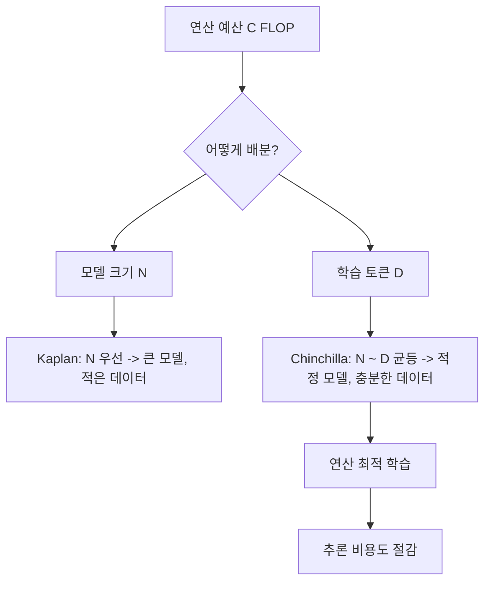

# 신경망 스케일링 법칙 (Neural Scaling Laws)

## 개요

신경망 스케일링 법칙(Neural Scaling Laws)은 언어 모델의 성능(손실)이 모델 크기(N), 데이터셋 크기(D), 연산량(C)에 대해 멱법칙(power-law) 관계를 따른다는 경험적 관찰이다. Kaplan et al.(2020)의 초기 발견과 Hoffmann et al.(2022)의 Chinchilla 보정이 이 분야의 두 축이다. 스케일링 법칙은 수십억 달러 규모의 학습 예산을 어떻게 배분할지 결정하는 핵심 지침이 되었으며, 2026년 현재에도 프론티어 모델 개발의 기본 계획 도구로 사용된다.

## 핵심 개념

### Kaplan 스케일링 법칙 (2020)

Kaplan et al.("Scaling Laws for Neural Language Models")은 7개 이상의 자릿수에 걸쳐 세 가지 멱법칙 관계를 확인했다.

| 변수 | 관계 | 핵심 발견 |
|------|------|-----------|
| 모델 크기 N | L(N) ~ N^{-alpha_N} | 파라미터 수가 늘면 손실이 예측 가능하게 감소 |
| 데이터 크기 D | L(D) ~ D^{-alpha_D} | 학습 데이터가 늘면 손실이 감소 |
| 연산량 C | L(C) ~ C^{-alpha_C} | 총 FLOP이 늘면 손실이 감소 |

Kaplan의 핵심 주장은 "큰 모델이 훨씬 샘플 효율적이므로, 최적 연산 효율을 위해서는 매우 큰 모델을 상대적으로 적은 데이터로 학습하고 수렴 전에 멈추는 것이 좋다"는 것이었다. 또한 "네트워크의 폭이나 깊이는 넓은 범위에서 최소한의 영향만 미친다"고 보고하여, 전체 파라미터 수가 구체적 아키텍처보다 중요하다고 결론지었다.

### Chinchilla 스케일링 법칙 (2022)

Hoffmann et al.("Training Compute-Optimal Large Language Models")은 Kaplan의 결론을 수정했다. 70M에서 16B 파라미터까지 400개 이상의 모델을 5B에서 500B 토큰으로 학습시킨 결과, 핵심 발견은 다음과 같다.

**"모델 크기를 두 배로 늘릴 때마다 학습 토큰 수도 두 배로 늘려야 한다."**

| 항목 | Kaplan 처방 | Chinchilla 처방 |
|------|------------|----------------|
| 모델-데이터 비율 | 큰 모델 + 적은 데이터 | 모델과 데이터 균등 스케일링 |
| 토큰/파라미터 비율 | ~불명확 | 약 20:1 (토큰:파라미터) |
| 핵심 함의 | 모델 크기 우선 | 데이터 품질과 양 동시 중시 |

Chinchilla(70B)는 Gopher(280B)와 동일한 연산 예산을 사용하면서도 "GPT-3(175B), Jurassic-1(178B), Megatron-Turing NLG(530B)를 일관되고 유의미하게 능가"했다. MMLU 벤치마크에서 67.5%를 달성하여 Gopher 대비 7% 향상을 기록했다.

### 실용적 함의

Chinchilla 결과는 업계에 즉각적인 영향을 미쳤다.

- **데이터 병목 인식**: 모델만 키우는 것이 아니라 [[pretraining-data-curation]]의 중요성이 부각
- **추론 비용 절감**: 동일 성능에서 더 작은 모델을 사용할 수 있어 배포 비용 감소
- **파인튜닝 효율**: 더 작은 모델이 [[supervised-fine-tuning]]과 [[lora-qlora-finetuning]] 시 자원 소모가 적음

## 작동 원리

스케일링 법칙의 핵심 방정식은 다음과 같다.

L(N, D) = E + A/N^alpha + B/D^beta

여기서 E는 환원 불가능한 손실(irreducible loss), A/N^alpha는 모델 크기에 의한 손실, B/D^beta는 유한한 데이터에 의한 손실이다. 연산 예산 C가 주어졌을 때 이 손실을 최소화하는 N*과 D*를 찾는 것이 연산 최적 학습의 핵심이다.

## 2026년 관점: Chinchilla 이후의 발전

### 과소 학습의 귀환

LLaMA(Touvron et al., 2023)는 Chinchilla 비율보다 훨씬 더 많은 토큰(7B 모델에 1T 토큰)으로 학습하여, "추론 시 연산 최적"이라는 새로운 관점을 제시했다. 학습은 과도하더라도 배포 시 작은 모델을 사용하면 총 비용이 낮아진다는 논리이다.

### 데이터 반복 학습

데이터 고갈 우려가 커지면서, 동일 데이터를 여러 에포크 반복 학습하는 전략이 연구되고 있다. [[rl-scaling-laws]]와 결합하여 후학습 단계의 스케일링도 활발히 연구된다.

### 후학습 스케일링

[[grpo]], [[dapo]], [[rlvr]] 등 강화학습 기반 후학습에서도 스케일링 법칙이 관찰되고 있다. 사전 학습 스케일링과 후학습 스케일링의 상호작용을 이해하는 것이 다음 과제이다.

## 대표 자료

- [Scaling Laws for Neural Language Models (Kaplan et al., 2020)](https://arxiv.org/abs/2001.08361)
- [Training Compute-Optimal Large Language Models (Hoffmann et al., 2022)](https://arxiv.org/abs/2203.15556)
- [LLaMA: Open and Efficient Foundation Language Models (Touvron et al., 2023)](https://arxiv.org/abs/2302.13971)

## 관련 문서
- [[palm-architecture]] -- PaLM - Google의 대규모 언어 모델
- [[moe-scaling-laws-paper]] -- MoE Transformer의 일반화와 스케일링 법칙
- [[inference-time-compute]] -- 추론 시점 계산 스케일링 (Test-Time Compute)
- [[dataset-scaling-laws-paper]] -- 데이터셋 스케일링 법칙: 30% 데이터로 90% 정확도

- [[rl-scaling-laws]] -- 강화학습 후학습 단계의 스케일링 법칙
- [[causal-language-modeling]] -- 스케일링 법칙이 가장 광범위하게 검증된 사전 학습 방식
- [[pretraining-data-curation]] -- Chinchilla가 부각시킨 데이터 품질의 중요성
- [[grpo]] -- 후학습 스케일링에서 주목받는 정책 최적화 기법
- [[test-time-compute-scaling]] -- 학습 시간 스케일링의 대안적 축
- [[knowledge-distillation]] -- 스케일링 비용을 절감하는 모델 압축 전략
