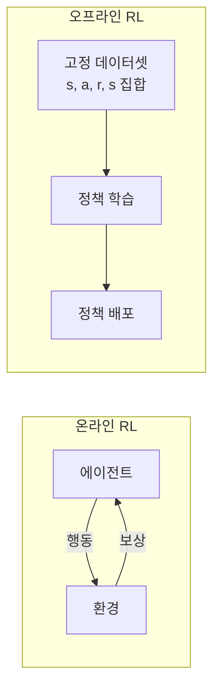

# 오프라인 강화학습 (Offline RL)

환경과의 추가 상호작용 **없이** 기존 수집된 데이터셋만으로 정책을 학습하는 RL 패러다임. 온라인 RL의 탐색 비용/위험을 제거하며, LLM의 [[rlhf-pipeline|RLHF]]와 밀접하게 연결된다.

## 온라인 vs 오프라인 RL

## 핵심 도전: 분포 이동

오프라인 데이터에 없는 (상태, 행동) 쌍에 대해 Q 값이 과대 추정되는 문제:

| 기법 | 해결 방식 |
|------|----------|
| **CQL** (Conservative Q-Learning) | 과대 추정에 페널티 부과 |
| **IQL** (Implicit Q-Learning) | 데이터 분포 내에서만 최적화 |
| **Decision Transformer** | RL을 시퀀스 모델링으로 재정의 |
| **DPO** | 보상 모델 없이 선호 쌍으로 직접 학습 |

## LLM과의 연결

[[direct-preference-optimization|DPO]]는 본질적으로 오프라인 RL이다: 고정된 선호도 데이터셋에서 온라인 탐색 없이 정책(LLM)을 최적화한다. RLHF의 PPO도 리플레이 버퍼 사용 시 오프라인 RL 요소를 가진다.

## 관련 문서

- [[policy-gradient-ppo]] -- PPO
- [[direct-preference-optimization]] -- DPO
- [[rlhf-pipeline]] -- RLHF
- [[q-learning-dqn]] -- Q-러닝과 DQN
