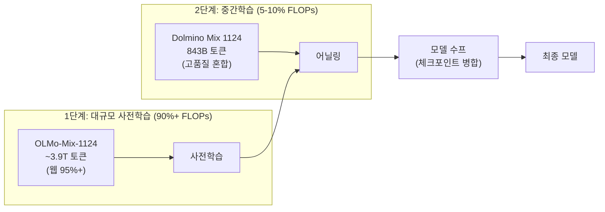
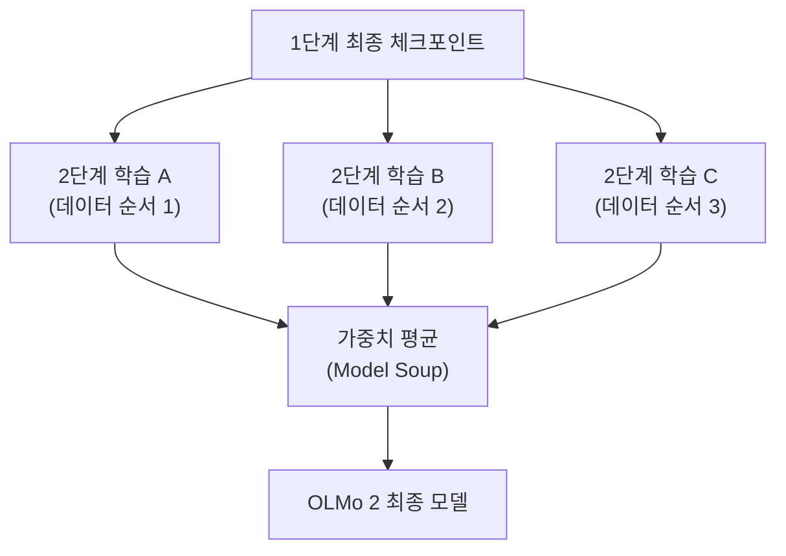

# OLMo 2 학습

## 개요

OLMo 2는 Allen Institute for AI(AI2)가 2024년 12월 공개한 완전 오픈소스 언어 모델 패밀리다. 7B, 13B, 32B 세 가지 크기로 제공되며, 모델 가중치뿐 아니라 전체 학습 데이터, 학습 코드, 학습 레시피, 학습 로그, 수천 개의 중간 체크포인트까지 모두 공개한다. 2단계 커리큘럼 학습, 모델 수프(model soup)를 통한 체크포인트 병합, QK-Norm과 Z-loss를 활용한 학습 안정성 개선이 핵심 기법이다. 논문 제목 "2 OLMo 2 Furious"가 암시하듯, OLMo 1 대비 학습 레시피를 근본적으로 개선했다.

## 모델 패밀리

| 모델 | 총 학습 토큰 | 1단계 토큰 | 2단계 토큰 | 수프 구성 |
|------|-----------|----------|----------|---------|
| OLMo 2 7B | ~4T | ~3.9T | 50B x 3 | 3개 체크포인트 병합 |
| OLMo 2 13B | ~5T | ~5T | 100B x 3 + 300B x 1 | 4개 체크포인트 병합 |
| OLMo 2 32B | - | - | 100B x 3 | 3개 체크포인트 병합 |

## 2단계 커리큘럼 학습

OLMo 2의 학습은 명확히 두 단계로 나뉜다. 이 구조는 최근 커리큘럼 학습 연구의 발전을 반영한다.

### 1단계: 대규모 사전학습

전체 학습 FLOPs의 90% 이상을 차지하는 주 학습 단계다. OLMo-Mix-1124 데이터셋을 사용하며, 약 3.9조 토큰(7B 기준) 규모로 대부분 웹 소싱 데이터로 구성된다. DCLM, Dolma, StarCoder, Proof Pile II 등에서 수집한 데이터의 95% 이상이 웹 데이터다.

### 2단계: 중간 학습 (Mid-training / Annealing)

전체 학습 FLOPs의 5-10%를 차지하는 품질 집중 단계다. Dolmino Mix 1124라는 특화 데이터셋을 사용하며, 총 843B 토큰 규모로 구성된다:

- 1단계 데이터에서 재샘플링한 고품질 웹 문서
- 교육, 수학, 학술 콘텐츠
- 지시 튜닝(instruction-tuning) 데이터
- 합성 데이터

## 모델 수프 (Model Soup)

OLMo 2의 가장 독특한 기법 중 하나다. 2단계 중간 학습에서 동일한 1단계 최종 체크포인트로부터 **데이터 순서만 다르게** 여러 번 학습을 수행한 뒤, 결과 모델들의 가중치를 평균하여 최종 모델을 생성한다.

| 모델 | 수프 레시피 |
|------|-----------|
| 7B | 50B 토큰 x 3회 (서로 다른 데이터 순서) -> 3개 모델 평균 |
| 13B | 100B 토큰 x 3회 + 300B 토큰 x 1회 -> 4개 모델 평균 |
| 32B | 100B 토큰 x 3회 -> 3개 모델 평균 |

이 접근법은 [[model-merging|모델 병합]]의 Model Soups 기법을 사전학습에 직접 적용한 것이다. 동일 기반 체크포인트에서 출발하므로 가중치 공간이 유사하여 단순 평균만으로도 효과적이며, 개별 학습 실행의 데이터 순서에 의한 편향을 상쇄하여 일반화 성능을 개선한다.

## 학습 안정성 기법

OLMo 2는 대규모 학습의 안정성을 확보하기 위해 여러 아키텍처 수준의 변경을 도입했다.

### QK-Norm

Query와 Key 벡터에 정규화(normalization)를 적용하여 어텐션 로짓의 폭주를 방지한다. 코사인 스케줄의 후반부에서 특히 효과적이며, loss spike 발생 빈도를 크게 줄인다.

### Z-loss 정규화

출력 로짓의 크기를 제한하는 보조 손실을 추가하여, 학습 후반부의 수치 불안정성을 방지한다. 로짓이 과도하게 커지면 softmax의 수치 정밀도가 떨어지는 문제를 예방한다.

### 기타 아키텍처 변경

| 변경 사항 | OLMo 1 | OLMo 2 |
|----------|--------|--------|
| 정규화 | Layer Norm (비파라미터) | RMSNorm |
| 정규화 순서 | Post-norm | Pre-norm (재배치) |
| 위치 인코딩 | 절대 위치 인코딩 | RoPE (회전 위치 인코딩) |
| 어텐션 안정화 | 없음 | QK-Norm |
| 로짓 안정화 | 없음 | Z-loss |

## 완전 오픈소스 철학

OLMo 2의 "완전 오픈소스"는 단순히 가중치 공개를 넘어선다:

| 공개 항목 | 설명 |
|----------|------|
| 모델 가중치 | 7B, 13B, 32B 최종 모델 |
| 중간 체크포인트 | 수천 개의 학습 중간 체크포인트 |
| 학습 데이터 | OLMo-Mix-1124, Dolmino Mix 1124 전체 |
| 학습 코드 | 전체 학습 파이프라인 코드 |
| 학습 레시피 | 하이퍼파라미터, 스케줄, 데이터 배합 비율 |
| 학습 로그 | 손실 곡선, 벤치마크 추적 로그 |

이 수준의 투명성은 학습 과정 자체를 연구 대상으로 삼을 수 있게 하며, [[pretraining-data-curation|데이터 큐레이션]]이나 [[data-mixing-curriculum-learning|커리큘럼 학습]] 연구에 귀중한 자원을 제공한다.

## 의의

OLMo 2는 완전 오픈소스 모델이 독점 모델과 경쟁할 수 있음을 증명한 사례다. 2단계 커리큘럼의 효과, 모델 수프의 사전학습 적용, QK-Norm/Z-loss의 안정성 기여 등은 모두 공개된 학습 로그와 중간 체크포인트를 통해 검증 가능하다. 이 투명성 자체가 OLMo 2의 가장 큰 기여로, LLM 학습의 과학적 재현성(scientific reproducibility)을 한 단계 끌어올렸다.

## 관련 문서

- [[model-merging]] -- 모델 수프의 이론적 배경과 다양한 병합 기법
- [[data-mixing-curriculum-learning]] -- 2단계 커리큘럼의 데이터 배합 전략
- [[pretraining-data-curation]] -- OLMo-Mix-1124, Dolmino Mix 1124 데이터 큐레이션
- [[mixed-precision-training]] -- 학습 수치 안정성과 정밀도 관리
- [[data-parallelism-fsdp]] -- 분산 학습 전략
- [[neural-scaling-laws]] -- 모델 크기별 학습 토큰 수 결정 근거
