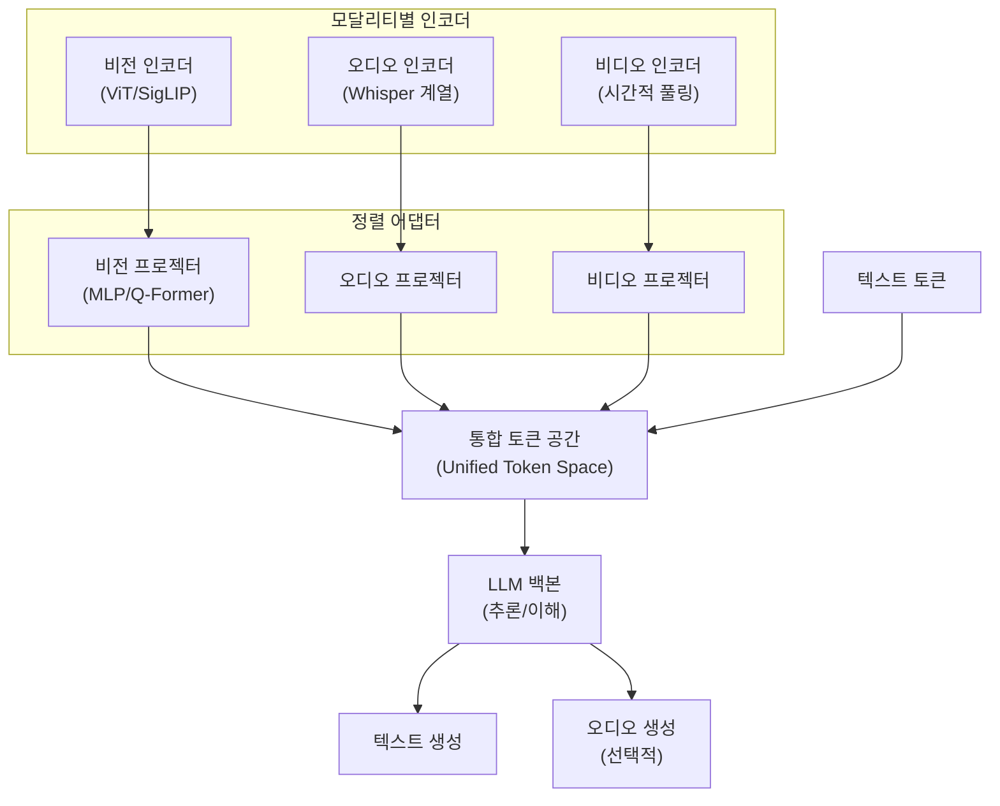
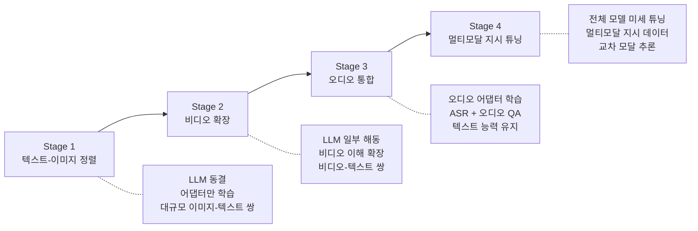

# 옴니모달 통합 학습 (Omni-Modal Training)

## 개요

옴니모달 통합 학습(Omni-Modal Training)은 텍스트, 이미지, 비디오, 오디오를 단일 모델에서 동시에 이해하고 생성하기 위한 학습 전략이다. 기존 멀티모달 모델이 텍스트+이미지 등 2-3개 모달리티를 조합하는 데 그쳤다면, 옴니모달 LLM(Omni-LLM/OLM)은 4개 이상의 모달리티를 통합 처리한다. Baichuan-Omni(2024), Qwen2.5-Omni(2025), Ola(2025), M2-omni 등이 대표적이며, 핵심은 점진적 모달리티 정렬(progressive modality alignment)과 통합 토크나이제이션(unified tokenization)이다. 이 페이지에서는 [[supervised-fine-tuning|지도 파인튜닝]]을 넘어서는 옴니모달 특유의 학습 파이프라인 설계를 다룬다.

## 아키텍처 기반: 모듈형 구조

### 인코더-LLM-디코더 패턴

대부분의 OLM은 모달리티별 전용 인코더, 공유 LLM 백본, 선택적 디코더로 구성된다:

### 통합 토크나이제이션

각 모달리티의 인코더 출력을 LLM의 토큰 임베딩 공간으로 프로젝션하여, 텍스트 토큰과 동일한 시퀀스에 연결(concatenation)한다. 이를 통해 LLM은 모달리티 구분 없이 통합된 시퀀스를 처리한다.

| 모달리티 | 인코더 | 토큰 수 (대략) | 프로젝션 |
|---------|--------|-------------|---------|
| 텍스트 | 토크나이저 | 원본 토큰 수 | 임베딩 룩업 |
| 이미지 | ViT | 256-576 토큰/이미지 | Linear/MLP |
| 비디오 | ViT + 시간 풀링 | 프레임당 64-256 토큰 | Linear + 시간 압축 |
| 오디오 | Whisper 변형 | 초당 25-50 토큰 | Linear/MLP |

## 점진적 모달리티 정렬 (Progressive Alignment)

### 다단계 학습 파이프라인

OLM 학습의 핵심은 모달리티를 한 번에 전부 통합하는 것이 아니라, 단계적으로 확장하는 것이다. 이 접근은 [[transfer-learning-for-nlp|전이 학습]]의 원리를 다중 모달리티로 확장한 것이다.

### Stage 1: 텍스트-이미지 정렬

가장 기본적인 단계로, 사전학습된 LLM과 비전 인코더(ViT/SigLIP)를 연결하는 프로젝터(MLP 또는 Q-Former)를 학습한다.

- **학습 대상**: 프로젝터 가중치만 (LLM + 비전 인코더 동결)
- **데이터**: 대규모 이미지-텍스트 쌍 (캡셔닝, VQA 등)
- **손실 함수**: 표준 교차 엔트로피 (텍스트 생성) + 선택적 대조 학습(contrastive)
- **규모**: 수억~수십억 이미지-텍스트 쌍

### Stage 2: 비디오 확장

텍스트-이미지 LLM 위에 비디오 이해 능력을 추가한다. 비디오는 이미지의 시간적 확장이므로, Stage 1의 비전 프로젝터를 재활용하되 시간적 모델링을 추가한다.

- **학습 대상**: 시간적 프로젝터 + LLM 일부 레이어
- **데이터**: 비디오-텍스트 쌍 (비디오 캡셔닝, 비디오 QA)
- **핵심 과제**: 긴 비디오의 토큰 수 폭발 -> 시간적 풀링/샘플링 필수

### Stage 3: 오디오 통합

오디오(음성, 환경음, 음악)를 별도 인코더로 처리하여 통합 토큰 공간에 합류시킨다. Whisper 계열 인코더가 일반적이다.

- **학습 대상**: 오디오 인코더 + 오디오 프로젝터
- **데이터**: ASR(자동 음성 인식), 오디오 캡셔닝, 오디오 QA
- **핵심 과제**: 기존 텍스트/비전 능력의 파국적 망각 방지

### Stage 4: 멀티모달 지시 튜닝

모든 모달리티를 활용한 지시-응답 데이터로 전체 모델을 [[supervised-fine-tuning|SFT]]한다. 교차 모달 추론(예: "이 이미지의 배경 음악을 설명해줘")을 학습한다.

## 학습 전략의 핵심 설계 원칙

### 파국적 망각 방지

모달리티를 순차적으로 추가하면 이전 모달리티의 성능이 하락할 수 있다. 이를 방지하는 전략:

- **텍스트 전용 데이터 혼합**: 모든 학습 단계에서 텍스트 전용 데이터를 일정 비율 유지하여 LLM 핵심 능력 보존
- **동결 스케줄(freezing schedule)**: 초기에는 인코더/LLM 동결, 점진적으로 해동 범위 확대
- **데이터 큐레이션**: 지름길 학습(shortcut learning)을 유발하는 저품질 멀티모달 데이터 필터링

### 데이터 배합 비율

옴니모달 학습에서 모달리티 간 데이터 비율은 성능에 결정적이다:

| 학습 단계 | 텍스트 | 이미지 | 비디오 | 오디오 |
|----------|--------|--------|--------|--------|
| Stage 1 | 20% | 80% | - | - |
| Stage 2 | 15% | 40% | 45% | - |
| Stage 3 | 15% | 30% | 25% | 30% |
| Stage 4 (SFT) | 25% | 25% | 25% | 25% |

실제 비율은 모델과 목표에 따라 크게 달라지며, 위 수치는 일반적 경향을 나타낸다.

### Brain-Mouth 분리 아키텍처

MGM-Omni 등 최신 모델은 "두뇌-입" 분리 패턴을 도입했다. 텍스트 기반 추론("두뇌" 트랙)과 실시간 음성 합성("입" 트랙)을 분리하여, 추론 품질을 유지하면서 실시간 음성 출력을 생성한다. 이 접근은 옴니모달 모델의 실시간 대화 능력을 크게 향상시킨다.

## 대표 모델의 학습 전략 비교

| 모델 | 규모 | 학습 단계 수 | 핵심 특징 |
|------|------|------------|----------|
| **Baichuan-Omni** | 7B | 4단계 | 자체 오디오 토크나이저, 500B 멀티모달 데이터 |
| **Qwen2.5-Omni** | 7B | 3단계 | Thinker-Talker 이중 구조, 실시간 스트리밍 |
| **Ola** | 7B | 4단계 점진적 정렬 | 이미지/비디오/오디오 순차 확장 |
| **M2-omni** | 72B | 다단계 | OpenCompass 비전 75.1%, MVBench 69.6 |

## 강화학습 기반 정렬

### 옴니모달 RL

텍스트 전용 [[direct-preference-optimization|DPO]]를 넘어, 옴니모달 모델에 특화된 정렬 기법이 등장하고 있다. HumanOmniV2는 태스크별 평가 지표(metrics-grounded evaluation)를 보상 신호로 활용하는 RL 접근을 제안했다. 이미지 캡셔닝의 CIDEr, ASR의 WER 등 각 모달리티 태스크에 맞는 자동 평가 지표가 보상 함수 역할을 한다.

## 평가 체계

### 옴니모달 벤치마크

| 벤치마크 | 평가 대상 | 주요 지표 |
|---------|----------|----------|
| OpenCompass | 텍스트-비전 | 종합 점수 |
| MVBench | 비디오 이해 | 정확도 |
| AudioCaps | 오디오 캡셔닝 | CIDEr |
| OmniBench (ICLR 2025) | 교차 모달 추론 | 종합 평가 |

OmniBench(ICLR 2025)는 옴니모달 모델의 교차 모달 추론 능력을 체계적으로 평가하는 벤치마크로, 단순 단일 모달리티 성능이 아닌 모달리티 간 통합 추론을 측정한다.

## 실무적 과제

### 연산 비용

4개 모달리티의 인코더 + LLM 백본을 동시에 학습하려면, 텍스트 전용 학습 대비 수배의 GPU 메모리와 연산이 필요하다. [[mixed-precision-training|혼합 정밀도 학습]]과 [[data-parallelism-fsdp|FSDP]]의 결합이 필수적이다.

### 모달리티 간 충돌

서로 다른 모달리티의 학습 신호가 공유 LLM 파라미터에서 충돌할 수 있다. 오디오 태스크에 최적화하면 비전 성능이 하락하는 등의 간섭이 발생하며, 그래디언트 조정(gradient surgery) 기법이나 모달리티별 [[lora-qlora-finetuning|LoRA]] 어댑터를 통해 완화할 수 있다.

### 데이터 불균형

텍스트 데이터는 수조 토큰 규모로 풍부하나, 고품질 비디오-텍스트 쌍이나 오디오-텍스트 쌍은 상대적으로 희소하다. 합성 데이터 생성과 자기 학습(self-training)을 통한 데이터 증강이 활발히 연구되고 있다.

## 참고 문헌

- "Baichuan-Omni Technical Report" (arXiv:2410.08565, 2024)
- "Qwen2.5-Omni Technical Report" (Alibaba, 2025)
- "Ola: Pushing the Frontiers of Omni-Modal Language Model with Progressive Modality Alignment" (arXiv:2502.04328, 2025)
- "Evaluating Omni-Modality Language Models on OmniBench" (ICLR 2025)
