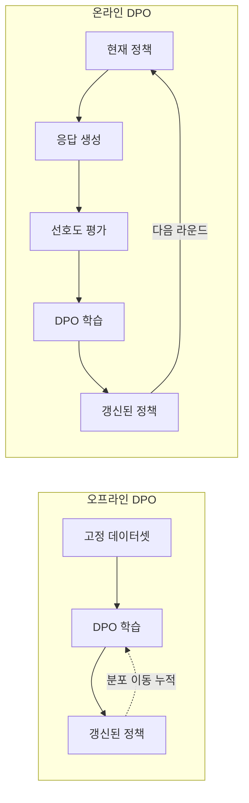
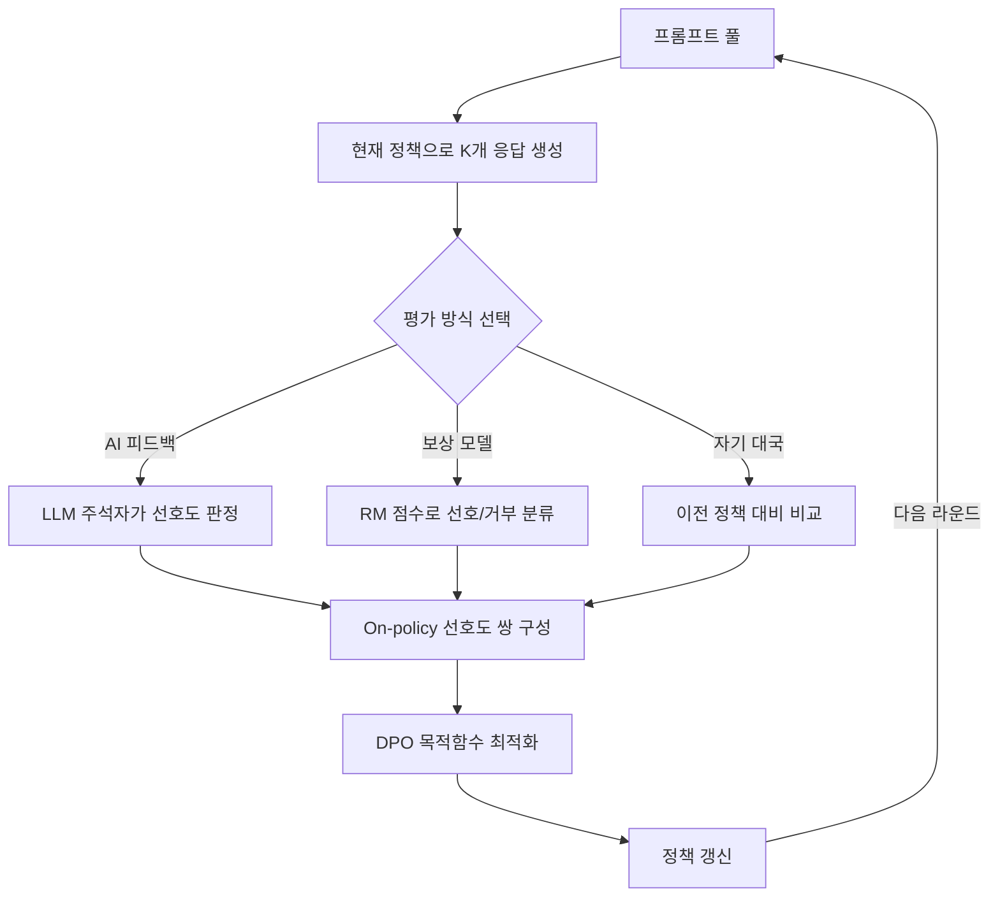

# 온라인/반복 DPO (Online & Iterative DPO)

## 개요

온라인 DPO(Online DPO)와 반복 DPO(Iterative DPO)는 기존 [[direct-preference-optimization|DPO]]의 오프라인(offline) 한계를 극복하기 위해 제안된 학습 패러다임이다. 표준 DPO는 사전에 수집된 고정 선호도 데이터셋으로 학습하므로, 학습이 진행되면서 정책(policy)이 변화해도 데이터가 이를 반영하지 못하는 분포 이동(distribution shift) 문제가 발생한다. 온라인/반복 DPO는 현재 정책에서 직접 응답을 생성하고(on-policy), 이를 평가하여 새로운 선호도 데이터를 만든 뒤, 반복적으로 정책을 갱신하는 방식으로 이 문제를 해결한다.

이 접근법은 [[ppo-for-llms|PPO 기반 RLHF]]의 온라인 학습 장점과 DPO의 구현 단순성을 결합한 것으로, [[rlhf-pipeline|RLHF 파이프라인]]의 실용적 대안으로 주목받고 있다.

## 오프라인 DPO의 한계

### 분포 이동(Distribution Shift) 문제

표준 DPO의 학습 데이터는 참조 정책(reference policy) 또는 다른 모델이 생성한 응답 쌍이다. 학습이 진행되면서 현재 정책과 데이터 생성 정책 사이의 괴리가 커지면, 학습 신호의 품질이 저하된다.

구체적인 문제점:

1. **데이터 신선도 감소**: 초기에 수집된 선호도 쌍이 학습 후반의 정책에는 무의미한 비교가 될 수 있다
2. **탐색 부족**: 고정 데이터셋은 현재 정책이 만들어낼 수 있는 다양한 응답 공간을 반영하지 못한다
3. **보상 과적합(Reward Overoptimization)**: 제한된 데이터에서 학습하면 특정 패턴에 과적합되기 쉽다
4. **KL 발산 추정 오류**: 오프라인 데이터로는 [[kl-divergence-penalty|KL 발산]]을 정확히 추정하기 어렵다

## 온라인 DPO 프레임워크

### 기본 구조

온라인 DPO의 각 반복(iteration)은 다음 단계로 구성된다:

1. **On-policy 생성**: 현재 정책 모델이 프롬프트 집합에 대해 다수의 응답을 샘플링
2. **선호도 레이블링**: 생성된 응답 쌍에 대해 선호도 판정을 수행
3. **DPO 갱신**: 새로 레이블된 on-policy 데이터로 표준 DPO 목적함수를 최적화
4. **정책 교체**: 갱신된 모델이 다음 라운드의 생성 정책이 됨

이 과정을 여러 라운드 반복하면서 정책이 점진적으로 개선된다.

### OAIF (Online AI Feedback)

Guo et al. (2024)이 제안한 OAIF(Online AI Feedback)는 온라인 DPO의 대표적 구현이다. OAIF는 [[rlaif-scalable-oversight|RLAIF]]의 프레임워크를 공유하면서 핵심적인 변형을 도입한다: LLM 주석자(annotator)가 현재 정책이 생성한 on-policy 응답에 대해 실시간으로 선호도를 평가하고, 이 데이터로 반복 학습한다.

OAIF의 장점:

- 인간 주석 없이 AI 피드백만으로 on-policy 선호도 데이터 생성
- 분포 이동 문제를 근본적으로 완화
- [[reward-model-training|별도 보상 모델]] 학습 불필요

### Self-Play Preference Optimization (SPPO)

SPPO는 자기 대국(self-play) 메커니즘을 도입한 반복 DPO 변형이다. 현재 정책이 이전 정책과 대결하여 선호도 쌍을 생성하며, 이론적으로 내시 균형(Nash equilibrium)에 수렴함이 증명되었다. SPPO는 사전 수집된 쌍별 선호도 데이터에 대한 의존도를 줄이고, 자율적으로 거부(rejected) 데이터를 생성한다.

### SPIN (Self-Play Fine-Tuning)

SPIN은 반복 학습에서 이전 반복의 모델이 생성한 응답을 거부 응답으로, 인간 작성 데이터를 선호 응답으로 사용하는 방식이다. 별도의 선호도 레이블링 없이도 반복적 개선이 가능하다.

## 수렴 특성과 이론적 분석

온라인/반복 DPO는 오프라인 DPO 대비 유의미한 샘플 효율성(sample complexity) 우위를 보인다:

- **오프라인 DPO**: 고정 데이터셋 크기에 의해 성능 상한이 결정되며, 데이터 품질이 분포 이동으로 저하
- **온라인 DPO**: 반복 횟수에 대해 선형 수렴(linear convergence)을 보이며, on-policy 데이터의 신선도로 인해 각 갱신의 학습 신호 품질이 유지

이론적으로, 가장 단순한 형태의 반복 on-policy DPO -- 매 배치를 순수 on-policy로 샘플링하고 표준 DPO 목적함수로 갱신하는 방식 -- 에서도 오프라인 DPO 대비 명확한 샘플 복잡도 분리(sharp separation in sample complexity)가 존재한다.

## 실전 구현 패턴

### 학습 파이프라인 설계

### 핵심 설계 결정

1. **응답 수(K)**: 프롬프트당 생성할 응답 수. Llama 3는 10-30개를 샘플링하여 최적 응답을 선별
2. **평가 방식**: AI 피드백(OAIF), 보상 모델 기반, 자기 대국 중 선택
3. **라운드 수**: Meta의 Llama 3는 6라운드의 반복 후학습을 수행
4. **데이터 혼합**: 이전 라운드 데이터와 현재 라운드 데이터의 혼합 비율
5. **참조 모델 갱신**: 매 라운드마다 참조 모델을 현재 정책으로 교체할지 결정

### 계산 비용 관리

온라인 DPO는 매 라운드마다 추론(inference)이 필요하므로 오프라인 DPO 대비 계산 비용이 높다. 실용적 최적화 방안:

- **배치 생성과 학습 병렬화**: 이전 배치로 학습하는 동안 다음 배치 응답 생성
- **Rejection Sampling 통합**: 다수 응답 중 최상위만 선택하여 SFT 데이터로도 활용
- **점진적 라운드 축소**: 초기 라운드는 대규모 데이터로, 후기에는 소규모 고품질 데이터로

## 주요 연구와 실증 결과

온라인 선호도 학습 알고리즘은 다양한 설정에서 오프라인 대응물을 유의미하게 능가한다는 것이 경험적으로 반복 입증되었다. Llama 3의 경우 6라운드 반복 후학습(SFT + Rejection Sampling + DPO)을 통해 각 라운드마다 새로운 [[preference-data-collection|선호도 데이터]]와 SFT 데이터를 수집하고, 최신 모델에서 합성 데이터를 샘플링하는 전략을 채택했다.

## 관련 페이지

- [[direct-preference-optimization|DPO]] - 기본 DPO 알고리즘과 변형들
- [[ppo-for-llms|PPO for LLMs]] - 온라인 학습의 원조 격인 PPO 기반 RLHF
- [[rlhf-pipeline|RLHF 파이프라인]] - 전체 후학습 프로세스
- [[reward-model-training|보상 모델 학습]] - 온라인 DPO에서 평가자로 활용
- [[rlaif-scalable-oversight|RLAIF]] - AI 피드백 기반 감독
- [[kl-divergence-penalty|KL 발산 패널티]] - 정책 갱신 시 안정성 제어
- [[preference-data-collection|선호도 데이터 수집]] - 선호도 쌍 구성 방법론
