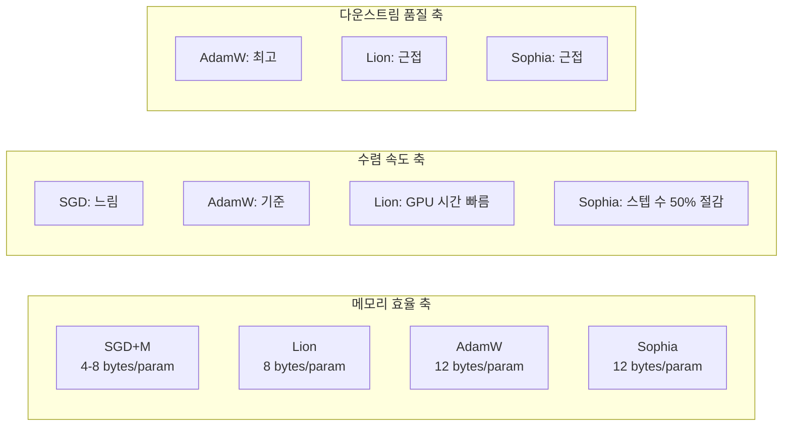

# 옵티마이저 선택

## 개요

옵티마이저는 그래디언트를 기반으로 모델 파라미터를 업데이트하는 알고리즘으로, 학습 속도, 수렴 안정성, 메모리 사용량에 직접적 영향을 미친다. LLM 사전학습에서는 AdamW가 사실상 표준이며, Lion(Google)은 메모리 효율과 학습 속도에서, Sophia(Stanford)는 검증 손실 수렴 속도에서 장점을 보인다. 옵티마이저의 상태 메모리는 [[deepspeed-zero]]와 [[data-parallelism-fsdp]]의 메모리 분할에서 가장 큰 비중을 차지하므로, 옵티마이저 선택은 분산 학습 전략과 밀접하게 연관된다.

## 핵심 개념

### SGD와 모멘텀

확률적 경사 하강법(SGD)은 가장 기본적인 옵티마이저로, 그래디언트 방향으로 고정 스텝만큼 파라미터를 업데이트한다. 모멘텀을 추가하면 이전 그래디언트의 이동 평균을 유지하여 진동을 줄이고 수렴을 가속한다. 그러나 LLM 학습에서는 적응형 학습률(adaptive learning rate)이 거의 필수적이어서 SGD 단독 사용은 드물다.

### Adam / AdamW

Adam은 1차 모멘트(그래디언트의 이동 평균)와 2차 모멘트(그래디언트 제곱의 이동 평균)를 모두 추적하여 파라미터별 적응형 학습률을 제공한다. AdamW는 가중치 감쇠(weight decay)를 L2 정규화가 아닌 파라미터 직접 감쇠로 구현하여 정규화 효과를 개선한 변형이다.

**메모리 요구량**: 파라미터당 12바이트
- FP32 마스터 가중치: 4 bytes
- 1차 모멘트 (m): 4 bytes
- 2차 모멘트 (v): 4 bytes

7B 모델에서 AdamW 옵티마이저 상태만 약 84GB를 차지한다. 이것이 [[deepspeed-zero]] Stage 1이 옵티마이저 상태 분할부터 시작하는 이유이다.

### Lion (EvoLved Sign Momentum)

Google Brain이 진화적 탐색(evolutionary search)으로 발견한 옵티마이저이다. 업데이트 방향만(sign) 사용하고 크기는 무시하며, 1차 모멘트만 추적한다.

**핵심 특성**:
- **메모리**: 파라미터당 8바이트 (2차 모멘트 없음). AdamW 대비 33% 절감
- **연산**: sign 함수 사용으로 업데이트 계산이 단순
- **학습률**: AdamW 대비 3-10배 작은 학습률 필요 (일반적으로 1e-4 수준)
- **가중치 감쇠**: AdamW 대비 3-10배 큰 값 필요

### Sophia (Scalable Second-order Optimizer)

Stanford에서 개발한 근사적 2차(second-order) 옵티마이저이다. 헤시안(Hessian)의 대각 근사를 이용하여 곡률(curvature) 정보를 활용한다. 손실 함수의 지형이 가파른 방향에서는 보수적으로, 평탄한 방향에서는 공격적으로 업데이트한다.

**핵심 특성**:
- **수렴 속도**: 동일 검증 손실 도달에 AdamW 대비 50% 적은 스텝
- **메모리**: AdamW와 유사 (헤시안 추정치 저장)
- **오버헤드**: 주기적 헤시안 추정 연산 (k 스텝마다 한 번)

## 옵티마이저 비교

### 정량 비교

| 항목 | AdamW | Lion | Sophia |
|------|-------|------|--------|
| 상태 메모리/파라미터 | 12 bytes | 8 bytes | ~12 bytes |
| 수렴 스텝 수 (기준 대비) | 1x | ~1x | ~0.5x |
| GPU 시간 (기준 대비) | 1x | 빠름 (단순 연산) | 유사 (헤시안 오버헤드) |
| 다운스트림 성능 | 최고 | 근접 | 근접 |
| 학습률 범위 | 1e-4 ~ 3e-4 | 1e-5 ~ 3e-5 | 별도 튜닝 필요 |
| 구현 복잡도 | 표준 | 낮음 | 높음 (헤시안 추정) |
| 프레임워크 지원 | 모든 프레임워크 | PyTorch, JAX | 연구 코드 |

### 대규모 모델에서의 검증 상태

현재까지의 옵티마이저 비교 연구는 주로 120M-220M 파라미터 모델(BERT, T5)에서 수행되었으며, 수십B 이상의 디코더 전용 LLM에서의 체계적 검증은 제한적이다. 실전에서는 AdamW가 가장 검증된 선택이며, Lion과 Sophia는 특정 조건에서 유망하지만 대규모 환경에서의 추가 검증이 필요하다.

## 실전 도입 가이드

### 옵티마이저 선택 기준

| 우선순위 | 권장 옵티마이저 | 근거 |
|---------|-------------|------|
| 안정성과 재현성 (기본) | AdamW | 가장 검증됨, 생태계 최적 |
| 메모리 절감 | Lion | 33% 옵티마이저 메모리 절감 |
| 빠른 수렴 (연구) | Sophia | 스텝 수 50% 절감 |
| GPU 시간 최소화 | Lion | 빠른 반복, 효율적 연산 |

### [[learning-rate-scheduling]]과의 관계

옵티마이저마다 최적의 학습률 범위와 스케줄이 다르다. AdamW의 경우 cosine decay가 표준이지만, Lion은 작은 학습률과 큰 가중치 감쇠가 필요하여 별도 튜닝이 필수적이다. [[mixed-precision-training]]에서 BF16 사용 시 옵티마이저 상태는 여전히 FP32로 유지된다.

### 흔한 실수

- **Lion에 AdamW 학습률 적용**: Lion은 3-10배 작은 학습률이 필요. 동일 값 사용 시 발산
- **옵티마이저 변경 시 체크포인트 비호환**: [[model-checkpointing-sharding]]에서 옵티마이저 상태 구조가 다르므로 변환 필요
- **메모리 예산 미계산**: 옵티마이저 상태가 전체 메모리의 60-70%를 차지. 옵티마이저 선택이 분산 전략에 영향

## 관련 문서
- [[training-learning-guides]] -- LLM 학습 가이드 모음
- [[grokking-training-dynamics]] -- 그로킹과 학습 동역학 (Grokking and Training Dynamics)
- [[bitnet-1bit-training]] -- BitNet 1비트 학습 (BitNet b1.58 Native 1-Bit Training)

- [[learning-rate-scheduling]] -- 옵티마이저와 결합하는 학습률 전략
- [[deepspeed-zero]] -- 옵티마이저 상태 분할 (Stage 1)
- [[data-parallelism-fsdp]] -- 옵티마이저 상태 샤딩
- [[mixed-precision-training]] -- FP32 옵티마이저 + BF16 연산
- [[model-checkpointing-sharding]] -- 옵티마이저 상태 체크포인팅
- [[mit-training-efficiency]] -- 학습 효율화 연구
