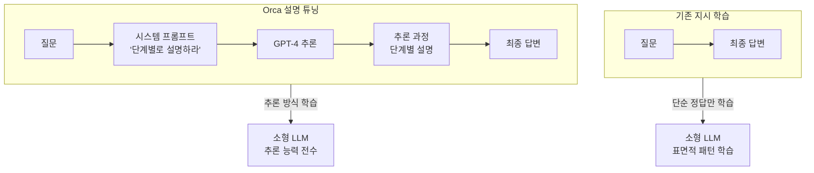

# Orca - 점진적 학습과 교사 추론 모방

Orca는 Microsoft Research가 2023년 발표한 파인튜닝 방법론으로, 소형 LLM이 대형 모델(GPT-4)의 **추론 과정(reasoning trace)**을 모방하도록 학습하는 것이 핵심이다. 단순히 "정답"이 아닌 "생각하는 과정"을 전수하는 것이 기존 [[instruction-tuning]]과의 차별점이다.

## 핵심 아이디어: 설명 튜닝 (Explanation Tuning)

기존 지시 학습(instruction tuning)은 `(질문, 답변)` 쌍을 학습 데이터로 사용한다. Orca는 여기에 **중간 추론 단계(chain of thought)**를 추가한다.



## 학습 파이프라인 상세

### 1단계: 시스템 지시 확장 (System Instruction Augmentation)

FLAN 5M 샘플에서 출발하여 다양한 **시스템 프롬프트**를 설계한다.

예시 시스템 프롬프트:
- "단계별로 설명하세요 (Think step by step)"
- "가능한 한 상세히 설명하세요"
- "전문가로서 답변하세요"
- "답변 전에 잘못된 부분을 먼저 검토하세요"

이 시스템 프롬프트들은 GPT-4가 단순 정답을 출력하는 대신 **추론 과정을 노출**하도록 유도한다.

### 2단계: GPT-4 추론 생성

```python
# Orca 데이터 생성 예시 (개념적)
system_prompt = "단계별로 생각하고, 각 단계를 명확히 설명하세요."

for question in flan_subset:
    response = gpt4.generate(
        system=system_prompt,
        user=question
    )
    # response에는 중간 추론 단계가 포함됨
    dataset.append({
        "system": system_prompt,
        "question": question,
        "reasoning_trace": response.chain_of_thought,
        "answer": response.final_answer
    })
```

### 3단계: 소형 모델 학습

수집된 `(시스템 프롬프트, 질문, 추론 과정, 답변)` 튜플로 LLaMA-13B 등 소형 모델을 파인튜닝한다.

## 점진적 학습 (Progressive Learning)

Orca의 "점진적" 측면은 데이터 난이도 커리큘럼에서 나온다.


모델이 단순한 질답 형식에서 시작해 점차 복잡한 추론 과정을 요구하는 데이터로 이동한다. 이는 사람이 쉬운 문제부터 풀어보며 학습하는 방식과 유사하다.

## Orca 2: 교수법 개선

Orca 2(2023)는 Orca의 후속으로, **태스크별 최적 추론 전략**을 학습하는 데 집중한다.

| 태스크 유형 | Orca 2의 추론 전략 |
|------------|------------------|
| 수학 문제 | 단계별 계산 + 중간 검증 |
| 코딩 태스크 | 알고리즘 설계 후 구현 |
| 사실 기반 QA | 정보 검색 후 합성 |
| 다단계 추론 | 역방향 추론 (backward reasoning) |

Orca 2는 어떤 전략을 언제 쓸지 메타 학습하여, Llama-2-13B 기반으로 GPT-4에 근접한 추론 성능을 달성했다.

## 핵심 실험 결과

Orca(LLaMA-13B)의 성능:
- BigBench Hard: GPT-4의 85% 수준
- AGIEval: Vicuna-13B 대비 42% 향상
- TriviaQA: ChatGPT 수준
- MMLU: LLaMA-65B와 경쟁

13B 파라미터 모델이 65B 모델과 경쟁하거나 능가한다는 점에서, 데이터 품질(추론 과정 포함)이 모델 크기보다 중요할 수 있음을 시사한다.

## 왜 중요한가

### 지식 증류의 진화
기존 지식 증류([[knowledge-distillation]])는 교사 모델의 **소프트 레이블**을 전달한다. Orca는 여기서 나아가 **추론 과정 자체**를 전달한다. 이는 "왜 그 답인지"를 함께 학습하는 것이다.

### 소형 모델의 새로운 가능성
추론 과정 포함 데이터로 학습한 소형 모델은 단순 정답 학습 대비:
- 새로운 문제 유형에 더 잘 일반화
- 멀티스텝 추론 성능 대폭 향상
- 설명 생성 능력 자연스럽게 습득

### 합성 데이터 방법론의 정석
Orca는 [[synthetic-data-training]]에서 단순히 "많은 데이터"가 아닌 **"깊은 데이터"**가 중요함을 증명한 사례다. 이 원칙은 이후 [[self-instruct-original]], [[evol-instruct-method]], [[magpie-synthetic-instruction]] 등 합성 데이터 방법론 전반에 영향을 주었다.

## 한계와 주의사항

1. **GPT-4 의존성**: 고품질 추론 데이터 생성에 GPT-4 API 비용이 크게 발생
2. **GPT-4 편향 전수**: GPT-4의 편향과 오류도 함께 학습될 수 있음
3. **도메인 한계**: FLAN 태스크 범위 밖의 문제에는 일반화 한계 존재
4. **평가 기준 논란**: BigBench 등 벤치마크 오염 가능성 지적

## 실무 시사점

1. **데이터 레시피 우선**: 학습 데이터에 추론 과정을 포함하면 모델 크기를 늘리는 것보다 효율적
2. **시스템 프롬프트 다양화**: 동일 질문에 다양한 시스템 지시를 붙여 데이터 다양성 확보
3. **난이도 커리큘럼**: 쉬운 것부터 어려운 것 순으로 학습 데이터 정렬

## 관련 문서

- [[knowledge-distillation]] - Orca가 확장하는 지식 증류 기본 개념
- [[instruction-tuning]] - Orca가 개선하려는 기존 지시 학습 방법
- [[supervised-fine-tuning]] - Orca 학습의 기술적 기반
- [[synthetic-data-training]] - 합성 데이터 생성 방법론 전반
- [[self-instruct-original]] - 자기 부트스트래핑 지시문 생성
- [[evol-instruct-method]] - 지시문 복잡화 진화 방법론
- [[magpie-synthetic-instruction]] - 대규모 합성 지시문 데이터
- [[distilbert-distillation]] - 지식 증류의 또 다른 접근 방식
