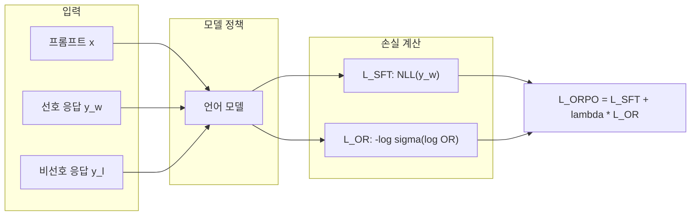

# ORPO (Odds Ratio Preference Optimization)

## 개요

ORPO(Odds Ratio Preference Optimization)는 Hong et al. (2024)이 제안한 선호도 최적화 알고리즘으로, [[supervised-fine-tuning|SFT(Supervised Fine-Tuning)]]와 선호도 정렬을 단일 목적함수로 통합하는 것이 핵심 혁신이다. 기존 [[direct-preference-optimization|DPO]]나 [[ppo-for-llms|PPO]] 기반 [[rlhf-pipeline|RLHF]]는 SFT를 먼저 수행한 뒤 별도의 선호도 정렬 단계를 거치는 2단계 파이프라인이 필요하지만, ORPO는 참조 모델(reference model) 없이 단일 단계에서 이 두 목표를 동시에 달성한다. EMNLP 2024에서 발표되었다.

논문: "ORPO: Monolithic Preference Optimization without Reference Model" (arXiv: 2403.07691)

## 동기: SFT 단독의 한계

### SFT의 구조적 문제

표준 SFT는 음의 로그 우도(negative log-likelihood, NLL) 손실을 최소화하여 선호 응답의 생성 확률을 높인다. 그러나 Hong et al.은 SFT가 선호 응답의 확률을 높이는 과정에서 비선호 응답의 확률도 함께 증가시킨다는 것을 경험적으로 보였다. 이는 SFT가 "좋은 응답 스타일"을 학습하면서 "나쁜 응답 스타일"을 명시적으로 억제하지 않기 때문이다.

이 관찰이 별도의 선호도 정렬 단계(DPO, RLHF 등)가 SFT 이후에 필요한 근본적 이유다. ORPO는 이 두 단계를 하나로 합치는 접근을 취한다.

### 참조 모델 제거의 이점

DPO는 참조 모델(보통 SFT 완료 모델)과의 로그 확률 비율을 사용한다. 이는 학습 중 참조 모델을 메모리에 유지해야 하므로 GPU 메모리 사용량이 2배에 달한다. ORPO는 참조 모델을 완전히 제거하여 메모리 효율성을 크게 높이고, 파이프라인 복잡도를 줄인다.

## 핵심 메커니즘

### 오즈비(Odds Ratio)의 정의

시퀀스 y를 입력 x가 주어졌을 때 생성할 "오즈(odds)"는 다음과 같이 정의된다:

`odds(y|x) = P(y|x) / (1 - P(y|x))`

여기서 P(y|x)는 시퀀스의 토큰별 조건부 확률의 평균 로그 확률로 계산된다. 오즈비는 선호 응답의 오즈와 비선호 응답의 오즈의 비율이다:

`OR(y_w, y_l | x) = odds(y_w|x) / odds(y_l|x)`

오즈비가 1보다 크면 모델이 선호 응답을 비선호 응답보다 더 높은 확률로 생성한다는 의미다.

### ORPO 목적함수

ORPO의 전체 손실은 SFT 손실과 오즈비 손실의 가중 합이다:

`L_ORPO = L_SFT + lambda * L_OR`

각 구성요소:

- **L_SFT**: 선호 응답 y_w에 대한 표준 NLL 손실. 모델이 좋은 응답을 생성하도록 학습
- **L_OR**: 오즈비 기반 대조 손실. `L_OR = -log(sigma(log(OR(y_w, y_l | x))))` 여기서 sigma는 시그모이드 함수

### lambda 하이퍼파라미터

lambda는 SFT 학습과 선호도 대조의 균형을 조절한다. 논문에서는 비선호 응답에 대한 "약한 패널티(minor penalty)"만으로도 선호도 정렬에 충분하다는 것을 이론적/경험적으로 보였다. 일반적으로 lambda = 0.1 ~ 1.0 범위가 사용된다.

## 이론적 근거

### 오즈비 선택의 타당성

Hong et al.은 125M에서 7B까지 다양한 모델 크기에서 오즈비가 SFT 과정 중 선호/비선호 스타일을 대조하는 합리적인 지표임을 이론적으로 증명하고 경험적으로 검증했다. 오즈비는 확률 자체보다 선호/비선호 간 상대적 차이를 더 민감하게 포착한다.

### DPO와의 비교

| 측면 | DPO | ORPO |
|------|-----|------|
| 학습 단계 | SFT + 별도 DPO | 단일 단계 |
| 참조 모델 | 필요 (메모리 2배) | 불필요 |
| 손실 함수 | Bradley-Terry 기반 이진 교차 엔트로피 | NLL + 오즈비 대조 |
| [[kl-divergence-penalty\|KL 제약]] | beta 파라미터로 제어 | 암묵적 (SFT 손실이 안정화 역할) |
| 구현 복잡도 | 중간 | 낮음 |
| GPU 메모리 | 높음 (참조 모델 유지) | 낮음 |

## 실증 결과

### 주요 벤치마크 성능

UltraFeedback 데이터셋만으로 학습한 결과:

- **Phi-2 (2.7B)**, **Llama-2 (7B)**, **Mistral (7B)** 모델에서 7B-13B급 최신 모델을 능가
- AlpacaEval 2.0: 최대 12.20%
- IFEval(지시 따르기): 66.19%
- MT-Bench: 7.32점

이는 ORPO가 SFT + DPO 2단계 파이프라인과 동등하거나 우수한 성능을 단일 단계로 달성할 수 있음을 시사한다.

### 학습 효율성

- 참조 모델 불필요로 GPU 메모리 약 50% 절감
- SFT와 정렬을 동시 수행하므로 전체 학습 시간 단축
- 하이퍼파라미터 수 감소 (참조 모델 관련 설정 불필요)

## 실전 적용

### HuggingFace TRL 통합

ORPO는 HuggingFace TRL 라이브러리의 `ORPOTrainer`를 통해 사용할 수 있다. DPO 대비 설정이 단순하며, 참조 모델을 별도로 로드할 필요가 없다.

### 적용 시 고려사항

1. **데이터 품질**: SFT와 정렬을 동시에 수행하므로, [[preference-data-collection|선호도 데이터]]의 품질이 두 가지 목표 모두에 영향
2. **lambda 튜닝**: 과도한 lambda는 SFT 학습을 방해하고, 너무 낮은 lambda는 정렬 효과가 미미
3. **모델 크기**: 125M-7B 범위에서 검증되었으며, 더 큰 모델에서의 스케일링 특성은 추가 연구 필요
4. **데이터 양**: 단일 단계이므로 충분한 양의 선호도 데이터가 필요

## DPO 변형 계보에서의 위치

ORPO는 DPO에서 파생된 선호도 최적화 변형들 -- SimPO(참조 모델 제거), [[kto|KTO]](쌍 데이터 불필요), IPO(과적합 방지) 등 -- 의 흐름에서, "SFT 통합"이라는 독자적 방향을 개척했다. [[direct-preference-optimization|DPO]]가 보상 모델을 제거했다면, ORPO는 SFT 단계와 참조 모델까지 제거하여 후학습 파이프라인의 최소화를 추구한다.

## 관련 페이지

- [[direct-preference-optimization|DPO]] - ORPO의 기반이 되는 직접 선호도 최적화
- [[supervised-fine-tuning|SFT]] - ORPO가 통합하는 지도 미세조정 단계
- [[rlhf-pipeline|RLHF 파이프라인]] - ORPO가 단순화하는 전체 후학습 프로세스
- [[kl-divergence-penalty|KL 발산 패널티]] - DPO의 참조 모델 기반 제약 vs ORPO의 암묵적 안정화
- [[reward-model-training|보상 모델 학습]] - ORPO가 우회하는 명시적 보상 모델
- [[preference-data-collection|선호도 데이터 수집]] - ORPO 학습에 필요한 데이터 구성
