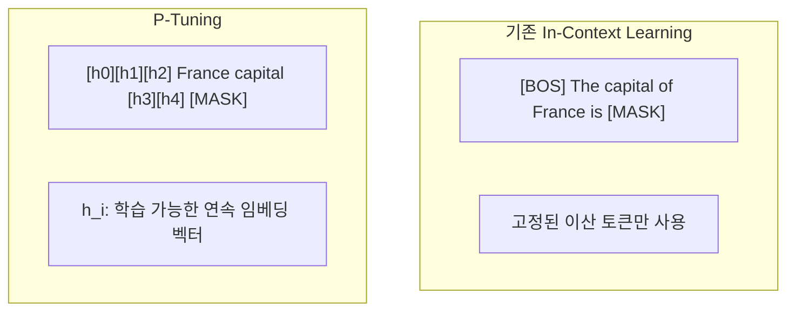
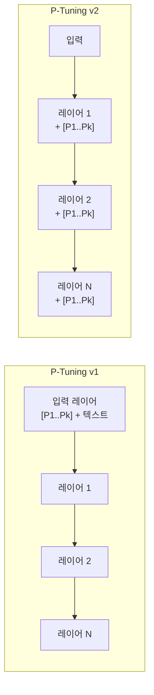

# P-Tuning - 연속 프롬프트 학습 (Prompt Tuning with Trainable Embeddings)

## 배경

GPT-3 등장 후 "프롬프트 엔지니어링(prompt engineering)"이 주목받았다. 올바른 프롬프트를 찾으면 모델 가중치 수정 없이도 다양한 태스크를 수행할 수 있었다. 하지만 이 방식에는 근본적 한계가 있다:

- 프롬프트는 이산 토큰(discrete token)으로 구성 → 미분 불가, 그래디언트로 최적화 불가
- 수작업 탐색에 의존 → 비재현적이고 서브옵티말
- 소형 모델에서는 in-context learning 자체가 취약

**P-Tuning(Liu et al., 2021 "GPT Understands, Too")**은 이산 프롬프트 대신 **입력 임베딩 공간에서 학습 가능한 연속 벡터**를 삽입하는 방법을 제안한다. 프롬프트를 그래디언트로 직접 최적화함으로써 수작업 탐색을 대체한다.

## 핵심 메커니즘

### 기존 in-context learning vs P-Tuning



모델의 입력 시퀀스에 실제 토큰 임베딩 대신 **학습 가능한 벡터 $h_0, h_1, \ldots$**를 삽입한다. 이 벡터들은 모델 임베딩 차원과 동일한 크기를 가지며 역전파로 직접 최적화된다.

### Prompt Encoder 설계

P-Tuning의 핵심 혁신은 학습 가능한 임베딩 벡터들이 **독립적으로 초기화되면 이산성(discreteness) 함정**에 빠질 수 있다는 문제를 해결한 것이다. 임베딩 공간에서 각 벡터가 고립된 점으로 수렴하는 현상을 막기 위해 **LSTM 기반 프롬프트 인코더**를 사용한다:

```python
import torch
import torch.nn as nn

class PromptEncoder(nn.Module):
    """P-Tuning 프롬프트 인코더 (LSTM 기반)"""

    def __init__(self, template_len: int, hidden_size: int, device: str):
        super().__init__()
        self.device = device
        self.seq_indices = torch.LongTensor(list(range(template_len))).to(device)

        # 학습 가능한 임베딩 + LSTM으로 연속성 확보
        self.embedding = nn.Embedding(template_len, hidden_size)
        self.lstm_head = nn.LSTM(
            input_size=hidden_size,
            hidden_size=hidden_size // 2,
            num_layers=2,
            bidirectional=True,
            batch_first=True,
        )
        self.mlp_head = nn.Sequential(
            nn.Linear(hidden_size, hidden_size),
            nn.ReLU(),
            nn.Linear(hidden_size, hidden_size),
        )

    def forward(self) -> torch.Tensor:
        input_embeds = self.embedding(self.seq_indices).unsqueeze(0)
        output_embeds = self.mlp_head(self.lstm_head(input_embeds)[0]).squeeze(0)
        return output_embeds
```

LSTM이 인접 프롬프트 토큰 간 의존성을 모델링해 더 매끄러운(smooth) 임베딩 공간을 탐색한다.

### 템플릿 설계

P-Tuning에서 프롬프트 템플릿은 연속 토큰($[P_i]$)과 이산 토큰(실제 단어)을 혼합한다:

```
# 지식 탐침(Knowledge Probing) 태스크 예시
입력: "The capital of [COUNTRY]"
P-Tuning 템플릿: "[P1][P2] [COUNTRY] [P3][P4] [MASK]"

# NLU 태스크 예시 (감성 분류)
입력: "This movie was great"
P-Tuning 템플릿: "[P1][P2] This movie was great [P3] [MASK]"
```

$[P_i]$는 학습 가능한 연속 임베딩, 나머지는 고정 이산 토큰이다.

## P-Tuning v2 개선

P-Tuning v1은 입력 레이어에만 연속 프롬프트를 삽입한다. 하지만 깊은 레이어에서는 초기 레이어의 연속 프롬프트 영향이 희석될 수 있다.

**P-Tuning v2(Liu et al., 2022)**는 모든 트랜스포머 레이어에 독립적인 프롬프트 벡터를 삽입한다:



v2는 prefix-tuning과 동일한 방식으로 모든 레이어의 키-값(K, V)에 프롬프트를 주입한다. 이를 통해 NLU(자연어 이해) 태스크에서 LoRA에 준하는 성능을 달성한다.

## 성능 특성

### 소형 vs 대형 모델에서의 효과

| 모델 크기 | P-Tuning 효과 |
|----------|--------------|
| 소형 (100M 이하) | 제한적. 전체 파인튜닝 필요 |
| 중형 (1B-10B) | 비교적 효과적 |
| 대형 (10B 이상) | 매우 효과적. 전체 파인튜닝과 격차 감소 |

소형 모델에서는 연속 프롬프트만으로 전체 파인튜닝을 대체하기 어렵다. 모델이 클수록 프롬프트 벡터가 더 많은 맥락 정보를 효과적으로 활용한다.

### SuperGLUE 벤치마크 (GPT-3 기준)

| 방법 | 평균 점수 | 추가 파라미터 |
|------|---------|------------|
| ICL (수작업 프롬프트) | 71.8 | 0 |
| **P-Tuning (LSTM)** | **75.1** | ~20K |
| Fine-Tuning | 76.9 | 전체 |

수작업 프롬프트 대비 큰 폭의 개선을 적은 파라미터로 달성했다.

## 다른 PEFT 방법과 비교

| 방법 | 삽입 위치 | 학습 파라미터 | 특징 |
|------|----------|------------|------|
| P-Tuning v1 | 입력 임베딩 | 매우 적음 | LSTM 인코더, NLU 약세 |
| P-Tuning v2 | 모든 레이어 KV | 적음 | NLU 경쟁력 |
| Prompt Tuning (Lester) | 입력 임베딩 | 매우 적음 | 대형 모델 특화 |
| Prefix-Tuning | 모든 레이어 KV | 적음 | 생성 태스크 특화 |
| LoRA | 어텐션 가중치 | 중간 | 범용, 넓은 지원 |

P-Tuning은 GPT 계열 단방향 언어 모델에서도 NLU 태스크를 수행할 수 있음을 보여준 점에서 의의가 있다("GPT Understands, Too"의 핵심 주장).

## 실무 적용 가이드

### 언제 사용하는가
- 대형 GPT 계열 모델(GPT-3, 초기 GPT-4급)을 API로만 접근 가능할 때
- 파라미터 효율이 극도로 중요한 경우 (임베딩만 저장)
- 지식 탐침(knowledge probing) 실험

### 언제 피하는가
- 소형 모델 (1B 이하) 파인튜닝
- 복잡한 생성 태스크 → Prefix-Tuning이 더 적합
- LoRA를 사용할 수 있는 환경 (v2와 비교해 LoRA가 더 범용적)

### 구현 고려사항
- 연속 프롬프트 길이 (일반적으로 20-100 토큰): 길수록 표현력 증가, 과적합 위험
- LSTM 인코더 사용: 임베딩 공간 탐색 안정화
- 학습률을 모델 파인튜닝보다 1-2 오더 높게 설정 (프롬프트 임베딩은 무작위 초기화)

## 관련 문서

- [[prefix-tuning-deep-prompts]] - 모든 레이어에 키-값 프리픽스 삽입
- [[prompt-tuning-soft-only]] - Lester et al.의 순수 소프트 프롬프트
- [[lora-qlora-finetuning]] - 가중치 행렬에 직접 저랭크 업데이트
- [[peft-adapter-survey]] - PEFT 방법론 전체 비교
- [[fine-tuning-overview]] - 파인튜닝 전략 개요
- [[instruction-tuning]] - 지시문 기반 파인튜닝
