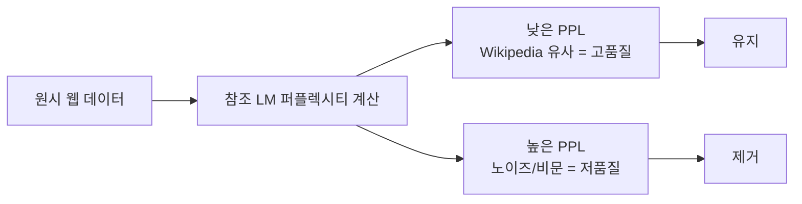

# 퍼플렉시티 기반 필터링

참조 언어 모델의 **퍼플렉시티(PPL)로 텍스트 품질을 측정**하여 저품질 웹 데이터를 제거하는 사전학습 데이터 큐레이션 기법. CCNet(Meta)이 대표적으로 사용했으며, Wikipedia로 학습한 KenLM 5-gram 모델의 PPL을 기준으로 필터링한다.

## Wikipedia 편향 문제

PPL 필터링의 가장 큰 비판: **Wikipedia 스타일 텍스트에 편향**된다. 대화체, 코드, 기술 문서 등은 PPL이 높아 부당하게 제거될 수 있다.

[[quality-classifier-filtering|품질 분류기 필터링]](FineWeb-Edu 방식)이 이 한계를 극복하기 위해 LLM 라벨링 + 경량 분류기 방식으로 대체하는 추세.

## 주요 모델별 사용

| 모델 | PPL 필터 | 대안 |
|------|---------|------|
| CCNet/Llama | KenLM 5-gram | 3단계 버킷 |
| FineWeb-Edu | 미사용 | 품질 분류기 |
| RedPajama v2 | 사용 | 40+ 시그널 중 하나 |

## 관련 문서

- [[pretraining-data-curation]] -- 사전학습 데이터 선별
- [[quality-classifier-filtering]] -- 품질 분류기 필터링
- [[data-deduplication-minhash]] -- 데이터 중복 제거
