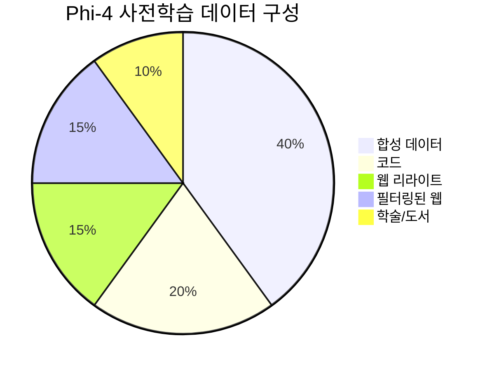
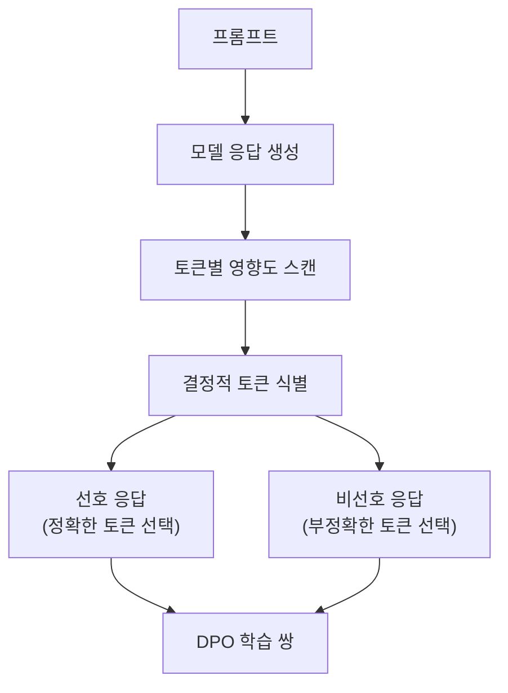

# Phi-4 학습

## 개요

Phi-4는 Microsoft Research가 2024년 12월 공개한 14B 파라미터 언어 모델이다. Phi 시리즈의 핵심 철학인 "데이터 품질 중심(data quality centric)" 접근법을 극한까지 밀어붙여, 사전학습 데이터의 40%를 [[synthetic-data-training|합성 데이터]]로 구성했다. 후속 학습에서는 Pivotal Token Search(PTS)라는 새로운 기법으로 [[direct-preference-optimization|DPO]] 학습 쌍을 생성했다. 가장 주목할 만한 결과는 14B 규모로 교사 모델인 GPT-4o를 STEM QA(GPQA)와 수학 경시대회(MATH) 벤치마크에서 초월한 것이다.

## 모델 사양

| 항목 | 수치 |
|------|------|
| 파라미터 | 14B |
| 아키텍처 | 디코더 전용 Transformer |
| 기본 컨텍스트 길이 | 4,096 토큰 |
| 학습 토큰 | 10T |
| 학습 데이터 중 합성 비율 | ~40% |

## 사전학습 데이터 구성

Phi-4의 사전학습 데이터는 대부분의 LLM과 근본적으로 다른 구성을 가진다. 유기적 웹 데이터 대신 합성 데이터와 가공 데이터가 주축이다.

| 데이터 유형 | 비율 | 설명 |
|-----------|------|------|
| **합성 데이터** | 40% | 교사 모델이 생성한 연습문제, 토론, 구조화된 추론 과제 |
| **코드** | 20% | 프로그래밍 언어 코드 |
| **웹 리라이트** | 15% | 웹 콘텐츠를 연습문제/토론/구조적 추론으로 재작성 |
| **필터링된 웹 데이터** | 15% | 추론/지식 중심으로 분류된 고품질 웹 데이터 |
| **학술/도서/포럼** | 10% | 학술 논문, 도서, 전문 포럼 |

### 합성 데이터 생성 전략

Phi-4의 합성 데이터는 단순 패러프레이징이 아니다. 유용한 콘텐츠가 포함된 원본 구절(passage)을 입력으로 받아, 교사 모델이 이를 다음과 같은 형태로 변환한다:

- **연습문제(Exercises)**: 개념 이해를 묻는 구조화된 문제
- **토론(Discussions)**: 주제에 대한 다각도 분석
- **구조화된 추론 과제(Structured reasoning tasks)**: 단계별 논리 전개

학습 초기 단계에서 합성 데이터 비율을 50% 이상으로 높이면 추론 중심 벤치마크에서 유의미한 성능 향상이 관찰되었다.

### 웹 데이터 처리

Phi-4 팀은 웹 데이터의 품질을 높이기 위해 커스텀 HTML-to-text 추출기를 구축했다. 일반적인 파서가 손상시키기 쉬운 콘텐츠를 보존하는 데 주력했다:

- TeX/MathML 수식
- 코드 블록
- 테이블
- 포럼 스레드 구조

HTML 태그명, CSS 클래스, 콘텐츠 길이, 트리 깊이 등의 신호를 활용하여 보일러플레이트와 광고를 구분했다.

## 후속 학습: Pivotal Token Search (PTS) DPO

### PTS의 핵심 개념

[[direct-preference-optimization|DPO]]는 선호/비선호 응답 쌍으로 모델을 정렬한다. Phi-4는 이 쌍을 생성하는 새로운 방법인 Pivotal Token Search를 도입했다.

PTS는 모델 응답에서 "결정적 토큰(pivotal token)"을 찾는다. 이 토큰은 응답의 품질을 좌우하는 분기점으로, 이 토큰에서의 선택이 정확한 답변과 환각(hallucination) 사이를 가른다.

### PTS DPO 효과

PTS 기반 DPO(DPO Stage 1)의 가장 두드러진 효과는 환각 감소다:

| 지표 | PTS DPO 이전 | PTS DPO 이후 |
|------|------------|------------|
| SimpleQA 환각률 | 38.7% | **17.4%** |

환각률이 약 55% 감소했으며, 이는 결정적 토큰에 집중한 정렬이 모델의 사실성(factuality)을 크게 개선함을 시사한다.

## 교사 모델 초월

Phi 시리즈의 이전 모델들은 대체로 교사 모델(GPT-4)의 능력을 증류하는 데 집중했다. Phi-4는 이 패턴을 깨고, STEM 중심 벤치마크에서 교사 모델 GPT-4o를 상당 폭으로 초월했다.

| 벤치마크 | Phi-4 (14B) | GPT-4o | 비교 |
|---------|------------|--------|------|
| GPQA (대학원 수준 STEM QA) | 교사 초월 | 기준선 | Phi-4 승 |
| MATH (수학 경시대회) | 교사 초월 | 기준선 | Phi-4 승 |

14B 규모 모델이 훨씬 큰 교사 모델을 특정 도메인에서 초월한 것은, 데이터 품질(특히 합성 데이터의 전략적 활용)이 모델 크기를 보상할 수 있음을 시사한다. 이는 [[neural-scaling-laws|스케일링 법칙]]의 "데이터 축" 해석에 중요한 사례를 제공한다.

## 학습 파이프라인 요약

| 단계 | 내용 | 핵심 기법 |
|------|------|----------|
| 사전학습 | 10T 토큰, 합성 40% | 합성 데이터 생성, 커스텀 웹 추출 |
| SFT | 정제된 SFT 데이터셋 | 기존 데이터셋 품질 개선 |
| DPO Stage 1 | PTS 기반 DPO 쌍 | Pivotal Token Search |
| DPO Stage 2+ | 추가 정렬 | 환각 감소, 안전성 향상 |

## 의의

Phi-4는 "작은 모델도 데이터가 충분히 좋으면 큰 모델을 이길 수 있다"는 Phi 시리즈의 가설을 가장 강력하게 검증한 모델이다. 합성 데이터 40%라는 파격적 구성은 [[synthetic-data-training|합성 데이터 학습]]의 실용적 상한선을 재설정했으며, PTS DPO는 [[direct-preference-optimization|DPO]] 학습 쌍 생성의 새로운 방법론을 제시했다. 14B 모델이 GPT-4o를 STEM 벤치마크에서 초월한 결과는, 모델 크기와 데이터 품질 사이의 관계에 대한 기존 통념에 도전한다.

## 관련 문서

- [[synthetic-data-training]] -- 합성 데이터 학습의 방법론과 위험
- [[direct-preference-optimization]] -- DPO와 PTS DPO의 이론적 기반
- [[knowledge-distillation]] -- 교사-학생 패러다임과 교사 초월 현상
- [[pretraining-data-curation]] -- 데이터 품질 중심 학습의 큐레이션 전략
- [[neural-scaling-laws]] -- 데이터 품질 vs 모델 크기 트레이드오프
- [[rlhf-pipeline]] -- DPO 단계가 포함된 후속 학습 파이프라인
