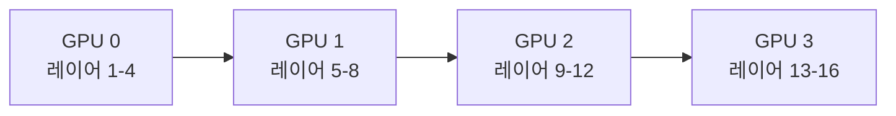
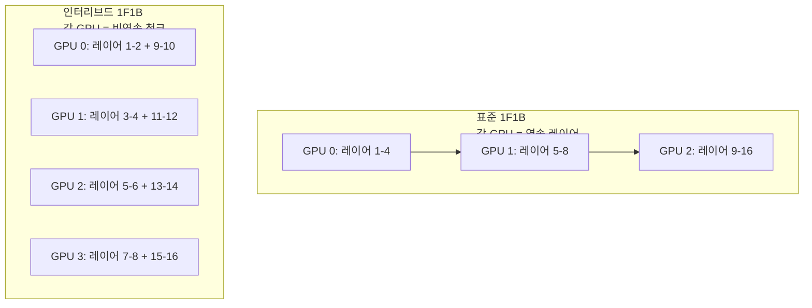
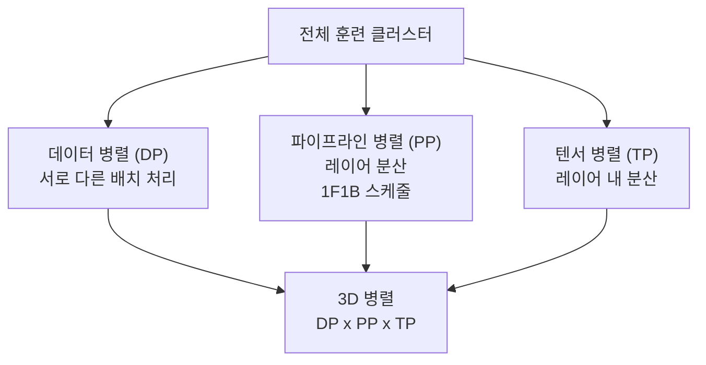

# 1F1B 파이프라인 병렬 스케줄

## 개요

1F1B(One Forward One Backward)는 파이프라인 병렬(pipeline parallelism) 훈련에서 GPU 활용률을 높이고 메모리 사용량을 줄이기 위한 마이크로배치 스케줄링 알고리즘이다. NVIDIA Megatron-LM에서 제안한 이 방식은 초기 GPipe의 높은 메모리 요구와 비효율적인 "거품(bubble)" 문제를 크게 개선했다. 수백~수천 억 파라미터 LLM의 [[distributed-training-overview]]에서 표준 기법으로 자리잡았다.

## 파이프라인 병렬의 기본 구조

파이프라인 병렬에서 모델 레이어는 여러 GPU(스테이지)에 순차적으로 분산된다.



데이터는 앞에서 뒤로(forward) 흐르고, 기울기는 뒤에서 앞으로(backward) 흐른다. 문제는 각 GPU가 자신의 차례가 올 때까지 **기다리는 시간(bubble)**이 발생한다는 것이다.

## GPipe와 거품 문제

GPipe(Google, 2019)는 미니배치를 작은 마이크로배치로 분할해 파이프라인을 채우려 했다.

```mermaid
gantt
    title GPipe 스케줄 (4 스테이지, 4 마이크로배치)
    dateFormat X
    axisFormat %s

    section GPU 0
    F1 :0, 1
    F2 :1, 2
    F3 :2, 3
    F4 :3, 4
    B4 :4, 5
    B3 :5, 6
    B2 :6, 7
    B1 :7, 8

    section GPU 3
    버블 :crit, 0, 3
    F4 :3, 4
    B4 :4, 5
    버블 :crit, 5, 8
```



GPipe에서는 모든 마이크로배치의 forward pass가 완료된 후에야 backward pass가 시작된다. 이로 인해:
- **메모리**: 모든 마이크로배치의 중간 활성화값(activation)을 동시에 보관해야 함
- **거품 비율**: $(p-1)/(m+p-1)$ — p는 스테이지 수, m은 마이크로배치 수

스테이지 수가 많을수록 거품이 커진다.

## 1F1B 스케줄

1F1B는 "하나 forward, 하나 backward"를 **교대로** 수행한다.

```mermaid
gantt
    title 1F1B 스케줄 (4 스테이지, 4 마이크로배치)
    dateFormat X
    axisFormat %s

    section GPU 0
    F1 :0, 1
    F2 :1, 2
    F3 :2, 3
    F4 :3, 4
    B1 :4, 5
    B2 :5, 6
    B3 :6, 7
    B4 :7, 8

    section GPU 1
    버블 :crit, 0, 1
    F1 :1, 2
    F2 :2, 3
    F3 :3, 4
    B1 :4, 5
    B2 :5, 6
    B3 :6, 7
    B4 :7, 8

    section GPU 3
    버블 :crit, 0, 3
    F1 :3, 4
    B1 :4, 5
    F2 :5, 6
    B2 :6, 7
    ...
```

핵심 차이:
- **Warm-up 단계**: 초기에 스테이지 수만큼 forward pass를 미리 실행
- **Steady 단계**: 이후 1 forward, 1 backward를 교대로 실행
- **Cool-down 단계**: 남은 backward pass 처리

**거품 비율 동일**: GPipe와 같은 $(p-1)/(m+p-1)$이지만, **메모리 사용량이 $O(m)$에서 $O(p)$로 감소**. 이것이 핵심 장점이다.

## 인터리브드 스케줄 (Interleaved 1F1B)

Megatron-LM v2는 1F1B를 발전시킨 **인터리브드 스케줄**을 제안했다. 각 스테이지가 연속적인 레이어 블록이 아니라 **비연속적인 여러 청크(chunk)**를 담당한다.



인터리브드 스케줄의 장점:
- **거품 비율 감소**: $(p-1)/(m \cdot v + p - 1)$ — v는 청크 수(virtual pipeline stages)
- v를 늘릴수록 거품이 줄어 GPU 활용률 향상
- 단점: 파이프라인 통신(p2p) 횟수가 $v$배 증가

## [[data-parallelism-fsdp]]와의 결합

대규모 훈련에서는 파이프라인 병렬과 [[data-parallelism-fsdp]] 및 텐서 병렬을 결합한다.



Llama 3, GPT-4 등 초대형 모델 훈련에서 이 3D 병렬이 표준이며, 파이프라인 병렬의 거품을 최소화하기 위해 마이크로배치 수 m을 충분히 크게 설정한다.

## 실용적 설정 권장

- **마이크로배치 수 m**: 거품 비율 5% 이하를 목표로 $m \geq 4p$ 권장
- **스테이지 수 p**: GPU 메모리와 모델 크기로 결정, 일반적으로 8~32
- **인터리브 청크 수 v**: 통신 대역폭이 충분하면 v=2~4가 효율적
- **활성화 체크포인팅**: 1F1B 상태에서도 메모리가 부족하면 선택적 재계산 적용

## 관련 문서

- [[distributed-training-overview]] - 분산 훈련 전체 개요
- [[data-parallelism-fsdp]] - FSDP 기반 데이터 병렬과의 결합
- [[tensor-pipeline-parallelism]] - 텐서 병렬과 파이프라인 병렬 비교
- [[sequence-parallelism]] - 시퀀스 축에서의 추가 병렬화
- [[mfu-model-flops-utilization]] - 파이프라인 거품이 MFU에 미치는 영향
