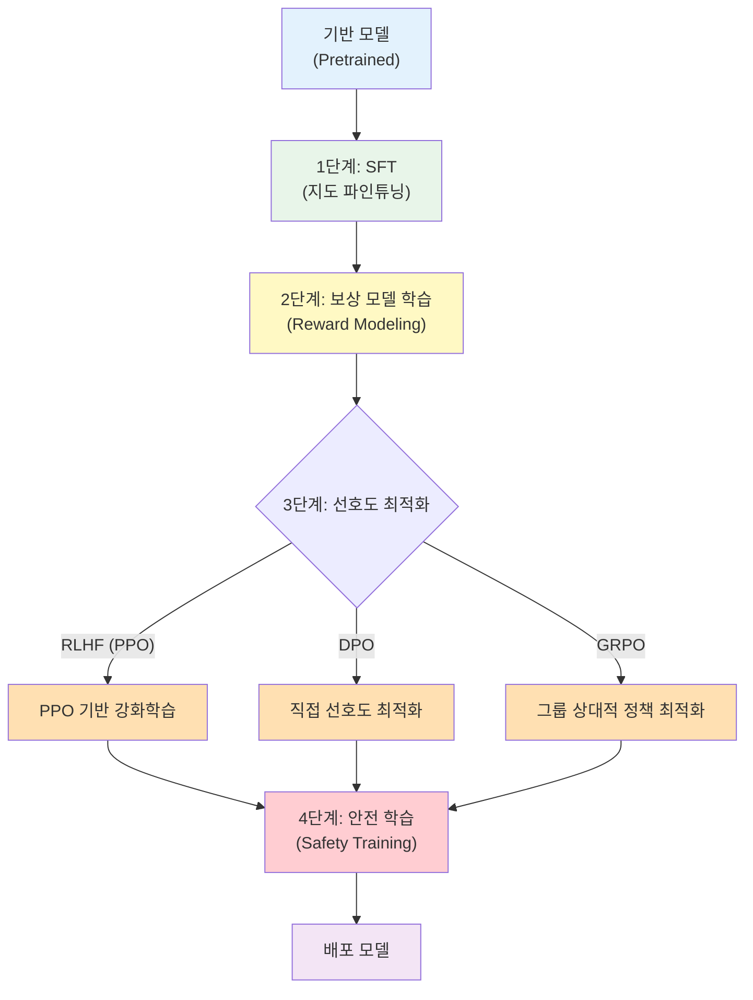
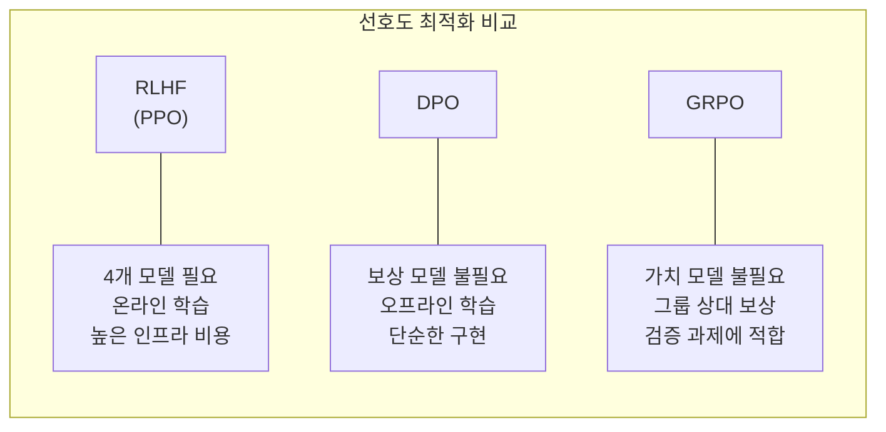
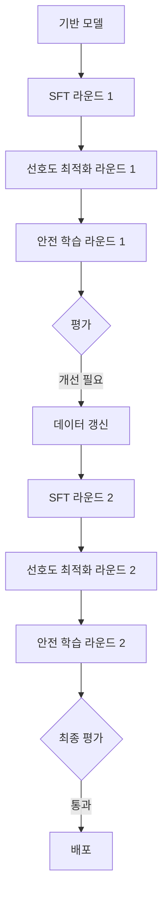

# 후학습 파이프라인 종단간 흐름 (Post-Training Pipeline E2E)

## 개요

후학습(Post-Training) 파이프라인은 사전 학습된 기반 모델(foundation model)을 유용하고 안전하며 도메인에 특화된 형태로 변환하는 전체 과정을 말한다. InstructGPT(Ouyang et al., 2022) 이래 표준화된 "SFT -> 보상 모델 -> RLHF" 3단계 구조에서, 2024-2025년에는 DPO, GRPO 같은 직접 선호도 최적화 기법과 다단계 안전 학습이 추가되어 더욱 정교한 파이프라인으로 진화했다.

이 페이지는 [[supervised-fine-tuning]], [[reward-model-training]], [[rlhf-pipeline]], [[direct-preference-optimization]] 등 개별 단계의 허브 페이지로서, 각 단계가 어떻게 연결되고 상호작용하는지를 종합적으로 다룬다.

## 파이프라인 전체 구조

현대 LLM의 후학습 파이프라인은 크게 네 단계로 구성된다.

## 1단계: 지도 파인튜닝 (SFT)

[[supervised-fine-tuning]]은 후학습의 첫 단계이다. 사전 학습된 모델의 일반적 언어 능력을 지시문-응답(instruction-response) 형식의 대화 능력으로 변환한다.

**핵심 역할**

- 모델이 사용자 지시를 이해하고 적절한 형식으로 응답하는 기본 능력을 확립
- 후속 강화학습 단계에서 올바른 응답(rollout)을 생성할 확률을 높이는 "콜드 스타트(cold-start)" 역할
- 대화 턴 구조, 시스템 프롬프트 인식, 도구 호출 형식 등을 학습

**데이터 요건**

고품질 지시문-응답 쌍이 필수이며, 데이터의 양보다 질이 중요하다. LIMA(Zhou et al., 2023)는 1,000개의 고품질 예시만으로도 경쟁력 있는 SFT 결과를 달성할 수 있음을 보였다. 현대 파이프라인에서는 인간 작성 데이터와 [[synthetic-data-training]]을 혼합하여 다양성과 규모를 확보한다.

## 2단계: 보상 모델 학습 (Reward Modeling)

[[reward-model-training]]은 인간의 선호도를 수치적 보상 신호로 변환하는 모델을 학습하는 단계이다.

**학습 방식**

- [[preference-data-collection]]을 통해 수집된 응답 쌍(chosen/rejected)으로 Bradley-Terry 모델을 학습
- 보상 모델은 주어진 (프롬프트, 응답) 쌍에 스칼라 보상 점수를 할당
- 일반적으로 SFT 모델과 동일한 아키텍처에서 마지막 레이어만 스칼라 출력으로 교체

**주의 사항**

- 보상 해킹(reward hacking): 모델이 보상 점수를 높이되 실제 품질은 저하되는 최적화
- 보상 모델의 정확도가 전체 파이프라인의 상한을 결정하므로, 지속적인 보상 모델 갱신이 필요
- [[process-reward-models]]처럼 단계별 보상을 제공하는 접근법이 복잡한 추론 과제에서 효과적

## 3단계: 선호도 최적화

보상 신호를 활용하여 모델의 정책(policy)을 인간 선호에 맞게 최적화하는 단계이다. 세 가지 주요 접근법이 경쟁한다.

### RLHF (PPO 기반)

[[rlhf-pipeline]]의 전통적 방식이다. [[ppo-for-llms]]를 사용하여 보상 모델의 점수를 최대화하되, [[kl-divergence-penalty]]로 SFT 모델(참조 정책)으로부터의 이탈을 제한한다.

- 장점: 온라인(on-policy) 학습으로 분포 외(out-of-distribution) 응답에 대한 학습 가능
- 단점: 4개 모델(정책, 참조, 보상, 가치)을 동시에 메모리에 유지해야 하므로 인프라 요구가 높음

### DPO (Direct Preference Optimization)

[[direct-preference-optimization]]은 명시적 보상 모델 없이, 선호도 데이터에서 직접 정책을 최적화한다.

- 장점: 구현 단순, 보상 모델 불필요, 학습 안정적
- 단점: 오프라인(off-policy) 학습으로 학습 데이터의 분포에 종속, 반복적 데이터 갱신 필요

### GRPO (Group Relative Policy Optimization)

DeepSeek에서 제안한 GRPO는 가치 함수(value function) 대신 그룹 내 상대적 보상 평균을 사용하여 PPO를 단순화한다. 명시적 가치 모델이 불필요하여 메모리 효율이 높고, 수학/코딩 같은 검증 가능한 과제에서 특히 효과적이다.

## 4단계: 안전 학습 (Safety Training)

선호도 최적화를 마친 모델에 안전성을 추가하는 최종 단계이다. 이 단계는 [[alignment-tax]]라는 성능-안전 트레이드오프를 수반한다.

**구성 요소**

- **거부 학습(Refusal Training)**: 유해한 요청에 대해 모델이 적절히 거부하도록 학습. 과도한 거부(over-refusal)를 방지하는 보정이 필요
- **Constitutional AI**: [[extended-constitutional-ai]]에서 다루는 원칙 기반 자기 수정 학습. AI가 스스로 생성한 비평과 수정으로 안전성을 향상
- **Red-teaming**: 적대적 프롬프트로 모델을 공격하여 취약점을 발견하고 학습 데이터에 반영
- **RLAIF**: [[rlaif-scalable-oversight]]에서 다루는 AI 피드백 기반 학습으로, 인간 레이블링 비용을 줄이면서 안전 학습을 확장

## 다단계 반복 구조

프론티어 모델의 실제 파이프라인은 위의 4단계를 1회 실행하는 것이 아니라, 여러 라운드에 걸쳐 반복한다.

Meta의 Llama 3는 6라운드의 사전 학습과 다단계 후학습을 수행했으며, Llama 4는 SFT, 거부 샘플링(rejection sampling), PPO, DPO를 결합한 다단계 정렬 프로세스를 사용했다.

## 실전 파이프라인 구성 시 고려 사항

| 고려 사항 | 권장 접근 |
|---|---|
| 데이터 규모가 작은 경우 | SFT -> DPO (보상 모델 생략) |
| 추론/코딩 최적화 | SFT -> GRPO (검증 가능한 보상) |
| 최대 품질 추구 | SFT -> RM -> PPO -> DPO -> Safety |
| 안전 학습 비용 최소화 | [[rlaif-scalable-oversight]] 활용 |
| [[alignment-tax]] 최소화 | 모델 병합, 널 공간 최적화 |

## 관련 페이지

- [[supervised-fine-tuning]] - 1단계 SFT 상세
- [[reward-model-training]] - 2단계 보상 모델 학습
- [[rlhf-pipeline]] - RLHF 파이프라인 전체 흐름
- [[direct-preference-optimization]] - DPO 상세
- [[ppo-for-llms]] - PPO 기반 LLM 강화학습
- [[kl-divergence-penalty]] - KL 발산 페널티
- [[alignment-tax]] - 안전 학습의 성능 비용
- [[extended-constitutional-ai]] - Constitutional AI 확장
- [[preference-data-collection]] - 선호도 데이터 수집
